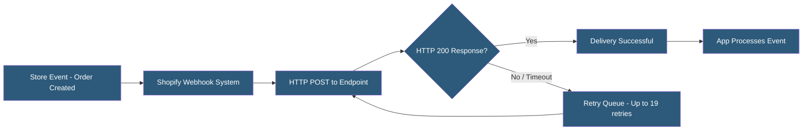

**Category:** E-commerce Hosting Platforms
**Difficulty:** Intermediate
**Reading time:** 5 min read

---

Shopify webhooks deliver real-time HTTP POST notifications to external endpoints when store events occur, enabling integrations to react to order placements, customer updates, inventory changes, and fulfillment events without polling the API. Webhooks are fundamental to building event-driven app integrations.

- **Webhook Topic** — The event category that triggers a delivery (e.g., orders/create, customers/update, inventory_levels/update)
- **HTTPS Endpoint** — The URL on the app server that receives the webhook payload; must return HTTP 200 within 5 seconds
- **HMAC Signature** — A SHA-256 HMAC signature in the X-Shopify-Hmac-Sha256 header used to verify the webhook came from Shopify
- **Retry Logic** — Shopify retries failed deliveries up to 19 times over 48 hours before deactivating the webhook
- **Event Deduplication** — Handling duplicate webhook deliveries (Shopify guarantees at-least-once delivery) using idempotency keys
- **Webhook Compression** — Large payloads are gzip-compressed; endpoints must handle Content-Encoding: deflate responses

Webhooks are registered via the Admin API with a topic, address (the HTTPS endpoint URL), and format (JSON or XML). When the triggering event occurs, Shopify serializes the relevant resource data as JSON and sends an HTTP POST to the registered address with a 5-second timeout for the endpoint to return a 200 response.

Endpoints must process webhooks quickly — if processing is slow, the endpoint should queue the webhook payload and return 200 immediately, then process asynchronously. Returning a non-200 status or timing out causes Shopify to queue a retry. The retry schedule backs off exponentially: retries occur at increasing intervals up to 19 total attempts over 48 hours. After 19 failures, Shopify deactivates the webhook and notifies the app.

HMAC verification is critical security practice. Each webhook includes an X-Shopify-Hmac-Sha256 header containing a base64-encoded HMAC-SHA256 hash of the raw request body using the app's client secret as the key. Endpoints must compute this hash independently and compare it against the header before processing, rejecting requests that do not match to prevent spoofed webhooks.

Because Shopify guarantees at-least-once delivery (not exactly-once), duplicate deliveries can occur during retry scenarios. App logic must be idempotent — processing the same order/create webhook twice should not create duplicate records. Using the resource ID as an idempotency key and checking for prior processing before acting on the event achieves this.

- Triggering order fulfillment workflows when new orders are placed
- Synchronizing customer data to external CRM systems on profile updates
- Updating external inventory systems when Shopify inventory changes
- Notifying ERP systems of new orders for accounting and financial reporting
- Triggering email automation flows on specific customer events

| Advantage | Disadvantage |
|-----------|--------------|
| Real-time event delivery eliminates API polling overhead | At-least-once delivery requires idempotent webhook handling |
| Retry mechanism handles transient endpoint failures automatically | Endpoints must respond within 5 seconds or processing must be async |
| HMAC signatures enable source verification | After 19 failures, webhook is deactivated requiring manual re-registration |
| Wide topic coverage enables fine-grained event subscriptions | Large high-volume events (orders during flash sales) may overwhelm endpoints |

- [Shopify GraphQL Admin API](shopify-graphql-admin-api.md)
- [Shopify App Store Ecosystem](shopify-app-store-ecosystem.md)
- [Shopify Flow Automation](shopify-flow-automation.md)

---
*Part of the [E-commerce Hosting Platforms](index.md) category · [Back to Master Index](../../index.md)*
