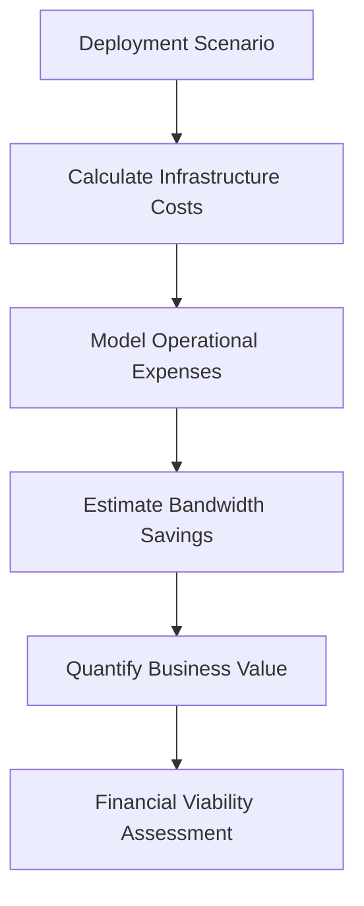

**Category:** Edge Computing
**Difficulty:** Intermediate
**Reading time:** 6 min read

---

Edge computing economics examines the financial aspects of deploying and operating edge infrastructure, including capital expenditures for hardware, operational costs, bandwidth savings, and the business value derived from reduced latency and improved performance.

- **Infrastructure costs** — hardware, facilities, and networking expenses for edge nodes
- **Operational expenses** — staffing, management tools, and maintenance of distributed systems
- **Bandwidth optimization** — reducing data transfer costs through local processing
- **Latency value** — quantifying business benefits of reduced response times
- **Scalability economics** — cost-per-node as infrastructure grows

Edge computing economics requires careful analysis of both costs and benefits. On the cost side, organizations must budget for edge hardware (servers, networking equipment, facilities), deployment and provisioning expenses, ongoing operational costs (monitoring, updates, support), and training. Benefits come from reduced bandwidth costs (local processing reduces data transfer), improved performance enabling new services (lower latency improves user experience), and operational efficiency (distributed processing reduces cloud load). The financial model must account for the distributed nature of edge infrastructure—managing thousands of edge nodes creates operational complexity that requires automation and skilled staff. Economies of scale work differently at the edge; costs don't decrease as rapidly as in centralized cloud because management overhead scales with the number of locations. Organizations must model different deployment patterns (small edge nodes vs. large regional edge data centers) to find the optimal cost structure for their workload.

- Justifying edge deployment costs based on bandwidth savings
- Modeling financial impact of reduced latency on customer retention
- Analyzing cost-benefit of edge processing vs. cloud-only alternatives
- Planning capital allocation across multiple edge deployment scenarios
- Calculating ROI for autonomous systems enabled by edge computing

| Advantage | Disadvantage |
|-----------|--------------|
| Reduces egress bandwidth costs | High initial capital investment |
| Enables new revenue-generating services | Distributed management adds overhead |
| Improves cost per transaction for high-volume services | Requires long-term commitment |
| Distributes investment across locations | Complex financial modeling required |
| May reduce cloud service costs | Hardware depreciation management complexity |

- [Edge Device Management](edge-device-management.md)
- [Edge Monitoring and Debugging](edge-monitoring-and-debugging.md)
- [Edge Computing Standards](edge-computing-standards.md)

---
*Part of the [Edge Computing](index.md) category · [Back to Master Index](../../index.md)*
