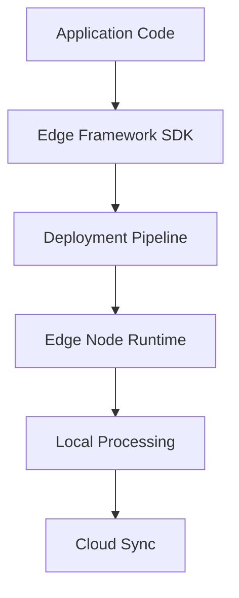

**Category:** Edge Computing
**Difficulty:** Intermediate
**Reading time:** 6 min read

---

Edge computing frameworks provide software platforms and runtime environments that enable developers to build, deploy, and manage applications across distributed edge nodes. These frameworks abstract the complexity of edge infrastructure and provide tools for resource management, deployment, and monitoring.

- **Runtime environments** — containerized or lightweight VM systems running on edge hardware
- **Deployment automation** — tools for packaging and distributing applications to multiple edge locations
- **Resource orchestration** — managing compute, memory, and network resources across edge nodes
- **Edge SDKs** — developer libraries for building edge-aware applications
- **Local processing logic** — frameworks enabling autonomous decision-making at the edge

Edge computing frameworks bridge the gap between traditional cloud development and edge deployment requirements. They provide abstraction layers that allow developers to write applications without deep knowledge of underlying edge hardware. The framework handles resource allocation, scaling, and failover across distributed edge nodes. These frameworks typically include SDKs for popular programming languages, APIs for accessing edge resources, and tools for monitoring and debugging edge deployments. They manage the complexity of deploying code to hundreds or thousands of edge devices while handling version updates, rollback capabilities, and local caching strategies. The frameworks also provide mechanisms for coordinating between edge processing and cloud analytics.

- IoT application deployment across thousands of devices
- Real-time video analytics at the network edge
- Machine learning model inference on edge hardware
- Distributed data processing for telemetry collection
- Edge caching and content delivery optimization

| Advantage | Disadvantage |
|-----------|--------------|
| Simplifies multi-site deployments | Learning curve for new frameworks |
| Reduces development complexity | Lock-in to specific framework ecosystem |
| Enables rapid iteration at scale | May have performance overhead |
| Provides monitoring and debugging tools | Requires operational expertise |
| Abstracts hardware heterogeneity | Not all use cases need full framework |

- [Edge Computing Standards](edge-computing-standards.md)
- [Edge Device Management](edge-device-management.md)
- [Edge Monitoring and Debugging](edge-monitoring-and-debugging.md)

---
*Part of the [Edge Computing](index.md) category · [Back to Master Index](../../index.md)*
