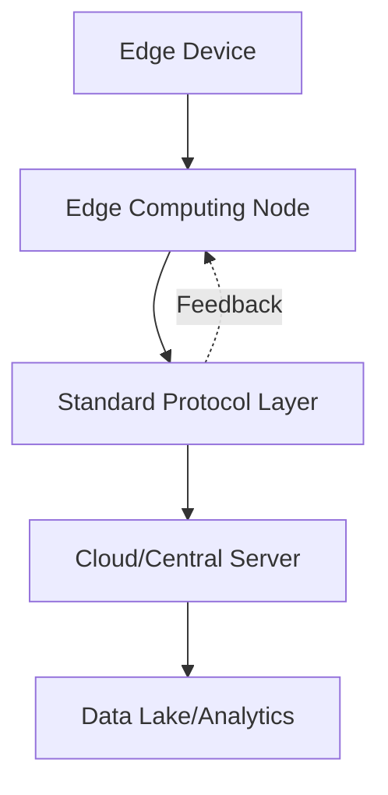

**Category:** Edge Computing
**Difficulty:** Intermediate
**Reading time:** 6 min read

---

Edge computing standards define protocols and frameworks for deploying compute resources closer to data sources. These standards ensure interoperability, security, and performance across diverse edge environments from IoT devices to distributed data centers.

- **Latency reduction** — moving processing closer to data minimizes network delay for real-time applications
- **Standard compliance** — ensures devices and systems can communicate across vendors and platforms
- **Edge-to-cloud synchronization** — protocols for coordinating compute across distributed tiers
- **Hardware specifications** — standardized requirements for edge computing devices and infrastructure
- **API standardization** — common interfaces for deploying and managing edge applications

Edge computing standards establish the technical foundations for distributed computing architectures. These standards define how edge devices communicate with central systems, what hardware and software requirements must be met, and how data flows between the edge and cloud. Standards bodies like IEEE, IETF, and industry consortia create these specifications to ensure that heterogeneous systems can work together seamlessly. The standards cover physical device specifications, communication protocols, security frameworks, and data formats. Organizations adopting edge computing use these standards to select compatible hardware, develop interoperable software, and design systems that can scale across multiple edge locations without proprietary lock-in.

- IoT device mesh networks requiring cross-vendor compatibility
- Manufacturing floor automation with standardized edge controllers
- Smart city infrastructure deploying edge nodes across municipalities
- Healthcare systems with distributed edge computing for patient monitoring
- Telecommunication networks implementing 5G edge computing standards

| Advantage | Disadvantage |
|-----------|--------------|
| Enables interoperability across vendors | Standards adoption lag in rapidly evolving fields |
| Reduces vendor lock-in | May constrain innovation in specific areas |
| Simplifies integration and deployment | Compliance overhead for implementation |
| Ensures security baseline | Performance trade-offs for standardized approaches |
| Facilitates skill portability | Requires ongoing standards updates |

- [Edge Computing Frameworks](edge-computing-frameworks.md)
- [Edge Device Management](edge-device-management.md)
- [Edge Monitoring and Debugging](edge-monitoring-and-debugging.md)

---
*Part of the [Edge Computing](index.md) category · [Back to Master Index](../../index.md)*
