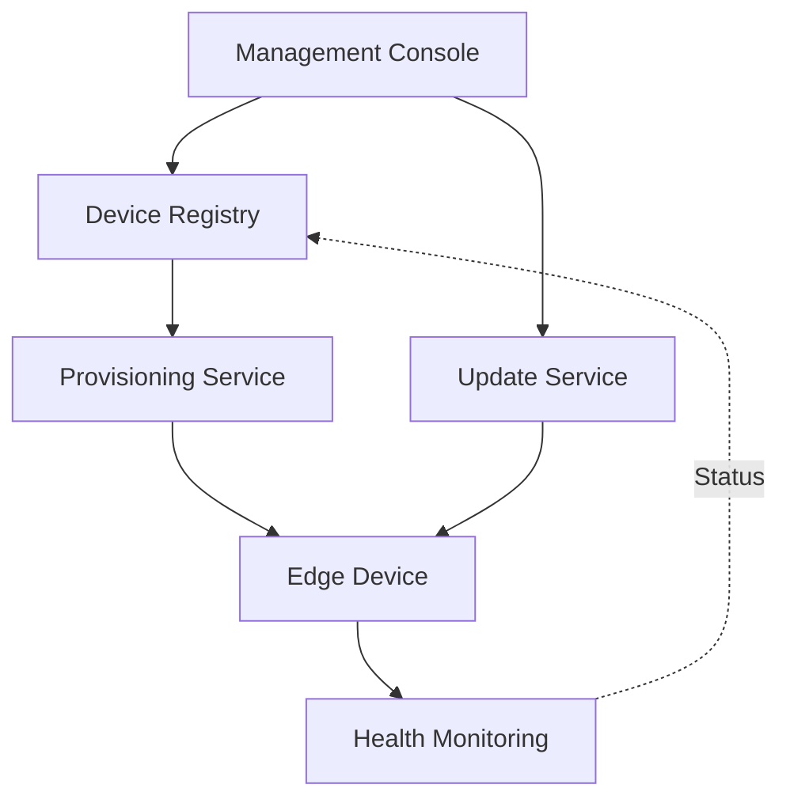

**Category:** Edge Computing
**Difficulty:** Intermediate
**Reading time:** 6 min read

---

Edge device management encompasses tools and processes for provisioning, configuring, updating, and maintaining edge computing hardware across distributed locations. Effective device management ensures operational consistency, security compliance, and optimal performance of edge infrastructure.

- **Device provisioning** — automated setup and onboarding of new edge hardware
- **Remote configuration** — centralized management of device settings and parameters
- **Over-the-air updates** — deploying firmware and software updates without physical access
- **Lifecycle management** — tracking device health, deprecation, and replacement
- **Security hardening** — enforcing security baselines across all managed devices

Edge device management platforms maintain a centralized registry of all edge devices in deployment. When new hardware is introduced, the provisioning service automatically configures it with required software, certificates, and access credentials. The management platform continually monitors device health metrics including CPU usage, network connectivity, storage capacity, and application performance. Updates are deployed through a staged rollout process that minimizes disruption and allows rollback if issues arise. The system tracks device compliance with security policies and can enforce configurations remotely. It also manages device decommissioning, including secure data deletion and inventory tracking. Most platforms provide dashboards for visualizing the entire edge infrastructure and alerting operators to problems before they impact service delivery.

- Managing thousands of IoT devices across multiple geographic regions
- Coordinating firmware updates for industrial edge controllers
- Ensuring security compliance across distributed infrastructure
- Monitoring device performance and predicting hardware failures
- Automated onboarding of new retail or branch office edge nodes

| Advantage | Disadvantage |
|-----------|--------------|
| Centralized visibility and control | Network dependency for remote operations |
| Reduces manual operational overhead | Requires robust security measures |
| Ensures consistent configurations | Can be complex to set up initially |
| Enables rapid scaling | Scaling can introduce management overhead |
| Improves security posture | May have high licensing costs |

- [Edge Computing Standards](edge-computing-standards.md)
- [Edge Computing Frameworks](edge-computing-frameworks.md)
- [Edge Monitoring and Debugging](edge-monitoring-and-debugging.md)

---
*Part of the [Edge Computing](index.md) category · [Back to Master Index](../../index.md)*
