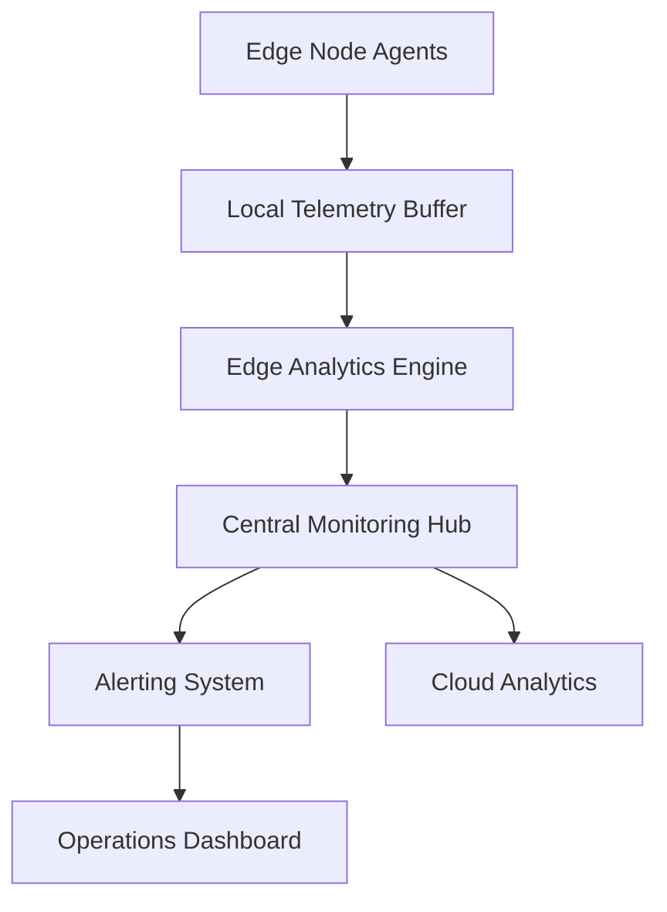

**Category:** Edge Computing
**Difficulty:** Intermediate
**Reading time:** 6 min read

---

Edge monitoring and debugging tools provide visibility into the health, performance, and behavior of applications and infrastructure running on distributed edge nodes. These tools enable operators to identify and resolve issues quickly, often with limited direct access to edge hardware.

- **Distributed telemetry** — collecting metrics and logs from multiple edge locations
- **Edge-cloud correlation** — linking edge events to cloud-based analytics for context
- **Remote debugging** — diagnosing issues on edge devices without physical presence
- **Performance tracing** — tracking application execution across edge and cloud
- **Alert aggregation** — centralizing notifications from thousands of edge nodes

Edge monitoring systems deploy lightweight agents on each edge node that continuously collect performance metrics, application logs, and system events. These agents aggregate data locally to reduce bandwidth requirements and transmit summaries or anomalies to a central monitoring hub. The monitoring hub correlates data across multiple edge nodes to detect distributed patterns that might indicate systemic issues. When problems are detected, operators can remotely retrieve detailed logs and even execute diagnostic commands on the edge node to understand the root cause. Time-series databases store historical metrics for trend analysis and capacity planning. The system often includes machine learning models that learn baseline behavior and automatically detect anomalies. Debugging tools allow operators to attach debuggers or trace system calls on running edge applications, though often with limitations to avoid impacting production.

- Detecting performance degradation across a distributed IoT fleet
- Correlating application errors on edge nodes with cloud-side events
- Predicting hardware failures by analyzing sensor data patterns
- Troubleshooting connectivity issues between edge and cloud
- Compliance auditing and forensic analysis of edge systems

| Advantage | Disadvantage |
|-----------|--------------|
| Real-time visibility across edge infrastructure | High volume of telemetry to manage |
| Faster mean-time-to-resolution | Privacy considerations with log collection |
| Enables proactive issue detection | Can impact edge node performance |
| Facilitates root cause analysis | Requires skilled operators to interpret data |
| Improves operational efficiency | Cost of storage and analytics infrastructure |

- [Edge Device Management](edge-device-management.md)
- [Edge Computing Frameworks](edge-computing-frameworks.md)
- [Edge Computing Economics](edge-computing-economics.md)

---
*Part of the [Edge Computing](index.md) category · [Back to Master Index](../../index.md)*
