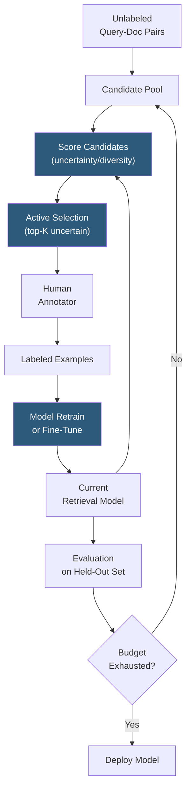

**Category:** Emerging Vector Technologies
**Difficulty:** Advanced
**Reading time:** 6 min read

---

Active learning for retrieval strategically selects the most informative query-document pairs for human annotation, maximizing improvement in retrieval model quality per labeling dollar. Rather than randomly sampling annotations, active learning identifies uncertain, diverse, or high-impact examples where model feedback would most improve embedding quality, reducing total labeling cost by 60–90% compared to passive annotation strategies.

- **Uncertainty Sampling** — selecting examples where the model has lowest confidence in relevance judgments, typically measured by margin between top-scoring documents
- **Query by Committee (QBC)** — using an ensemble of embedding models to identify examples where models disagree most on relevance ranking
- **Core-Set Selection** — choosing annotation examples that best cover the distribution of unlabeled query-document pairs in embedding space
- **Annotation Budget** — the fixed number of human judgments available; active learning maximizes model improvement within this constraint
- **Oracle** — the human annotator providing ground truth relevance labels for actively selected examples
- **Relevance Judgment** — a binary or graded (0–3) label indicating how relevant a document is to a query, typically following TREC guidelines
- **Curriculum Learning** — ordering training examples from easy to hard, complementing active learning by structuring how labeled examples are incorporated

Active learning for retrieval iterates through an annotation loop. Starting with a small seed set of labeled examples (or even zero labels using zero-shot initialization), the model scores all unlabeled query-document pairs in the candidate pool using one or more informativeness criteria.

**Uncertainty sampling** identifies pairs where the margin between the highest-scoring and second-highest-scoring document for a query is smallest — the model is most undecided at these query positions. Labeling these examples directly targets the model's decision boundary in embedding space.

**Query by Committee** maintains a diverse ensemble of bi-encoders trained with different random seeds, hyperparameters, or data subsets. For each unlabeled query, the ensemble produces multiple ranked lists; queries where inter-ensemble disagreement (measured by Kendall's tau) is highest are prioritized for annotation. This approach is more robust than single-model uncertainty for complex non-linear embedding spaces.

**Core-set selection** approaches the problem geometrically: it chooses annotation examples that minimize the maximum distance between any unlabeled example and its nearest labeled example in embedding space. This ensures the labeled set covers the full distribution rather than focusing on a single uncertain region.

After each annotation batch, the retrieval model is fine-tuned on the accumulated labeled set, generating updated uncertainty scores for the remaining unlabeled pool. This loop continues until the annotation budget is exhausted. Empirically, active learning curves on TREC-style benchmarks show most recall gains are captured in the first 20% of the labeling budget — the remainder provides diminishing returns.

- Building search evaluation sets for new product domains with minimal annotator time
- Fine-tuning production retrieval models where annotation budget is fixed and tight
- Identifying adversarial or edge-case queries where the current model fails most
- Iterative improvement of medical or legal search where expert annotators are expensive
- Multi-lingual retrieval where annotation capacity is limited for low-resource languages

| Advantage | Disadvantage |
|-----------|--------------|
| Achieves same model quality with 60–90% fewer annotations | Requires an active selection infrastructure on top of the training pipeline |
| Directly targets model weaknesses rather than random coverage | Batch delays between annotation rounds slow iteration cycles |
| Reduces annotation cost for expensive domain experts | Distribution bias: model-driven selection can miss rare but important query types |
| Composable with few-shot and continual learning pipelines | Annotation quality matters more per example — errors have higher impact |

- [Few-Shot Retrieval](few-shot-retrieval.md)
- [Reinforcement Learning for Search](reinforcement-learning-for-search.md)
- [Continual Learning for Embeddings](continual-learning-for-embeddings.md)

---
*Part of the [Emerging Vector Technologies](index.md) category · [Back to Master Index](../../index.md)*
