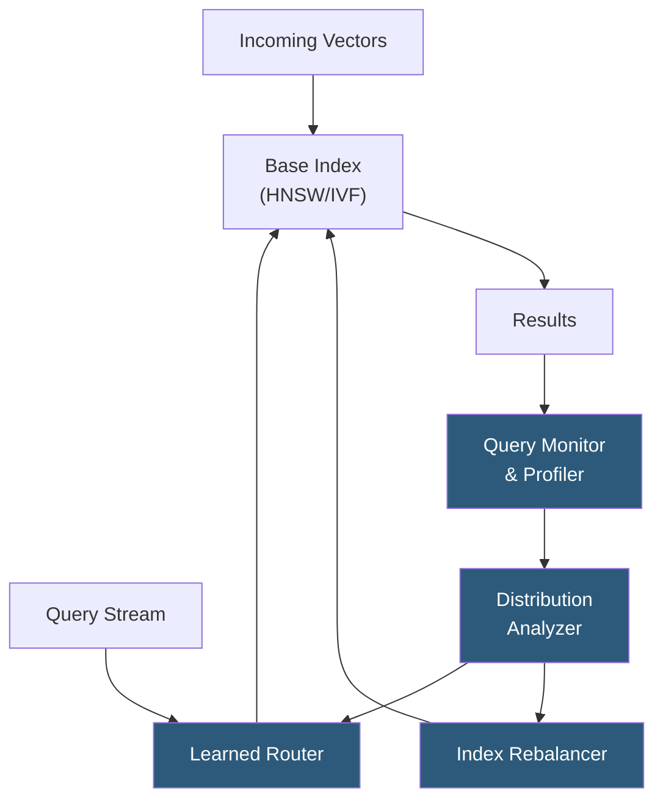

**Category:** Emerging Vector Technologies
**Difficulty:** Advanced
**Reading time:** 7 min read

---

Adaptive indexing strategies dynamically reconfigure vector index structures in response to query workload patterns, data distribution shifts, and performance feedback rather than relying on static build-time parameters. These systems learn from observed query distributions to tune partition granularity, routing policies, and distance computation budgets, enabling indexes that improve over time without manual retuning.

- **Workload-Driven Indexing** — adjusting index parameters (number of clusters, link density) based on observed query frequency and access patterns
- **Dynamic HNSW** — variants of Hierarchical Navigable Small World graphs that support efficient online insertion and deletion without full rebuilds
- **IVF Cell Rebalancing** — redistributing vectors across inverted file index cells when cluster centroids drift due to new data ingestion
- **Learned Routing** — using a lightweight ML model to predict which index cells or partitions are most likely to contain nearest neighbors for a given query
- **Index Pruning** — removing stale, redundant, or low-access index entries to reduce memory footprint and search latency
- **Proactive Prefetching** — predicting future queries from patterns and pre-loading relevant index regions into fast memory tiers
- **Feedback Loop** — mechanism by which user interaction signals (clicks, dwell time) inform index parameter adjustments

Adaptive indexing operates through a continuous monitoring-analysis-tuning loop. A query profiler records per-query metadata including latency, recall@K (estimated via ground truth sampling), and the distribution of probed index cells. Statistical analysis of this stream detects when query clusters drift away from the current partitioning, when certain cells become hotspots, or when recall degrades below a configurable threshold.

The rebalancing component responds in several ways. For IVF-style indexes, K-means clustering is periodically re-run on a sample of recent vectors to update centroids; vectors are reassigned to new cells incrementally to avoid downtime. For HNSW graphs, the maximum neighbor count (M parameter) can be increased for high-degree hub nodes that route many queries, improving recall at moderate memory cost, while low-traffic leaf nodes can be pruned to reclaim memory.

Learned routing models — typically shallow neural networks or gradient boosted trees — are trained on query-to-probed-cell mappings, learning non-linear correlations between query vector coordinates and optimal search regions. At inference, the router selects a reduced set of cells to probe, achieving the same recall with 20–60% fewer distance computations compared to uniform probing.

Proactive prefetching uses sequence models to anticipate likely next queries in interactive search sessions, issuing background reads to warm CPU caches or GPU VRAM before the request arrives. Together these mechanisms create an index that continuously tunes itself toward the evolving query workload without human intervention.

- Long-running production vector search services where query distributions evolve over months
- Recommendation engines with seasonal or event-driven shifts in user interest
- Multi-tenant vector databases serving diverse query workloads from different customers
- Continuous learning RAG systems where document corpus grows incrementally
- Low-latency real-time search where manual retuning windows are operationally impractical

| Advantage | Disadvantage |
|-----------|--------------|
| Maintains recall and latency SLOs without manual retuning | Monitoring and rebalancing overhead adds system complexity |
| Reduces resource waste by pruning cold index regions | Learned routing models require labeled query-cell data to train |
| Adapts to data and query distribution drift automatically | Rebalancing during high-traffic periods risks transient latency spikes |
| Improves with deployment time as patterns stabilize | Cold-start period requires fallback to static index parameters |

- [AI-Optimized Vector Indexes](ai-optimized-vector-indexes.md)
- [Self-Organizing Vector Maps](self-organizing-vector-maps.md)
- [Meta-Learning for Search](meta-learning-for-search.md)

---
*Part of the [Emerging Vector Technologies](index.md) category · [Back to Master Index](../../index.md)*
