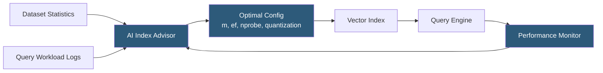

**Category:** Emerging Vector Technologies
**Difficulty:** Advanced
**Reading time:** 6 min read

---

AI-optimized vector indexes apply machine learning techniques to auto-configure, auto-tune, and continuously improve the performance of approximate nearest-neighbor (ANN) structures. Rather than requiring engineers to hand-select HNSW parameters or IVF cluster counts, these systems learn optimal configurations from data statistics and query workloads. They represent the convergence of AutoML principles and vector database engineering.

- **AutoIndex** — a system that automatically selects the best index algorithm and hyperparameters for a given embedding dataset
- **Workload-Aware Tuning** — monitoring live queries to adjust index parameters (ef, m, nprobe) for minimum latency at target recall
- **Learned Quantization** — using neural codebooks optimized end-to-end for the specific embedding distribution rather than generic product quantization
- **Dynamic Index Rebuilding** — triggering background index reconstruction when drift detection shows the current index is suboptimal
- **Hybrid HNSW-IVF** — a learned architecture that selects graph or inverted-file traversal per query based on predicted performance
- **Recall-Budget Optimizer** — a learned controller that adjusts nprobe or beam width to meet a recall SLA within a latency budget
- **Vector Index Advisor** — an AI assistant that recommends index type, compression, and sharding strategy from a dataset sample

AI-optimized vector indexes operate in three phases: profiling, construction, and adaptive maintenance. During profiling, the system samples the embedding dataset to compute statistical features — intrinsic dimensionality, cluster structure, distance distribution, and query selectivity. A trained configuration model (typically a gradient-boosted tree or small neural net) maps these features to predicted-optimal index hyperparameters: HNSW's `m` and `ef_construction`, or IVF's `nlist` and `nprobe`.

Index construction uses these recommended parameters, potentially with learned quantization. Unlike standard product quantization which partitions dimensions evenly, learned quantization trains a residual codebook that minimizes reconstruction error for the specific embedding model in use, achieving better recall at the same compression ratio.

At query time, a recall-budget controller monitors p50/p99 latency and recall@k (estimated via ground truth probing on a held-out set). If latency spikes, it reduces nprobe; if recall drops below the SLA threshold, it increases nprobe or widens the HNSW beam. This closed-loop control runs asynchronously to avoid adding per-query overhead.

When the underlying data distribution shifts — detected by monitoring centroid drift or new embedding model deployments — the system triggers a background index rebuild with a freshly sampled configuration. The old index remains live during reconstruction, and a seamless swap occurs once the new index warms up.

- Large-scale recommendation systems where embedding models are updated frequently
- Enterprise search with multi-tenant query patterns requiring per-tenant tuning
- Real-time personalization engines with strict latency SLAs
- Research databases where new embedding models are experimented with regularly
- Multimodal search systems mixing text, image, and audio embeddings

| Advantage | Disadvantage |
|-----------|--------------|
| Eliminates manual hyperparameter tuning burden | Requires workload telemetry infrastructure |
| Continuously adapts to data and query distribution shifts | Background rebuilds consume additional compute resources |
| Better recall-latency Pareto frontier than generic defaults | Configuration model accuracy depends on profiling data quality |
| Reduces time-to-production for new embedding models | Adds system complexity versus static index configuration |

- [Neural Database Architectures](neural-database-architectures.md)
- [Adaptive Indexing Strategies](adaptive-indexing-strategies.md)
- [Learned Index Structures](learned-index-structures.md)

---
*Part of the [Emerging Vector Technologies](index.md) category · [Back to Master Index](../../index.md)*
