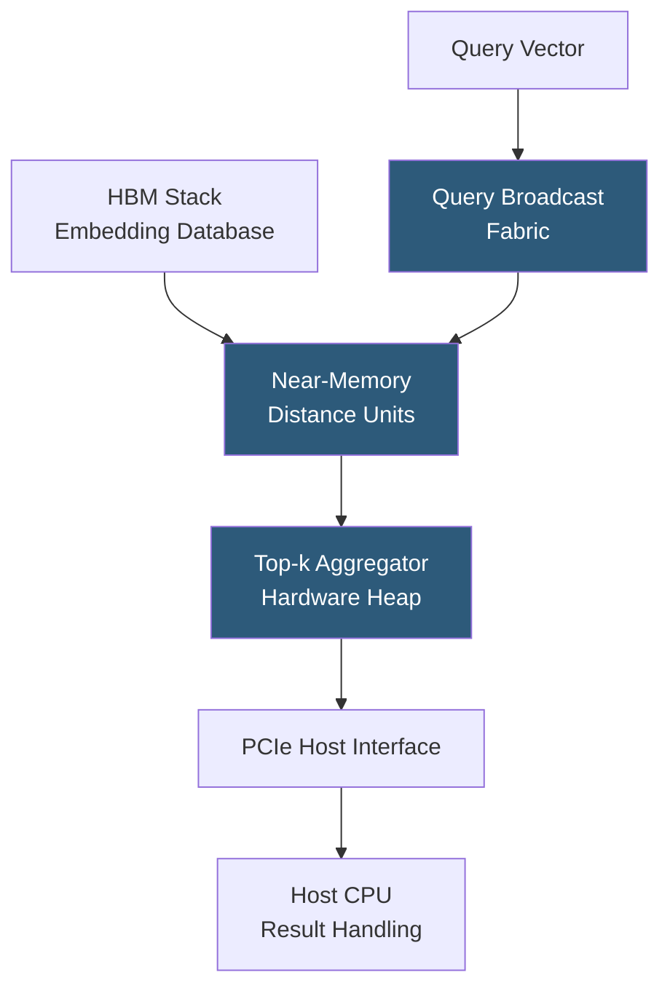

**Category:** Emerging Vector Technologies
**Difficulty:** Advanced
**Reading time:** 6 min read

---

Application-Specific Integrated Circuits (ASICs) purpose-built for embedding search represent the frontier of vector hardware acceleration. Unlike GPUs (general-purpose parallel compute) or FPGAs (reconfigurable logic), ASICs implement fixed-function circuits optimized exclusively for ANN operations, achieving the highest performance-per-watt and lowest latency for production similarity search. Companies like Google (ScaNN-ASIC research), Esperanto, and startups like Etched are targeting embedding search as a primary ASIC use case.

- **Custom Silicon** — integrated circuits designed for a single purpose, manufactured at leading-edge fabs (TSMC, Samsung) for maximum density
- **Near-Memory Computing** — placing processing logic adjacent to DRAM or HBM to eliminate the memory bandwidth wall for embedding access
- **Fixed-Function Distance Unit** — hardwired circuit implementing L2, cosine, or IP distance for a specific vector dimensionality (e.g., 768D)
- **HBM (High Bandwidth Memory)** — stacked DRAM delivering >1 TB/s bandwidth directly to the chip, critical for embedding-heavy workloads
- **Chiplet Architecture** — multiple specialized dies (distance compute, HNSW traversal, DMA) connected via advanced packaging like TSMC CoWoS
- **In-DRAM Processing (PIM)** — embedding compute units integrated directly into DRAM die, eliminating bus transfer for distance computation
- **Wafer-Scale Integration** — extreme integration (e.g., Cerebras WSE-3) placing all compute and memory on a single wafer to maximize bandwidth

An embedding-search ASIC is architected around the memory bandwidth wall: the primary bottleneck in ANN search is reading embedding vectors from memory, not computing distances. To address this, near-memory processing units are placed physically adjacent to HBM stacks on the same package. Each HBM channel (providing ~50 GB/s bandwidth) has dedicated distance computation logic that processes vectors as they emerge from the memory bus, avoiding the long data path to remote processing cores.

The query vector is broadcast simultaneously across all memory channels via a low-latency query fabric. Each near-memory unit reads its assigned portion of the embedding database and computes distances against the query in a streaming fashion. Results flow into a hardware top-k aggregator — a multi-stage tournament tree implemented in register arrays — that maintains the k smallest distances without requiring full sorting.

For HNSW graph traversal, a dedicated graph walker unit maintains traversal state, issues prefetch requests for predicted next-hop neighbor lists, and manages the priority queue entirely in on-chip SRAM. This avoids the irregular memory access pattern penalty that degrades GPU efficiency for HNSW.

Power efficiency comes from eliminating programmability overhead: no instruction fetch-decode-execute cycle, no general register file, no branch prediction. The fixed dataflow consumes transistor budget solely on useful computation, achieving 10–100× better TOPS/W than GPU for this specific task. The tradeoff is inflexibility: changing the distance metric, vector dimensionality, or index algorithm requires a new tape-out.

- Hyperscale search engines processing billions of queries per day
- Centralized embedding inference servers in large recommendation platforms
- Real-time ad auction systems requiring microsecond similarity matching
- Enterprise semantic search appliances deployed on-premises
- High-frequency trading firms building proprietary market data embedding systems

| Advantage | Disadvantage |
|-----------|--------------|
| Maximum performance-per-watt for fixed ANN workloads | 18–24 month tape-out cycle; cannot adapt to algorithm changes |
| Near-memory compute eliminates bandwidth wall | Extremely high NRE cost ($10M–$100M+ for leading-edge ASICs) |
| Deterministic cycle-accurate latency | Fixed vector dimensionality limits multi-model deployments |
| Enables rack-scale embedding search appliances | Only economical at very high query volumes (billions per day) |

- [FPGA Acceleration for Vectors](fpga-acceleration-for-vectors.md)
- [Photonic Vector Processing](photonic-vector-processing.md)
- [In-Memory Vector Computing](in-memory-vector-computing.md)

---
*Part of the [Emerging Vector Technologies](index.md) category · [Back to Master Index](../../index.md)*
