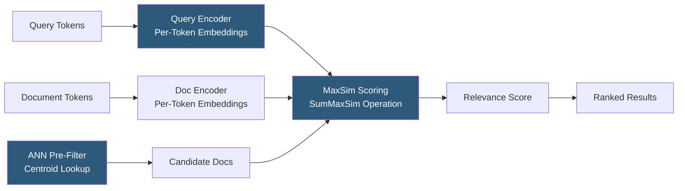

**Category:** Emerging Vector Technologies
**Difficulty:** Advanced
**Reading time:** 6 min read

---

Attention-based retrieval systems apply the transformer attention mechanism not just to encoding documents and queries, but directly to the retrieval scoring step. Late-interaction models like ColBERT compute separate embeddings for each query and document token, then score relevance via a MaxSim operation across all token pairs. This produces substantially more expressive rankings than single-vector retrieval while remaining tractable through ANN pre-filtering, combining the efficiency of dense retrieval with the quality of cross-attention.

- **Late Interaction** — scoring that computes fine-grained similarity between query and document token embeddings, unlike bi-encoders which produce single vectors
- **ColBERT (Contextualized Late Interaction over BERT)** — the defining late-interaction model producing per-token embeddings and scoring via MaxSim
- **MaxSim** — the ColBERT scoring function: sum over query tokens of the maximum cosine similarity to any document token
- **Token Embeddings** — distinct per-token vectors produced by a transformer, capturing position-specific context rather than a single pooled document representation
- **PLAID** — a ColBERT serving system using centroid-based ANN pre-filtering to avoid scoring all documents with expensive token-level computation
- **RAG with Late Interaction** — retrieval-augmented generation using ColBERT for first-stage retrieval to improve passage quality before LLM generation
- **Multi-Vector Retrieval** — storing multiple embeddings per document (one per token or chunk) to enable fine-grained interaction scoring

Attention-based retrieval begins with dual encoding: the query and each document are independently passed through a BERT-style encoder, producing one embedding vector per token rather than a single pooled vector. A 32-token query yields 32 vectors; a 128-token document yields 128 vectors. These are compressed to 128 dimensions and stored as the document's multi-vector index entry.

Scoring uses MaxSim: for each query token embedding, the system finds the maximum cosine similarity across all document token embeddings. These maximum similarities are summed across all query tokens to produce the final document score. This captures fine-grained token-level alignments — a query token about "neural networks" matches the document's "deep learning" token even if they don't appear together elsewhere.

Direct scoring of all documents using MaxSim is O(|Q|×|D|) per query — far too expensive for million-document collections. PLAID (Production-Level Approximate Index for Dense Retrieval) solves this with a two-phase approach: first, a fast centroid-based ANN search identifies candidate documents whose token embeddings fall near the query's token embedding centroids; second, exact MaxSim scoring is applied only to the 100–1000 shortlisted candidates.

Storage overhead is the primary cost: a million-document collection with average 128 tokens per document requires storing 128 million token embeddings of 128 dimensions, consuming ~65 GB at FP16 — roughly 64× more than a single-vector index. Quantization (ColBERT uses 2-bit compression for document token embeddings) reduces this to ~4 GB with minimal quality loss.

- Open-domain question answering where precise passage retrieval is critical
- Legal document retrieval requiring nuanced clause-level matching
- Scientific literature search where specific technical terms must align across query and document
- RAG pipelines where retrieval quality bottlenecks generation accuracy
- Customer support knowledge bases where exact phrase-level matching matters

| Advantage | Disadvantage |
|-----------|--------------|
| Substantially higher MRR and NDCG than single-vector bi-encoders | 10–100× larger index storage due to per-token multi-vector representation |
| Captures token-level alignment invisible to pooled embeddings | PLAID complexity increases system architecture and operational burden |
| Late interaction avoids the quality collapse of single-vector compression | Slower query latency than single-vector ANN for same recall target |
| Compatible with standard BERT fine-tuning pipelines | Indexing pipeline must encode and store all document token embeddings |

- [Transformer-Based Indexing](transformer-based-indexing.md)
- [Graph Neural Networks for Search](graph-neural-networks-for-search.md)
- [Few-Shot Retrieval](few-shot-retrieval.md)

---
*Part of the [Emerging Vector Technologies](index.md) category · [Back to Master Index](../../index.md)*
