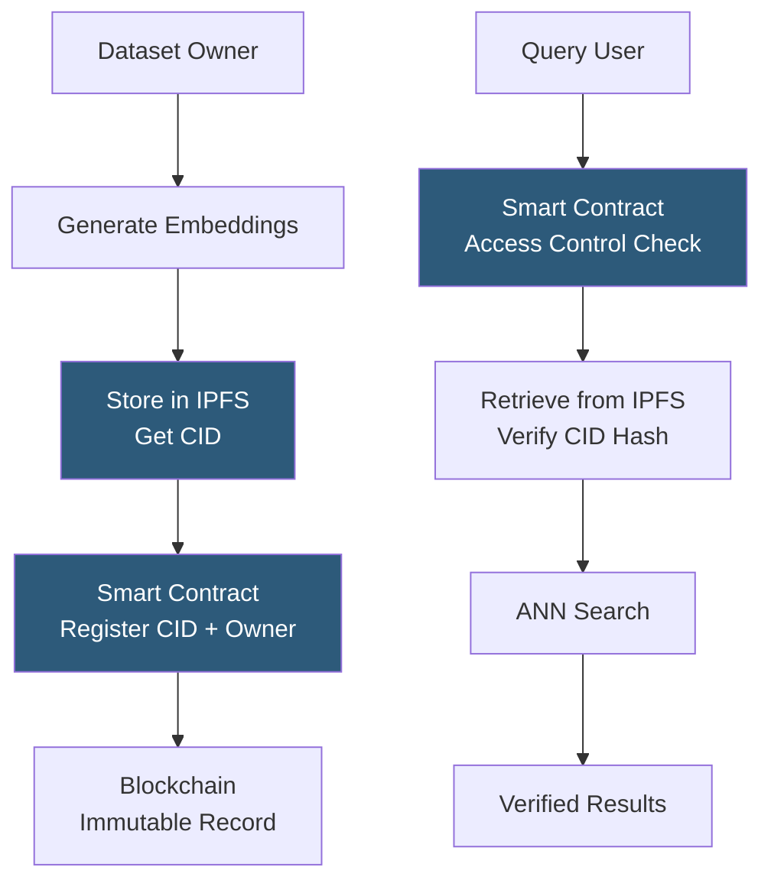

**Category:** Emerging Vector Technologies
**Difficulty:** Advanced
**Reading time:** 6 min read

---

Blockchain-based vector storage anchors embedding data to decentralized ledgers, creating verifiable provenance, tamper-evident audit trails, and decentralized ownership of AI embeddings. While raw vector data is typically stored off-chain (in IPFS or Filecoin) due to on-chain storage costs, the content hash and ownership record are committed to the blockchain, enabling verifiable data lineage for AI training datasets and query results. This is increasingly relevant for AI governance, copyright attribution, and data marketplace applications.

- **Content-Addressed Storage** — storing embeddings by their cryptographic hash (CID) via IPFS, making any tampering detectable
- **On-Chain Index Pointer** — a smart contract that maps an embedding's content hash to its owner, training provenance, and access permissions
- **zkML Proof** — a zero-knowledge proof that a specific vector embedding was computed correctly by a declared model without revealing the source data
- **Data NFT** — a non-fungible token representing ownership of a specific embedding dataset or model, enabling programmable royalty payments
- **Decentralized Storage Layer** — networks like Filecoin or Arweave providing incentivized persistent storage for large embedding files
- **Embedding Marketplace** — a smart-contract-governed marketplace where embedding dataset owners sell access to buyers, with automatic provenance attribution
- **Consensus-Based Retrieval** — federated nodes that must agree on query results to prevent single-node censorship or manipulation

Blockchain-based vector storage separates concerns between storage (off-chain), indexing (off-chain), and provenance/governance (on-chain). The dataset owner generates embeddings from their data and uploads the resulting vectors to IPFS, receiving a content identifier (CID) — a deterministic hash of the content. This CID is submitted to a smart contract on Ethereum or a purpose-built chain (Ocean Protocol, Filecoin VM), which records the owner's address, a metadata URI, and access pricing terms.

When a data buyer wants to use the embeddings, they call the smart contract to purchase access, triggering an automatic royalty payment to the owner. The smart contract returns a signed authorization token that the IPFS gateway verifies before serving the vector files. Any tampering with the vectors would change their hash and invalidate the CID, providing tamper-evident integrity.

For AI training provenance, zkML proofs can demonstrate that a specific embedding was generated by a certified model (e.g., OpenAI ada-002 at a declared version) without revealing the source text. This enables copyright-aware AI systems where model trainers must prove they used licensed data, with on-chain records creating legally actionable audit trails.

Query results can optionally be committed to the chain: a hash of the top-k result set, combined with the query embedding hash and timestamp, creates a verifiable record that a specific query was answered in a specific way at a specific time. This is valuable for regulated industries where AI search decisions must be auditable.

- AI training data provenance tracking for copyright compliance
- Decentralized embedding marketplaces with automatic royalty distribution
- Verifiable audit trails for regulatory AI decisions in finance or healthcare
- Cross-organization data sharing with cryptographic access controls
- Web3 semantic search for decentralized knowledge bases

| Advantage | Disadvantage |
|-----------|--------------|
| Immutable tamper-evident provenance for embeddings | On-chain transaction costs add latency and expense per operation |
| Programmable access control and automatic royalty payments | Blockchain finality latency (seconds to minutes) incompatible with real-time search |
| Decentralized: no single point of censorship or control | IPFS content availability depends on pinning services |
| Legal-quality audit trail for AI governance compliance | Smart contract bugs can lock or lose access to embedding data |

- [Decentralized Embedding Networks](decentralized-embedding-networks.md)
- [Vector Search in Web3](vector-search-in-web3.md)
- [Privacy-Preserving Embeddings](privacy-preserving-embeddings.md)

---
*Part of the [Emerging Vector Technologies](index.md) category · [Back to Master Index](../../index.md)*
