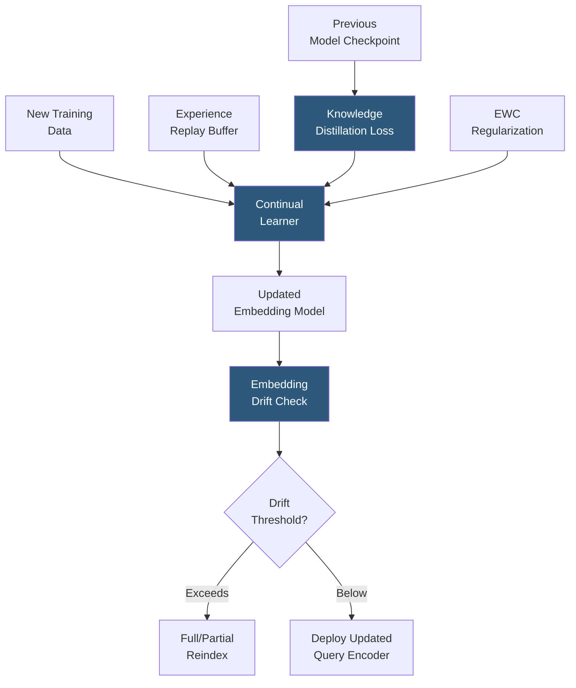

**Category:** Emerging Vector Technologies
**Difficulty:** Advanced
**Reading time:** 7 min read

---

Continual learning for embeddings addresses the challenge of updating embedding models with new training data without forgetting previously learned representations — a phenomenon known as catastrophic forgetting. Production search systems must evolve their embeddings as language, concepts, and user intent drift over time, requiring training strategies that incrementally incorporate new knowledge while preserving the geometric structure of existing indexes.

- **Catastrophic Forgetting** — the tendency of neural networks to rapidly overwrite previously learned weights when trained on new data sequentially
- **Elastic Weight Consolidation (EWC)** — regularization method that adds a penalty term to preserve weights important for previous tasks, measured by their Fisher information
- **Experience Replay** — storing a buffer of past training examples and interleaving them with new data to prevent forgetting
- **Knowledge Distillation** — using a frozen copy of the old model to generate soft targets that constrain the new model to preserve previous representations
- **Embedding Stability** — the degree to which vectors for previously indexed documents remain consistent after model updates
- **Index Drift** — degradation in retrieval quality when the query encoder's representation space diverges from the document encoder used to build the index
- **Progressive Neural Networks** — architecture that adds new columns for new tasks while freezing old columns, preventing any interference

Continual learning for embedding models typically combines three complementary strategies. **Knowledge distillation** keeps a frozen snapshot of the previous model and adds a loss term penalizing divergence between old and new model outputs on shared inputs. This acts as an anchor, ensuring the new model's embedding space remains compatible with the existing ANN index for unchanged documents.

**Experience replay** maintains a randomly sampled or importance-weighted buffer of previous training examples. These are mixed into each mini-batch alongside new examples, forcing the optimizer to balance new objective gradients with preservation of old representations. Reservoir sampling keeps the buffer at fixed size, with new examples replacing old ones at a probability that maintains temporal diversity.

**EWC** computes the Fisher information matrix diagonal for all model parameters after training on each task. This matrix estimates which weights are critical for previous tasks; subsequent training adds a quadratic penalty on changes to high-Fisher parameters, allowing plastic adaptation where it matters least and stability where it matters most.

A critical operational concern is **index drift**: after updating the embedding model, query vectors may no longer align with document vectors built by the old model. Drift monitoring computes cosine similarity between old and new model outputs for a representative sample of corpus documents. If average drift exceeds a threshold (typically 0.02–0.05 in cosine distance), a partial or full re-indexing is triggered. Asymmetric architectures that update only the query encoder can defer re-indexing, but accumulate latent drift over many updates.

Scheduled re-indexing — for example, nightly batch re-embedding of recently added documents using the latest model — combined with a fallback index of the previous model version enables blue-green deployment of embedding model updates with zero retrieval downtime.

- News search indexes that must absorb new terminology, entities, and events daily
- E-commerce semantic search adapting to new product categories and seasonal language
- Conversational AI knowledge bases updated with new facts without full retraining
- Research search engines incorporating newly published papers and terminology
- Multi-lingual models that incrementally add new languages without losing existing coverage

| Advantage | Disadvantage |
|-----------|--------------|
| Enables continuous model improvement without full retraining | Complexity of balancing plasticity and stability requires careful tuning |
| Preserves existing index compatibility, reducing reindex frequency | Experience replay increases memory requirements for training |
| EWC prevents catastrophic forgetting with modest compute overhead | Fisher information computation is expensive for large models |
| Distillation maintains semantic consistency across model versions | Accumulated small drifts over many continual updates may eventually require full reindex |

- [Real-Time Embedding Updates](real-time-embedding-updates.md)
- [Adaptive Indexing Strategies](adaptive-indexing-strategies.md)
- [Temporal Vector Search](temporal-vector-search.md)

---
*Part of the [Emerging Vector Technologies](index.md) category · [Back to Master Index](../../index.md)*
