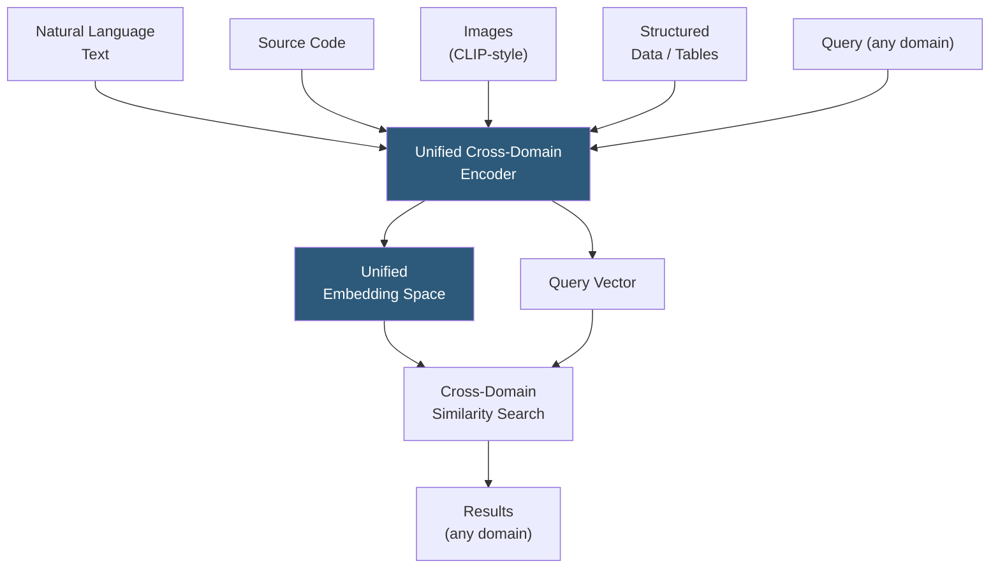

**Category:** Emerging Vector Technologies
**Difficulty:** Advanced
**Reading time:** 6 min read

---

Cross-domain embeddings project text, images, audio, or structured data from different domains into a unified vector space where semantic similarity is preserved across modalities and subject areas. These representations enable retrieval across domain boundaries — searching medical literature with layman queries, finding relevant code from natural language descriptions, or retrieving product images using text — without requiring domain-specific models for each source.

- **Domain Gap** — the distributional difference between source and target domains that degrades embedding transferability
- **Contrastive Pre-training** — training strategy pairing cross-domain positive examples (text-image, code-description) to align heterogeneous embedding spaces
- **CLIP (Contrastive Language-Image Pre-training)** — OpenAI model aligning image and text embeddings; foundational cross-domain architecture
- **CodeBERT / StarEncoder** — embedding models mapping natural language queries and programming code to a shared space for code search
- **Grounded Embeddings** — representations tied to real-world entities shared across domains (e.g., named entity embeddings consistent across news, scientific, and financial text)
- **Domain Adaptation** — fine-tuning a general embedding model on target domain data to reduce domain gap without sacrificing cross-domain alignment
- **Semantic Anchoring** — training technique that preserves the relative geometry of general-domain embeddings when adapting to a specialized domain

Cross-domain embeddings are trained using contrastive objectives on paired data that spans domain boundaries. For text-image alignment (CLIP), 400 million image-caption pairs from the web are used to train dual encoders — one visual, one textual — to minimize cosine distance between matching pairs and maximize it for non-matches within each batch. The resulting shared space allows text queries to retrieve images and vice versa.

For code-text domains, models like CodeBERT use bimodal masked language modeling on GitHub code paired with docstrings, producing a space where function signatures and natural language descriptions of the same function occupy nearby positions. This enables semantic code search without requiring exact keyword matches in comments.

Domain adaptation refines general embeddings for specialized fields. A medical domain adapter fine-tunes a general encoder on clinical notes and biomedical literature while using knowledge distillation to prevent it from diverging too far from the general embedding space. The adapter adds a learned projection layer that maps general embeddings to a domain-specific subspace while maintaining alignment with the original space for cross-domain queries.

**Semantic anchoring** is critical for maintaining cross-domain utility during adaptation: key domain concepts are assigned anchor vectors derived from general-domain embeddings, and the adaptation objective includes a term penalizing deviation of these anchors. This ensures that queries about shared concepts (e.g., "heart disease" appearing in both medical and general text) produce consistent results across the domain boundary.

Production cross-domain indexes partition by modality at storage level while exposing a unified query API, routing query vectors to appropriate sub-indexes and fusing ranked results via cross-modal reciprocal rank fusion.

- Enterprise knowledge search spanning documents, spreadsheets, images, and code repositories
- E-commerce visual search enabling "find similar products" from uploaded images or text descriptions
- Scientific literature retrieval linking natural language hypotheses with experimental data tables
- Software development tools retrieving relevant API examples from natural language task descriptions
- Multi-modal RAG pipelines combining text, chart, and diagram retrieval for document understanding

| Advantage | Disadvantage |
|-----------|--------------|
| Eliminates domain-specific index proliferation | Paired cross-domain training data is scarce for specialized domains |
| Enables novel cross-modal retrieval use cases | Domain gap may require expensive domain-specific adaptation |
| Single model serves multiple retrieval applications | Modality imbalance can bias embedding space toward dominant domain |
| Grounded entities provide consistent cross-domain retrieval | Cross-modal quality often lags monomodal state-of-the-art |

- [Cross-Lingual Vector Search](cross-lingual-vector-search.md)
- [Transfer Learning for Retrieval](transfer-learning-for-retrieval.md)
- [Multi-Task Embedding Models](multi-task-embedding-models.md)

---
*Part of the [Emerging Vector Technologies](index.md) category · [Back to Master Index](../../index.md)*
