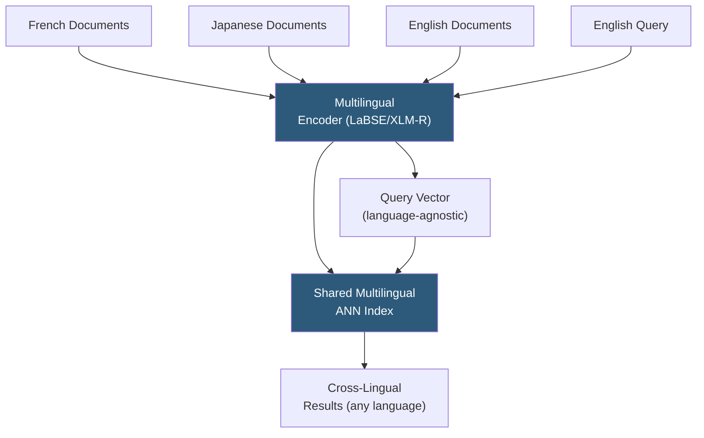

**Category:** Emerging Vector Technologies
**Difficulty:** Advanced
**Reading time:** 6 min read

---

Cross-lingual vector search enables querying a document corpus in one language using queries written in a different language, by projecting both into a shared multilingual embedding space. Multilingual models align semantic representations across languages so that a query in English retrieves relevant French or Japanese documents without translation, dramatically expanding the reach of search infrastructure across language boundaries.

- **Multilingual Encoder** — transformer model trained on parallel or multilingual corpora to produce language-agnostic representations (e.g., mBERT, XLM-R, LaBSE)
- **Language-Agnostic Embeddings** — vectors where semantically equivalent text in different languages occupies the same region of embedding space regardless of surface form
- **Parallel Corpus Alignment** — training strategy using human-translated sentence pairs to anchor multilingual embedding geometry
- **Cross-Lingual Transfer** — the ability to apply a model trained primarily on high-resource languages to retrieve in low-resource languages with no or minimal language-specific training
- **MIRACL Benchmark** — multilingual information retrieval benchmark spanning 18 languages for evaluating cross-lingual retrieval quality
- **Code-Switching** — text mixing multiple languages in a single document or query; multilingual models that handle this outperform monolingual retrieval for mixed-language corpora
- **LaBSE (Language-Agnostic BERT Sentence Embeddings)** — Google's model trained on 109 languages using translation ranking objectives, excelling at cross-lingual retrieval

Cross-lingual vector search is built on multilingual transformer models pre-trained to map semantically equivalent text across languages to nearby positions in a shared embedding space. The key training mechanism is **translation ranking**: given a sentence and its translation, the model is trained to embed them closer together than any other sentence in the batch (using contrastive loss with in-batch negatives).

LaBSE, trained on 109 languages with 6 billion translation pairs, achieves near state-of-the-art bitext retrieval (finding translations) in low-resource language pairs with fewer than 1,000 training examples. XLM-R, trained with masked language modeling on 100 languages, provides strong zero-shot cross-lingual transfer for retrieval without explicit translation pair training.

At index build time, all documents — regardless of language — are encoded by the same multilingual model and stored in a single ANN index. At query time, the user's query in any supported language is encoded to the same embedding space. Cosine similarity search retrieves semantically relevant documents across all languages simultaneously.

For specialized domains (legal, medical, scientific), multilingual models pre-trained on general web data may fail to generalize. Domain-specific cross-lingual fine-tuning using even small numbers of domain-translated pairs (500–2,000) significantly improves recall. Aligned vocabulary normalization (e.g., shared multilingual BPE tokenization) ensures that technical terms that are identical or near-identical across languages (borrowed terminology) map to similar token sequences, improving out-of-the-box cross-lingual performance for technical domains.

- Multinational enterprise search across internal documents in multiple official languages
- International e-commerce enabling customers to search in their native language
- Academic search retrieving papers across English, Chinese, German, and French corpora
- Legal and compliance search spanning documents across jurisdictions and languages
- Customer support knowledge base retrieval for global user bases without language-specific indexes

| Advantage | Disadvantage |
|-----------|--------------|
| Single index serves all languages, reducing infrastructure cost | Performance gap vs. monolingual models for high-resource language pairs |
| No translation required at query or index time | Low-resource languages have weaker representation quality |
| Natural handling of code-switching and multilingual documents | Domain-specialized cross-lingual models require parallel domain corpus |
| Zero-shot retrieval for languages seen during pre-training | Index capacity grows linearly with number of supported languages |

- [Zero-Shot Vector Search](zero-shot-vector-search.md)
- [Cross-Domain Embeddings](cross-domain-embeddings.md)
- [Multi-Task Embedding Models](multi-task-embedding-models.md)

---
*Part of the [Emerging Vector Technologies](index.md) category · [Back to Master Index](../../index.md)*
