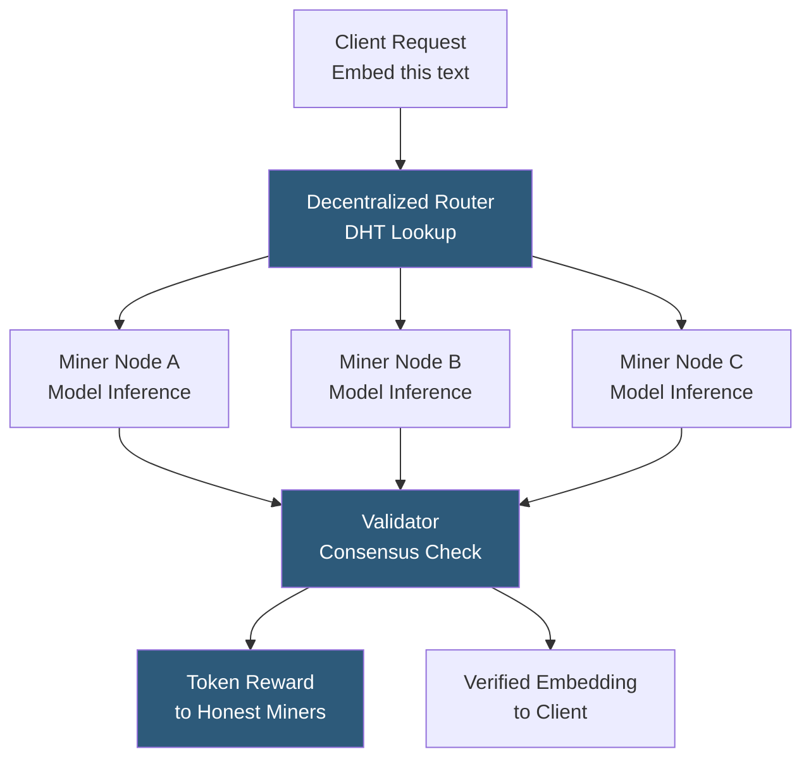

**Category:** Emerging Vector Technologies
**Difficulty:** Advanced
**Reading time:** 6 min read

---

Decentralized embedding networks distribute both embedding generation and vector storage across a peer-to-peer network of independent nodes, removing reliance on centralized API providers like OpenAI or Cohere. Projects like Bittensor (subnet 5 for embeddings), Ritual, and community-run Hugging Face inference nodes form nascent decentralized embedding infrastructure. These networks offer censorship resistance, no single-provider lock-in, and the ability for model providers to earn revenue through token incentives.

- **Validator-Miner Architecture** — miners run embedding inference; validators score output quality and slash dishonest miners' staked tokens
- **Proof of Inference** — cryptographic mechanism proving that a claimed embedding was genuinely computed by a specific model rather than fabricated
- **Staking and Slashing** — economic mechanism where miners stake tokens as collateral forfeited if they return incorrect embeddings
- **Model Consensus** — a process where multiple miners compute embeddings for the same input and validators detect outliers via embedding similarity
- **Decentralized Inference Network** — a permissionless network where anyone can contribute compute to serve embedding requests in exchange for token rewards
- **Content Routing** — DHT-based or reputation-based routing of embedding requests to nodes capable of running the requested model
- **zkML (Zero-Knowledge ML)** — using ZK proofs to verify that a returned embedding was honestly computed without re-running the model

Decentralized embedding networks use a validator-miner model inspired by blockchain consensus. Miners are nodes that run embedding model inference — they receive text or image inputs, compute embeddings using a declared model, and return the vector along with a cryptographic commitment. Validators are higher-stake nodes that sample miner outputs and verify their consistency.

Verification exploits a key property: for a fixed deterministic model, the same input always produces the same embedding. Validators run the same inference on sampled inputs and compare results. Miners whose outputs diverge beyond a tolerance threshold (indicating either hardware faults or deliberate manipulation) are penalized by having their staked tokens slashed. This game-theoretic incentive drives miners to run inference honestly.

For non-deterministic models or cases where re-running inference is expensive, zkML proofs provide an alternative: the miner generates a ZK proof that their claimed output is consistent with the model weights and input, which validators verify cheaply without re-executing the inference.

Routing leverages a distributed hash table (DHT) or a reputation-weighted directory: clients specify the model name and the router queries the DHT for miners that have registered support for that model and have sufficient reputation. Load is distributed across available miners based on capacity signals.

The primary limitation is latency: the DHT lookup, miner selection, and result aggregation add 50–500ms overhead versus a direct API call. Projects like Ritual are building optimistic inference where results are served speculatively and proofs are verified asynchronously.

- Censorship-resistant semantic search for content platforms in restrictive jurisdictions
- Decentralized AI applications requiring no single embedding provider
- Token-incentivized open embedding model serving for public goods
- Research networks where universities contribute compute for shared embedding infrastructure
- Web3 dApps requiring on-chain-provable embedding computation

| Advantage | Disadvantage |
|-----------|--------------|
| No single-provider lock-in or API dependency risk | Higher latency than centralized APIs due to routing and consensus overhead |
| Economic incentives for community-contributed compute | Validator slashing complexity; bugs in the validator logic harm honest miners |
| Censorship resistance for politically sensitive applications | Quality consistency harder to guarantee than centralized managed services |
| Community model governance without corporate control | Token economics may not sustain long-term network participation |

- [Blockchain-Based Vector Storage](blockchain-based-vector-storage.md)
- [Vector Search in Web3](vector-search-in-web3.md)
- [Federated Vector Search](federated-vector-search.md)

---
*Part of the [Emerging Vector Technologies](index.md) category · [Back to Master Index](../../index.md)*
