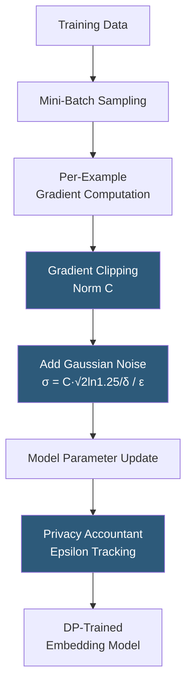

**Category:** Emerging Vector Technologies
**Difficulty:** Advanced
**Reading time:** 6 min read

---

Differential privacy (DP) provides a mathematical framework for releasing statistics about a dataset while limiting what can be learned about any individual record. Applied to embeddings, DP mechanisms add calibrated random noise to vectors before storage, training, or sharing, providing formal guarantees that the presence or absence of any single individual cannot be reliably detected from the released embeddings. This is increasingly required for GDPR-compliant AI systems processing personal data.

- **(epsilon, delta)-DP** — the formal guarantee: any algorithm's output probability changes by at most e^epsilon with probability 1-delta when any single record is added or removed
- **Laplace Mechanism** — adds noise drawn from a Laplace distribution scaled by sensitivity/epsilon; suitable for low-dimensional embeddings
- **Gaussian Mechanism** — adds Gaussian noise for (epsilon, delta)-DP; preferred for high-dimensional vectors due to better privacy-utility trade-off
- **Sensitivity** — the maximum L2 (or L1) change in an embedding when a single training record is modified; determines the noise scale
- **DP-SGD (DP Stochastic Gradient Descent)** — clips per-example gradients during model training, then adds Gaussian noise before the gradient update, training DP embedding models
- **Privacy Budget Accounting** — tracking cumulative privacy cost (epsilon) across multiple queries or training epochs using the moments accountant or Rényi DP
- **Local vs. Central DP** — local DP adds noise on-device before data leaves; central DP adds noise at the aggregator server after collection

Differential privacy for embeddings operates at two levels: training-time DP (protecting the training dataset) and inference-time DP (protecting query inputs or stored embeddings).

Training-time DP uses DP-SGD: during backpropagation, per-example gradients are computed and clipped to a maximum L2 norm C (preventing any single training example from dominating updates). Gaussian noise with standard deviation proportional to C/epsilon is added to the clipped sum of gradients before the optimizer step. This process is tracked by a privacy accountant (typically the moments accountant or zero-concentrated DP) that computes the cumulative epsilon consumed over all training steps. The final model's embedding outputs satisfy (epsilon, delta)-DP with respect to the training dataset — meaning an adversary with access to the trained model cannot distinguish whether any particular individual was in the training set.

Inference-time DP protects query embeddings or database embeddings at query time. The Gaussian mechanism adds noise with scale sigma = sqrt(2 * ln(1.25/delta)) * sensitivity / epsilon to the query embedding before sending it to the server. This provides local DP: the server learns a noisy version of the query that satisfies DP, limiting what can be inferred about the user's original query. The noise degrades ANN recall, so practitioners calibrate epsilon by measuring the recall@10 curve versus privacy budget on a held-out set.

Privacy budget management is critical in production: each query consumes a fraction of the per-user privacy budget. Systems implement a rolling budget window (e.g., epsilon = 1.0 per day per user) with query rate limiting to prevent budget exhaustion attacks.

- GDPR-compliant semantic search where EU personal data is embedded and queried
- Healthcare embeddings training on patient records requiring HIPAA privacy guarantees
- Federated analytics where embedding statistics are shared across data silos
- Training recommendation models on sensitive user behavior data
- Publishing embedding-based analytics about populations without individual exposure

| Advantage | Disadvantage |
|-----------|--------------|
| Formal mathematical privacy guarantee with quantifiable epsilon | Noise addition degrades embedding quality and ANN recall |
| Composable with other DP mechanisms via privacy budget accounting | Strong DP (small epsilon) requires large noise, severely hurting utility |
| Standard legal defensibility for GDPR/HIPAA compliance | DP-SGD training requires smaller batch sizes and more epochs |
| Local DP protects privacy even against honest-but-curious servers | Budget exhaustion from repeated queries requires rate limiting |

- [Privacy-Preserving Embeddings](privacy-preserving-embeddings.md)
- [Homomorphic Encryption for Vectors](homomorphic-encryption-for-vectors.md)
- [Federated Vector Search](federated-vector-search.md)

---
*Part of the [Emerging Vector Technologies](index.md) category · [Back to Master Index](../../index.md)*
