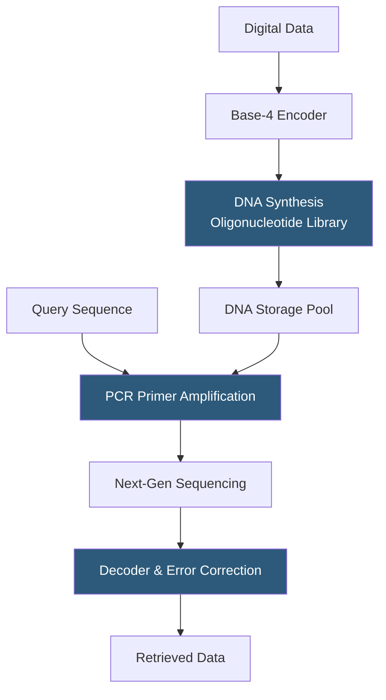

**Category:** Emerging Vector Technologies
**Difficulty:** Advanced
**Reading time:** 6 min read

---

DNA computing uses the biochemical properties of deoxyribonucleic acid — base pairing, strand displacement, and polymerase chain reactions — to encode, store, and retrieve information. For data retrieval applications, DNA's massive parallelism (trillions of molecules per milliliter) enables simultaneous search across all stored strands, making it theoretically ideal for exact and approximate similarity queries on encoded embeddings. This field is in early research phases with demonstrations in university labs.

- **DNA Storage Density** — theoretically 10^18 bits per gram, compared to 10^10 bits per gram for flash memory
- **Base-Pair Encoding** — mapping binary or analog data to sequences of adenine (A), thymine (T), guanine (G), cytosine (C)
- **Hybridization** — the Watson-Crick base-pairing process where complementary strands bind, forming the basis for content-addressable retrieval
- **Strand Displacement Cascade** — a chain reaction of DNA strand exchanges enabling computation without enzymes
- **PCR-Based Retrieval** — using polymerase chain reaction with primer sequences to selectively amplify and retrieve specific data strands
- **Random Access DNA Memory** — techniques allowing retrieval of specific files from a pooled DNA solution without reading all data
- **Error Correction in DNA** — redundancy coding applied to DNA sequences to handle synthesis and sequencing errors

DNA-based data retrieval begins with encoding: digital data is converted to DNA base sequences using a mapping (e.g., 00→A, 01→C, 10→G, 11→T) with error-correcting codes interspersed to handle synthesis defects. The encoded sequences are synthesized as short oligonucleotides (typically 100–300 bases) by DNA synthesis machines and pooled into a physical tube.

Retrieval exploits hybridization chemistry. To retrieve specific data, primer sequences complementary to address regions of the target strands are added to the pool along with PCR reagents. The polymerase chain reaction amplifies only strands matching the primer, exponentially enriching the target data from background noise. The amplified strands are then sequenced by a next-generation sequencer, and the digital data is reconstructed via the decoder.

For similarity-based retrieval, researchers have demonstrated "approximate string matching in DNA" by designing primers with intentional mismatches or using degenerate bases that hybridize to multiple related sequences. A query embedding encoded as DNA can hybridize preferentially to its nearest neighbors in Hamming space, effectively performing a massively parallel similarity filter.

The fundamental bottlenecks are read latency (hours for sequencing) and cost ($1,000+ per gigabyte for synthesis in 2024). Write-once immutability and the wet-lab environment limit DNA storage to archival applications today. However, Microsoft Research's Project Silica and others are targeting automated DNA storage systems for cold archival by 2030.

- Ultra-dense archival storage of genomic databases and scientific data
- Content-addressable biological data retrieval by sequence similarity
- Research into molecular computing and biocomputing paradigms
- Long-duration data preservation (DNA is stable for 10,000+ years)
- Exploratory biosensor systems with molecular pattern recognition

| Advantage | Disadvantage |
|-----------|--------------|
| Theoretical storage density exceeds all silicon alternatives | Read/write latency measured in hours, not milliseconds |
| Massively parallel chemical search across trillions of molecules | Synthesis and sequencing costs remain prohibitively high |
| Extraordinary longevity — stable for millennia in dry conditions | Write-once: in-place updates require full pool replacement |
| Zero power consumption for long-term storage | Requires wet-lab infrastructure, not data-center-compatible |

- [Quantum Computing for Similarity Search](quantum-computing-for-similarity-search.md)
- [Photonic Vector Processing](photonic-vector-processing.md)
- [Neuromorphic Vector Search](neuromorphic-vector-search.md)

---
*Part of the [Emerging Vector Technologies](index.md) category · [Back to Master Index](../../index.md)*
