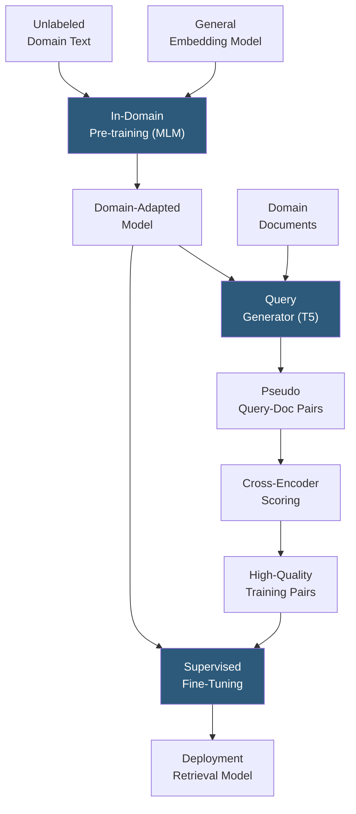

**Category:** Emerging Vector Technologies
**Difficulty:** Intermediate
**Reading time:** 6 min read

---

Domain adaptation for vectors bridges the distributional gap between a general-purpose embedding model's training distribution and the specialized text, terminology, and query patterns of a target deployment domain. Through techniques ranging from continued pre-training to lightweight adapter modules, domain adaptation produces retrieval models that outperform general embeddings on specialized corpora without sacrificing broad generalization.

- **Domain Shift** — the statistical difference between the distribution of training data and target deployment data that degrades model performance
- **In-Domain Pre-training** — continued unsupervised training on unlabeled target-domain text using masked language modeling objectives
- **Adapter Modules** — lightweight bottleneck networks inserted between transformer layers, trained on domain data while the backbone is frozen
- **Task-Adaptive Pre-training (TAPT)** — continued pre-training on unlabeled data from the exact task distribution (e.g., only query-like text) rather than the full domain
- **Generative Augmentation** — using a language model to synthetically generate domain-specific query-document pairs, bootstrapping supervised fine-tuning data
- **GPL (Generative Pseudo-Labeling)** — pipeline combining a query generator, cross-encoder reranker, and negative mining to produce pseudo-labeled training data for any domain
- **Vocabulary Expansion** — adding domain-specific subwords to the tokenizer vocabulary to improve tokenization of specialized terminology

Domain adaptation proceeds through two primary stages. The first is **unsupervised domain adaptation**: continuing masked language modeling on unlabeled domain text. For specialized domains like biomedicine or legal, the tokenizer may first be extended with domain vocabulary derived from subword frequencies in domain corpora, improving tokenization of technical terms that would otherwise be fragmented. Continued pre-training for 10,000–100,000 steps on domain text moves the model's representations toward domain-specific semantic structure.

When labeled query-document pairs are unavailable — the common case for niche domains — **Generative Pseudo-Labeling (GPL)** provides a pathway to supervised fine-tuning data. A sequence-to-sequence model (e.g., docT5query) is fine-tuned to generate plausible search queries for documents. For each domain document, multiple queries are generated, producing a large pool of synthetic (query, document) pairs. A cross-encoder reranker then scores each synthetic pair and assigns a soft pseudo-label score. Only high-scoring pairs pass a quality filter and are used for contrastive fine-tuning.

Adapter-based domain adaptation offers a parameter-efficient alternative: bottleneck adapter layers (projecting down to 64–256 dimensions then back up) are inserted between transformer layers. Only adapter weights are updated during domain training, preserving the general embedding structure while encoding domain-specific transformations. Multiple domain adapters can coexist on the same backbone and be switched at runtime, enabling a single serving instance to handle legal, medical, and financial queries with domain-appropriate embeddings.

GPL on average achieves 10–20% NDCG@10 improvement over zero-shot general model performance across BEIR domains using only unlabeled domain documents as input.

- Pharmaceutical research search adapting general models to drug interaction literature
- Legal discovery systems fine-tuned on jurisdiction-specific case law
- Financial regulatory compliance search adapted to regulatory document corpora
- Manufacturing quality control knowledge base with specialized technical documentation
- Customer support search for SaaS products with domain-specific feature terminology

| Advantage | Disadvantage |
|-----------|--------------|
| GPL enables supervised fine-tuning with zero labeled data | Generative augmentation quality depends on generator model capability |
| Adapter modules enable multi-domain serving from one backbone | In-domain pre-training compute cost scales with domain corpus size |
| Significant recall improvement (10–20%) over zero-shot baselines | Domain-specific vocabulary expansion requires tokenizer retraining |
| Preserves general embedding capabilities via adapter isolation | Quality filtering of GPL data requires a cross-encoder inference pass |

- [Transfer Learning for Retrieval](transfer-learning-for-retrieval.md)
- [Cross-Domain Embeddings](cross-domain-embeddings.md)
- [Zero-Shot Vector Search](zero-shot-vector-search.md)

---
*Part of the [Emerging Vector Technologies](index.md) category · [Back to Master Index](../../index.md)*
