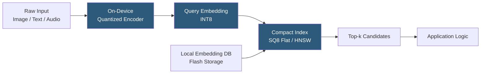

**Category:** Emerging Vector Technologies
**Difficulty:** Intermediate
**Reading time:** 5 min read

---

Edge vector search brings approximate nearest-neighbor retrieval to resource-constrained devices — smartphones, IoT sensors, smart cameras, and embedded systems — without requiring a cloud round-trip. By combining aggressive quantization, compact index structures, and hardware-aware optimization, edge ANN systems achieve practical recall rates within tight power budgets. This enables privacy-preserving, low-latency AI features like on-device face recognition, voice embedding matching, and semantic document search.

- **Scalar Quantization (SQ8/SQ4)** — compressing FP32 embedding components to 8-bit or 4-bit integers, reducing memory footprint 4–8× with minimal recall loss
- **Binary Embeddings** — extreme quantization encoding each dimension as a single bit; Hamming distance computation is orders of magnitude faster than L2
- **Flat Index** — brute-force linear scan of quantized embeddings; practical for databases up to ~100k vectors on-device
- **Compact HNSW** — an HNSW graph trimmed to lower `m` values (4–8 vs 16–64) for memory-constrained edge deployments
- **On-Device Embedding Model** — quantized transformer (MobileNet, TinyBERT, DistilBERT) generating embeddings entirely on-device
- **Incremental Index Update** — online insertion of new embeddings without full index reconstruction, critical for continually updated on-device knowledge bases
- **TensorFlow Lite / ONNX Runtime Edge** — inference runtimes delivering quantized embedding model execution on ARM, x86, and NPU targets

Edge vector search systems are designed around a tight memory budget — typically 50–500 MB for the combined embedding model and index. Quantization is the primary lever: scalar quantization to INT8 reduces a 768-dimensional FP32 vector from 3 KB to 768 bytes, fitting a 100k-vector database into 75 MB. Binary quantization goes further, encoding 768 dimensions in 96 bytes (768 bits), enabling a million-vector flat scan in tens of milliseconds on a mobile CPU.

The embedding model is a compact, quantized encoder. TinyBERT or MobileBERT fine-tuned with knowledge distillation from a larger teacher model generates embeddings that trade some accuracy for 10–50× size reduction. The INT8-quantized model fits in an NPU on modern smartphones (Qualcomm Hexagon, Apple Neural Engine), where inference runs at <10ms latency without touching the CPU.

Index structures for edge use a conservative HNSW (m=4, ef=16) or a two-level IVF with small nlist. The index is stored in a memory-mapped file on flash, with frequently accessed layers pinned to RAM. Incremental updates use a dual-buffer approach: new embeddings append to a staging flat index while the main HNSW remains immutable; a background merge integrates the staging buffer periodically.

Privacy is a core benefit: raw user data (photos, messages, documents) never leaves the device. The embedding index captures semantic meaning without exposing raw content, and searches against local knowledge bases produce instant results offline.

- On-device face recognition for photo library organization
- Offline semantic document search in mobile productivity apps
- Smart speaker wake-word and voice profile matching without cloud
- Industrial inspection cameras identifying defect patterns locally
- Wearable health devices matching biosignal patterns to reference libraries

| Advantage | Disadvantage |
|-----------|--------------|
| Zero network latency; works fully offline | Smaller model and index capacity limits recall accuracy |
| Privacy-preserving: raw data stays on-device | Quantization introduces approximation error in distances |
| Reduces cloud infrastructure costs | Index updates on constrained hardware are slow |
| Low power consumption with NPU-accelerated encoding | Managing index consistency across app updates is complex |

- [On-Device Embedding Search](on-device-embedding-search.md)
- [Federated Vector Search](federated-vector-search.md)
- [In-Memory Vector Computing](in-memory-vector-computing.md)

---
*Part of the [Emerging Vector Technologies](index.md) category · [Back to Master Index](../../index.md)*
