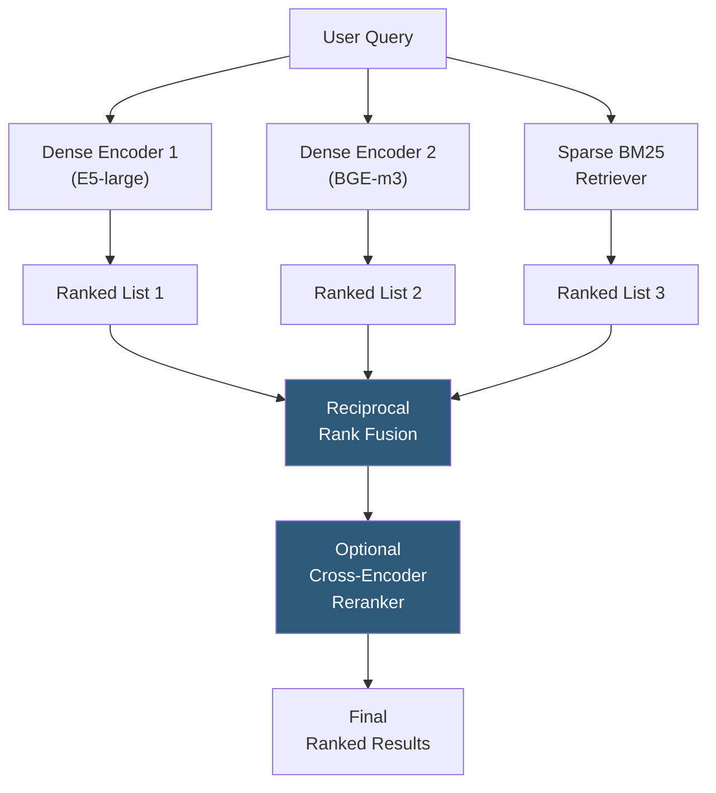

**Category:** Emerging Vector Technologies
**Difficulty:** Advanced
**Reading time:** 6 min read

---

Ensemble embedding methods combine predictions from multiple independent embedding models or retrieval strategies to produce search results more accurate and robust than any single model achieves alone. By exploiting diversity in model architectures, training data, and retrieval mechanisms, ensembles reduce variance, cover complementary relevance signals, and improve tail-query performance where individual models exhibit systematic blind spots.

- **Reciprocal Rank Fusion (RRF)** — parameter-free score fusion combining ranked lists from multiple retrievers by summing reciprocal rank positions; k=60 constant prevents domination by top-ranked items
- **Dense-Sparse Hybrid Retrieval** — combining dense embedding retrieval (semantic) with sparse BM25 retrieval (lexical) to cover both semantic and keyword matching
- **Embedding Concatenation** — concatenating vectors from multiple encoders into a single higher-dimensional vector for unified ANN search
- **Score Normalization** — converting raw similarity scores to a common scale before aggregation, using min-max normalization or z-score standardization
- **Model Diversity** — the key prerequisite for effective ensembles; models trained on different data, with different architectures, or optimized for different objectives
- **Late Fusion** — aggregating ranked result lists after individual retrieval, the most common ensemble approach in production
- **Early Fusion** — combining embedding representations before retrieval, e.g., via concatenation or learned weighted sum

The most widely deployed ensemble strategy in production retrieval is **Reciprocal Rank Fusion**. Each retriever independently returns a ranked list of document IDs for a query. RRF assigns each document a score of 1/(k + rank) for each list it appears in, where k=60 is a smoothing constant, and sums scores across all lists. Documents appearing consistently in high positions across multiple lists receive the highest fused scores. RRF's parameter-free design means no calibration is needed when adding or removing retrievers — a significant operational advantage.

**Dense-sparse hybrid retrieval** is the single most impactful ensemble combination. Dense retrievers excel at semantic and paraphrase matching but can fail on exact entity lookups (rare product codes, proper nouns). BM25 reliably handles these cases. Their complementary failure modes mean fusion consistently outperforms either alone, achieving 3–8% NDCG@10 improvement across BEIR benchmarks.

**Embedding concatenation** (early fusion) takes vectors from multiple encoders and concatenates them into a joint representation. For two 768-dimensional encoders, this produces a 1536-dimensional vector. The combined ANN index implicitly performs joint retrieval. This approach enables capturing complementary semantic dimensions encoded by different models (e.g., one trained primarily on web text, another on scientific literature) but doubles index storage and reduces ANN search efficiency.

**Learned fusion** trains a small neural network on annotated data to optimally weight each retriever's score. While more powerful than RRF, it requires labeled training data and is sensitive to distribution shift. In practice, RRF is the default starting point, with learned fusion reserved for high-traffic queries where the additional complexity is justified.

- Production search requiring robustness across diverse query types (keyword, semantic, entity)
- E-commerce search where product code lookups (sparse) and descriptive queries (dense) coexist
- Multi-language deployments combining language-specific BM25 with multilingual dense models
- Long-tail query improvement where single models exhibit systematic coverage gaps
- Fallback reliability for SLA-critical search where single-model failures need mitigation

| Advantage | Disadvantage |
|-----------|--------------|
| Consistently improves recall over any single retriever | Latency increases linearly with number of retrievers |
| RRF requires no labeled calibration data | Storage doubles or more for concatenation-based ensembles |
| Covers complementary failure modes of diverse models | Debugging relevance issues is harder with multiple contributing models |
| Robust to individual model updates; other models act as safety net | Operational complexity of maintaining and updating multiple model versions |

- [Adaptive Indexing Strategies](adaptive-indexing-strategies.md)
- [Transformer-Based Indexing](transformer-based-indexing.md)
- [Domain Adaptation for Vectors](domain-adaptation-for-vectors.md)

---
*Part of the [Emerging Vector Technologies](index.md) category · [Back to Master Index](../../index.md)*
