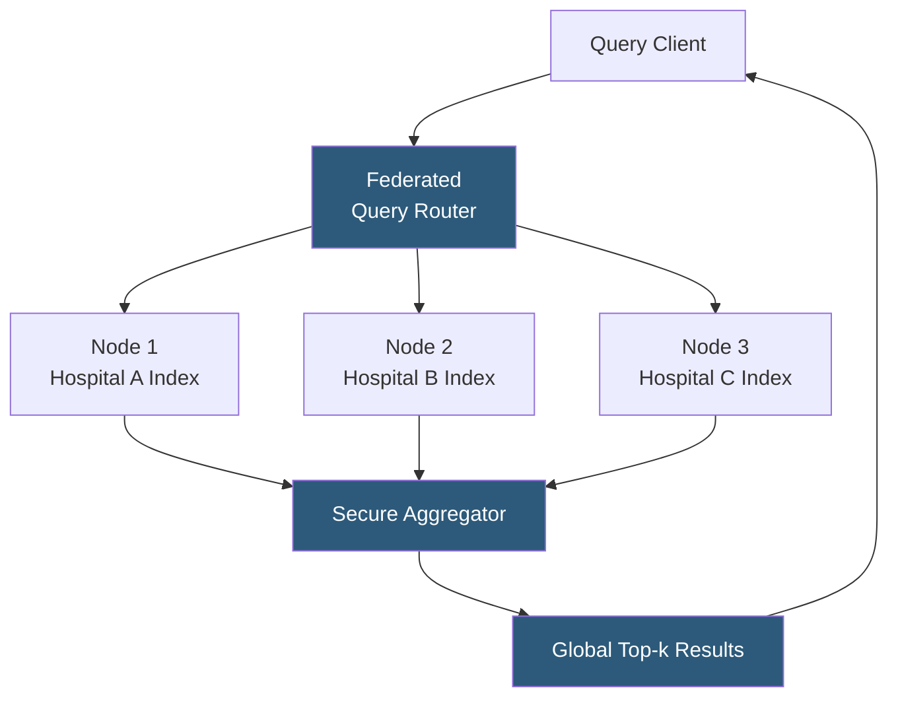

**Category:** Emerging Vector Technologies
**Difficulty:** Advanced
**Reading time:** 6 min read

---

Federated vector search distributes similarity search across multiple isolated data silos — hospitals, banks, or devices — without centralizing the underlying data. Each node maintains its own embedding index and responds to search queries by sharing only result candidates or encrypted similarity scores, never raw data. This architecture enables collaborative AI search across organizational or jurisdictional boundaries while satisfying GDPR, HIPAA, and data sovereignty requirements.

- **Federated Query Routing** — broadcasting query embeddings to all participating nodes and aggregating their top-k results into a global result set
- **Secure Aggregation** — combining partial similarity scores from multiple nodes using cryptographic protocols so no single party learns individual node contributions
- **Differential Privacy for Search** — adding calibrated noise to shared candidate lists to prevent membership inference attacks on the index
- **Federated Index** — a virtual distributed index where each node hosts its own local HNSW or IVF structure, invisible to other nodes
- **Gossip-Based Freshness** — lightweight peer-to-peer protocol propagating index updates across federated nodes without central coordination
- **Threshold k Selection** — each node returns k' > k candidates locally to guarantee the global merge yields accurate top-k results
- **Data Residency Enforcement** — routing query shards only to nodes in approved geographic or jurisdictional zones

A federated vector search query begins at the router, which broadcasts the query embedding (or its privacy-protected version) to all participating nodes. Each node performs a local ANN search against its private index, returning its top-k' candidates (with k' selected to provide statistical guarantee that the true global top-k is covered). Crucially, nodes share candidate IDs and distances, not the underlying documents or embeddings.

The secure aggregator merges candidate lists using a ranked merge algorithm — typically the Threshold Algorithm (TA) or a round-robin merge — that determines global top-k without requesting more candidates than necessary. For privacy-critical deployments, the aggregation uses a secure multi-party computation protocol: each node encrypts its distance scores under a shared public key, and the aggregator decrypts only the minimum needed to establish the top-k boundary.

Differential privacy adds controlled noise to the distances returned by each node, ensuring that whether a specific record is in the index cannot be inferred from repeated queries. The privacy budget (epsilon) is allocated per node per time window, balanced against the acceptable recall degradation from added noise.

Gossip-based index freshness propagates metadata (new record counts, index version hashes) between nodes on a configurable schedule. When a node detects that a peer's index has grown significantly, it triggers a rebalancing negotiation to keep query load proportional to each node's index size.

- Multi-hospital clinical trial matching searching across independent patient EHR embeddings
- Financial crime detection aggregating transaction embeddings across competing banks
- Cross-organizational research paper discovery respecting institutional data agreements
- Government data sharing programs requiring in-country data residency
- IoT fleet analysis searching across device-local sensor embedding indexes

| Advantage | Disadvantage |
|-----------|--------------|
| Satisfies data sovereignty and residency requirements | Higher query latency due to network round-trips to each node |
| Enables collaboration without centralizing sensitive data | Recall may be lower than centralized index due to threshold effects |
| Resilient to single-node failure for partial results | Operational complexity of managing multi-party trust agreements |
| Scales by adding nodes without migrating data | Network partition can cause incomplete results |

- [Privacy-Preserving Embeddings](privacy-preserving-embeddings.md)
- [Homomorphic Encryption for Vectors](homomorphic-encryption-for-vectors.md)
- [Decentralized Embedding Networks](decentralized-embedding-networks.md)

---
*Part of the [Emerging Vector Technologies](index.md) category · [Back to Master Index](../../index.md)*
