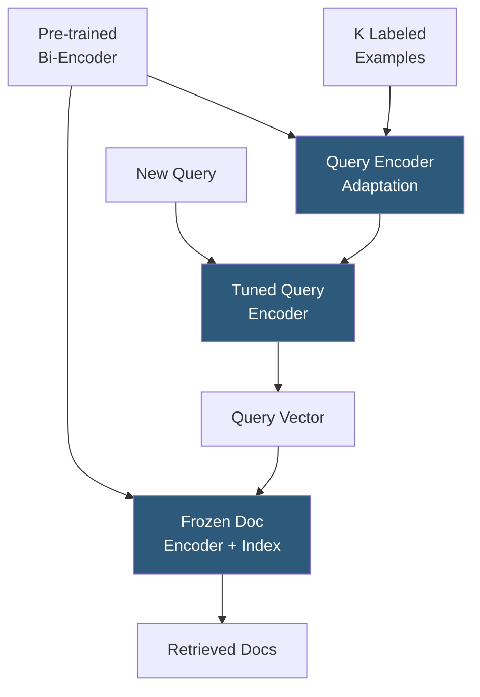

**Category:** Emerging Vector Technologies
**Difficulty:** Advanced
**Reading time:** 6 min read

---

Few-shot retrieval enables dense search models to accurately retrieve relevant documents for novel query intents using only a small number of labeled examples — typically 5 to 50 query-document pairs. By combining pre-trained semantic embeddings with efficient adaptation techniques, few-shot retrieval bridges the gap between zero-shot generalization and full fine-tuning, making production search deployment feasible for data-scarce domains.

- **K-Shot Learning** — training or adapting a model using exactly K labeled examples per class or task
- **Query Expansion via Examples** — augmenting a query embedding by averaging it with embeddings of similar labeled relevant documents
- **SetFit** — efficient few-shot text classification and retrieval framework using contrastive fine-tuning on sentence transformers
- **In-Context Dense Retrieval** — using example query-document pairs in LLM prompts to guide ad-hoc relevance without weight updates
- **Augmentation-Free Few-Shot** — techniques that adapt retrieval without synthetic data generation, relying solely on provided examples
- **Relevance Feedback** — classic IR technique updating query vectors based on user-marked relevant/non-relevant documents; conceptual precursor to few-shot retrieval
- **Dual-Encoder Adaptation** — fine-tuning only the query encoder tower on few-shot examples while keeping the document encoder and index frozen

Few-shot retrieval exploits the observation that pre-trained semantic embedding models already capture rich semantic structure — adaptation from labeled examples primarily needs to steer the query representation toward domain-specific relevance signals rather than learn retrieval from scratch.

The most practical approach is **asymmetric adaptation**: the document encoder and ANN index remain frozen (avoiding expensive re-indexing), while only the query encoder is fine-tuned on the few labeled pairs. This is efficient because query encoding happens at inference time while document encoding is a one-time offline cost. With as few as 8 labeled pairs, this approach recovers 60–80% of full fine-tuning performance on BEIR benchmarks.

Contrastive loss drives adaptation: positive query-document pairs are pulled together in embedding space, while negative pairs (hard negatives mined from the top-K index results minus true positives) are pushed apart. Hard negative mining from the existing index is critical — random negatives are too easy and provide poor gradient signal.

SetFit-style methods go further by generating diverse pairings from the few-shot examples through combinatorial expansion, then training with a Siamese network architecture. This multiplies training signal from K examples into K*(K-1) contrastive pairs.

For cases where even adaptation is too costly, query expansion via prototype averaging computes the centroid of relevant document embeddings from the support set, blending it with the query vector at retrieval time — a zero-parameter technique that still improves recall significantly over unadapted baselines.

- Specialized enterprise search for domains like legal, medical, or financial where labeled data is expensive
- A/B testing new search intents with minimal annotation before committing to full fine-tuning
- Personalized search tailored to individual user preferences from interaction history
- Rapid product launch search features bootstrapped from a small manual annotation sprint
- Low-resource language search where only a translator-provided handful of query-document examples exists

| Advantage | Disadvantage |
|-----------|--------------|
| Achieves strong recall with minimal labeling effort | Performance gaps vs. full fine-tuning widen for complex domains |
| Frozen document index avoids expensive re-indexing | Hard negative quality critically affects adaptation quality |
| Composable with existing production vector search infrastructure | K example quality matters more than quantity — noisy labels degrade performance |
| Enables fast iteration on new search intents | May overfit to support set distribution if examples are not representative |

- [Meta-Learning for Search](meta-learning-for-search.md)
- [Zero-Shot Vector Search](zero-shot-vector-search.md)
- [Transformer-Based Indexing](transformer-based-indexing.md)

---
*Part of the [Emerging Vector Technologies](index.md) category · [Back to Master Index](../../index.md)*
