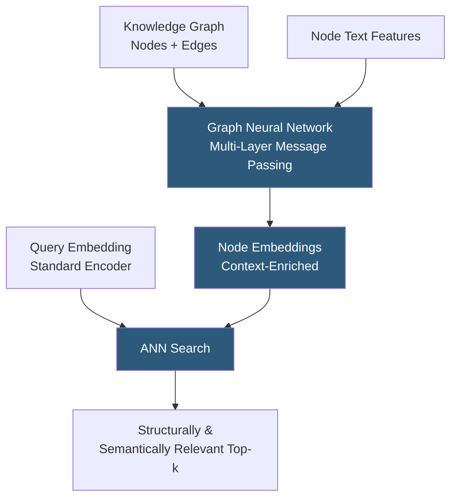

**Category:** Emerging Vector Technologies
**Difficulty:** Advanced
**Reading time:** 7 min read

---

Graph Neural Networks (GNNs) improve embedding quality for structured retrieval tasks by aggregating information from an entity's neighbors in a knowledge graph, citation network, or social graph. Instead of encoding documents in isolation, GNN-based embedding models incorporate relational context, producing embeddings where structurally similar nodes cluster together. This yields significant retrieval improvements in domains with rich graph structure: academic papers, product catalogs, and enterprise knowledge bases.

- **Message Passing** — the GNN mechanism where each node aggregates feature vectors from its immediate neighbors, iterating for multiple hops
- **GraphSAGE** — a scalable GNN that samples a fixed number of neighbors per hop, enabling inductive learning on unseen nodes
- **Graph Attention Network (GAT)** — a GNN variant that learns attention weights over neighbors, emphasizing the most relevant connections
- **Heterogeneous Graph** — a graph with multiple node types (author, paper, topic) and edge types (wrote, cites, covers), requiring type-aware message passing
- **Node Embedding** — the output of a GNN: a fixed-dimensional vector for each node capturing both its features and its structural position
- **Transductive vs. Inductive GNN** — transductive models embed only nodes seen at training time; inductive models generalize to new nodes, required for live search systems
- **Graph-Augmented Retrieval** — using GNN-derived embeddings alongside standard text embeddings for a hybrid search that leverages relational structure

GNN-based search systems build upon standard text encoders by adding a relational aggregation step. Each entity in the knowledge base is represented as a node with text features (a BERT embedding of its description) and structural connections (citations, links, category memberships). The GNN iteratively updates each node's representation by aggregating its neighbors' current representations.

In a two-layer GNN, the first message-passing layer gives each node access to its direct neighbors' features. The second layer extends this to two-hop neighbors, capturing patterns like "papers that are co-cited by influential papers" or "products that share suppliers with popular items." The GNN learns weights (in standard GNNs) or attention weights (in GAT) that determine how much each neighbor type should influence the central node's embedding.

For heterogeneous graphs with multiple entity and relation types, R-GCN (Relational GCN) or HAN (Heterogeneous Attention Network) apply separate weight matrices per relation type, preserving the distinct semantics of different edge types. A paper's "authored_by" neighbors contribute differently than its "cites" neighbors.

At query time, the user's query has no graph position, so it is encoded with the standard text encoder. The ANN search then operates in the GNN embedding space, where structurally important nodes have been shifted toward each other — papers in the same research community cluster tightly even if their abstracts use different terminology.

Training uses contrastive objectives on positive/negative node pairs derived from the graph structure: connected nodes are pulled together, random non-connected nodes are pushed apart. Fine-tuning on downstream retrieval benchmarks (MS MARCO, BEIR) with the graph loss as a regularizer preserves both relational and semantic signal.

- Academic paper discovery using citation graph structure to improve semantic search
- E-commerce product recommendation combining text similarity and purchase co-occurrence graphs
- Enterprise knowledge graph search incorporating document-to-concept relationships
- Drug discovery: searching molecular similarity using chemical interaction graphs
- Social content recommendation combining text embeddings with social connection graphs

| Advantage | Disadvantage |
|-----------|--------------|
| Captures relational context invisible to text-only encoders | Requires constructing and maintaining a graph alongside the document corpus |
| Improves recall for structurally related entities | GNN inference is more expensive than simple encoder forward passes |
| Inductive models generalize to new nodes without retraining | Graph quality directly impacts embedding quality: noisy edges hurt performance |
| Compatible with standard ANN indexes after embedding generation | Multi-hop aggregation risks over-smoothing: distant nodes become indistinguishable |

- [Attention-Based Retrieval](attention-based-retrieval.md)
- [Transformer-Based Indexing](transformer-based-indexing.md)
- [Cross-Domain Embeddings](cross-domain-embeddings.md)

---
*Part of the [Emerging Vector Technologies](index.md) category · [Back to Master Index](../../index.md)*
