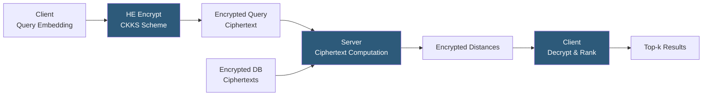

**Category:** Emerging Vector Technologies
**Difficulty:** Advanced
**Reading time:** 7 min read

---

Homomorphic encryption (HE) enables computation on encrypted data without decryption, allowing vector similarity search to be performed on a server that never sees the plaintext embeddings. A client encrypts its query and database embeddings under an HE scheme; the server computes ciphertext distances and returns encrypted results; only the client can decrypt the top-k answers. This provides cryptographic confidentiality guarantees far stronger than differential privacy or access controls.

- **Fully Homomorphic Encryption (FHE)** — allows arbitrary addition and multiplication on ciphertexts, supporting any computable function but with enormous computational overhead
- **Somewhat Homomorphic Encryption (SHE)** — supports a bounded number of operations; sufficient for inner product computation used in cosine similarity
- **CKKS Scheme** — a HE scheme supporting approximate arithmetic on real-valued data, ideal for floating-point embedding computations
- **Ciphertext Inner Product** — computing the dot product of two encrypted vectors as a sequence of homomorphic multiplications and additions
- **Bootstrapping** — a computationally expensive operation that refreshes the noise level in a ciphertext, enabling deeper circuits
- **Batching (SIMD packing)** — encoding multiple embedding components into a single ciphertext polynomial for parallel computation
- **Noise Budget** — the limited number of operations a ciphertext supports before the noise level corrupts the plaintext; managed by circuit depth planning

Homomorphic encryption for vector search uses the CKKS (Cheon-Kim-Kim-Song) scheme, which supports approximate arithmetic on real numbers — perfectly suited to floating-point embedding vectors. The client encrypts the query embedding and the database manager encrypts all stored embeddings under the client's public key. The resulting ciphertext polynomials are transmitted to the computation server.

The server computes cosine similarity by evaluating the inner product formula homomorphically: element-wise homomorphic multiplication of corresponding ciphertext components followed by a homomorphic sum reduction across dimensions. Thanks to batching, up to 8192 embedding dimensions can be packed into a single ciphertext polynomial, dramatically reducing the number of ciphertext operations. For 768-dimensional embeddings batched with CKKS at 128-bit security, a single inner product requires approximately 12 ciphertext multiplications.

The computational overhead is the primary challenge. A single CKKS inner product for a 768D vector takes approximately 100ms on a modern server versus microseconds for plaintext computation. Searching a database of 10 million embeddings naively requires 1,000 server-years of compute. Practical deployments mitigate this through hybrid approaches: homomorphic computation is applied only to a pre-filtered candidate set (from non-sensitive coarse clustering), reducing the HE portion to 100–1000 candidates.

Active research directions include leveled HE circuits that avoid expensive bootstrapping for inner product computation, GPU-accelerated HE libraries (Microsoft SEAL on CUDA), and custom HE-friendly embedding models trained to reduce required circuit depth.

- Medical: hospital queries against an encrypted patient embedding database held by a cloud provider
- Government intelligence: cross-agency search where neither party can see the other's data
- Financial: bank-to-bank similar transaction search without exposing customer records
- Privacy-preserving recommendation: matching user preference embeddings against item embeddings without server learning user preferences
- Regulatory compliance scenarios requiring zero-knowledge database access

| Advantage | Disadvantage |
|-----------|--------------|
| Cryptographic confidentiality: server learns zero plaintext information | Compute overhead is 10^6× versus plaintext; only feasible for small candidate sets |
| Composable with other privacy tools (DP, access control) | Ciphertext sizes are 100–1000× larger than plaintext vectors |
| Provable security under standard lattice hardness assumptions | Bootstrapping operations are impractical for full database scans |
| Outsourcing search computation without data exposure | Key management complexity; client must maintain decryption key securely |

- [Differential Privacy in Embeddings](differential-privacy-in-embeddings.md)
- [Privacy-Preserving Embeddings](privacy-preserving-embeddings.md)
- [Federated Vector Search](federated-vector-search.md)

---
*Part of the [Emerging Vector Technologies](index.md) category · [Back to Master Index](../../index.md)*
