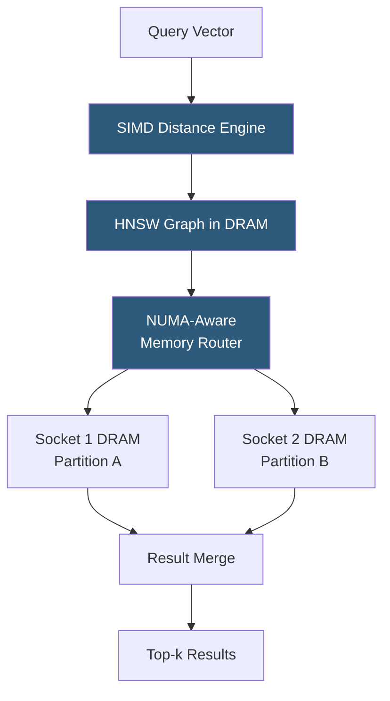

**Category:** Emerging Vector Technologies
**Difficulty:** Intermediate
**Reading time:** 5 min read

---

In-memory vector computing keeps entire embedding databases resident in RAM to eliminate disk I/O latency from similarity search. Modern systems combine DRAM-resident HNSW graphs with NUMA-aware access patterns and persistent memory technologies like Intel Optane to scale beyond single-machine RAM limits. This approach achieves sub-millisecond ANN latency at billion-scale by trading memory cost for compute efficiency.

- **DRAM-Resident Index** — entire vector index loaded into RAM, enabling memory-bandwidth-bound rather than I/O-bound search
- **NUMA (Non-Uniform Memory Access)** — multi-socket server architecture where CPUs access local memory faster than remote sockets; critical for scaling in-memory search
- **Persistent Memory (PMem)** — byte-addressable non-volatile memory (e.g., Intel Optane) providing DRAM-like access speeds with SSD-like density
- **Memory-Mapped Files** — OS abstraction allowing large vector indexes to be accessed via virtual memory without explicit load/unload operations
- **SIMD Vectorization** — using CPU instructions (AVX-512) to compute 16 float32 distances in a single instruction, maximizing memory bandwidth utilization
- **Pinned Memory** — locking vector index pages in physical RAM to prevent OS eviction under memory pressure
- **Tiered Memory Architecture** — hot embeddings in DRAM, warm embeddings in PMem, cold embeddings on NVMe SSD

In-memory vector computing begins with startup: the vector index (typically an HNSW graph or IVF structure) is loaded from persistent storage entirely into DRAM. For a billion-vector database with 768-dimensional FP32 embeddings, this requires approximately 3TB of RAM — achievable on large-memory servers with 12–24 DIMMs or through quantization to reduce footprint.

Query processing exploits CPU SIMD units: AVX-512 instructions compute 16 float32 differences and their squares simultaneously, enabling L2 distance computation at peak memory bandwidth (~300 GB/s on modern Xeon Scalable processors). HNSW graph traversal accesses neighbor lists stored in compact arrays aligned to cache lines, minimizing cache miss penalties.

NUMA topology is critical at scale. A 4-socket server with 6TB total RAM partitions the index across sockets. A NUMA-aware router analyzes query load to route search shards to local NUMA nodes, reducing remote memory access penalties (which add ~100ns per hop). Systems like Microsoft's DiskANN and Milvus implement explicit NUMA affinity in their thread pool designs.

Tiered memory extends capacity: Intel Optane PMem in App Direct mode provides 4–6× more byte-addressable capacity than DRAM at ~3× lower bandwidth. Frequently accessed cluster centroids and graph entry points remain in DRAM while less-accessed leaf nodes reside in PMem. A feedback-driven hot/cold migration policy continuously reshuffles placement based on access frequency histograms.

- Billion-scale product recommendation requiring <10ms p99 latency
- Real-time ad matching where embedding databases must be fully current
- Financial fraud detection needing microsecond transaction embedding lookup
- Search engines with strict SLA requirements on query latency
- Online feature stores for ML serving pipelines

| Advantage | Disadvantage |
|-----------|--------------|
| Sub-millisecond ANN latency without disk I/O | RAM cost is 10–50× higher than SSD-based storage |
| Predictable latency without I/O queue variance | Large startup time to load indexes into memory |
| Full SIMD and cache hierarchy utilization | Memory capacity limits practical scale without quantization |
| Simplifies deployment: no warm-up after cold start | NUMA misconfiguration can cause severe latency degradation |

- [FPGA Acceleration for Vectors](fpga-acceleration-for-vectors.md)
- [Edge Vector Search](edge-vector-search.md)
- [AI-Optimized Vector Indexes](ai-optimized-vector-indexes.md)

---
*Part of the [Emerging Vector Technologies](index.md) category · [Back to Master Index](../../index.md)*
