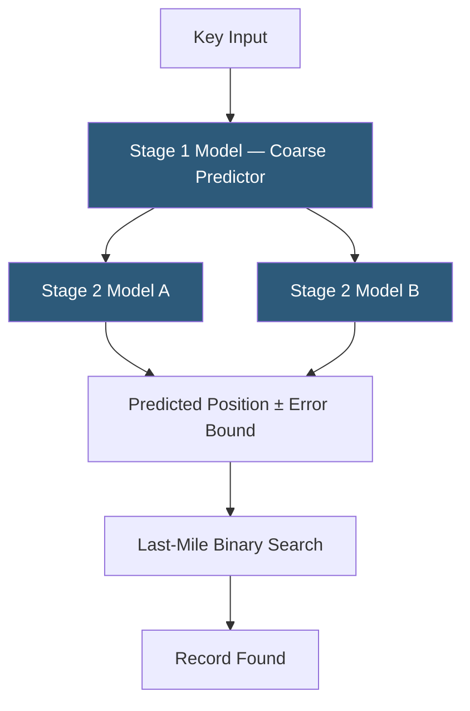

**Category:** Emerging Vector Technologies
**Difficulty:** Advanced
**Reading time:** 6 min read

---

Learned index structures replace classical B-trees and hash tables with machine learning models that predict the memory or disk position of a key. Pioneered by Google's 2018 "The Case for Learned Index Structures" paper, they exploit the regularity in data distributions to achieve smaller memory footprints and faster lookups than their handcrafted counterparts. Modern variants extend this idea to multi-dimensional and high-dimensional vector data.

- **Recursive Model Index (RMI)** — a hierarchy of models where each stage refines the position prediction of the next, trading accuracy for speed
- **CDF Approximation** — modeling the cumulative distribution function of keys so the model output directly maps to a sorted position
- **Error Bounds** — minimum and maximum position offsets that guarantee a local binary search will always find the key
- **Last-Mile Search** — the small, bounded binary search used to locate the exact key after the model predicts its approximate position
- **ALEX** — an updatable learned index that dynamically inserts gaps to handle new keys without full retraining
- **PGM Index** — Piecewise Geometric Model index offering provably optimal space-time trade-offs for sorted data
- **Multi-dimensional Learned Index** — extension of learned indexes to 2D/3D spatial or embedding-space coordinates

A learned index treats the index as a function that maps a key to its position in a sorted array. Rather than building a tree of pointers, it trains a model (often a series of linear regressors or small neural networks) to approximate this mapping. The model is fit to the empirical CDF of the key distribution: if keys are uniformly distributed integers from 0 to 1 billion, a linear model can predict positions nearly perfectly.

In practice, keys are rarely perfectly distributed, so an RMI uses a cascade of models. The first stage makes a coarse estimate and selects which second-stage model to use; the second stage refines the estimate. Each stage tracks the maximum prediction error over the training set, establishing an error bound. At query time, the model predicts a position and a bounded binary search of width 2×error confirms the exact record in O(log error) time rather than O(log n).

Updatable variants like ALEX maintain a dynamic set of linear models over contiguous data segments. When inserts shift key distributions, ALEX reshapes its model segments incrementally. The PGM Index offers a mathematically optimal construction: it computes piecewise linear segments that guarantee each segment predicts positions within a user-specified epsilon error, achieving O(log n/epsilon) query time and O(n/epsilon) space.

For high-dimensional embeddings, learned spatial indexes partition the embedding space using a trained tree of classifiers, routing queries to leaf nodes that contain candidate neighbors, dramatically reducing the scan radius for ANN search.

- Low-latency key-value stores where memory efficiency is critical
- Time-series databases with monotonically increasing timestamps
- Geospatial indexes for nearest-neighbor location queries
- DNA sequence databases with sorted k-mer arrays
- Read-heavy analytical workloads with stable data distributions

| Advantage | Disadvantage |
|-----------|--------------|
| 10–100× smaller memory footprint than B-trees | Requires retraining or rebuilding on significant data drift |
| Faster lookups by exploiting data distribution regularity | Correctness depends on maintaining error bounds during updates |
| No pointer overhead; cache-friendly sequential access | Complex engineering for concurrent writes and deletions |
| Tunable space-time trade-off via epsilon parameter | Out-of-distribution keys can degrade performance to linear scan |

- [Neural Database Architectures](neural-database-architectures.md)
- [AI-Optimized Vector Indexes](ai-optimized-vector-indexes.md)
- [Adaptive Indexing Strategies](adaptive-indexing-strategies.md)

---
*Part of the [Emerging Vector Technologies](index.md) category · [Back to Master Index](../../index.md)*
