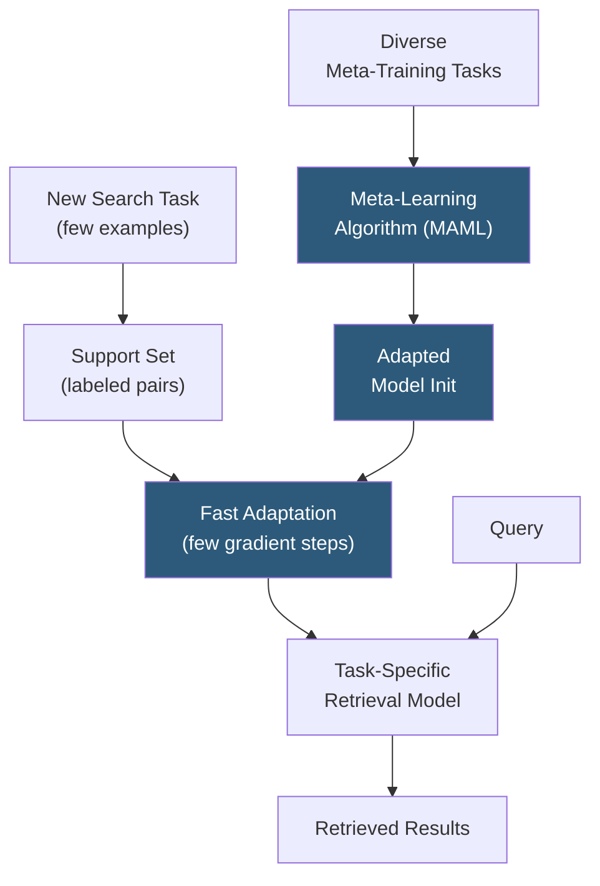

**Category:** Emerging Vector Technologies
**Difficulty:** Advanced
**Reading time:** 6 min read

---

Meta-learning for search applies "learning to learn" algorithms to train retrieval models that rapidly adapt to new domains, query types, or user preferences with minimal labeled data. Rather than learning a single fixed retrieval model, meta-learning trains a model initialization or adaptation procedure that generalizes across diverse search tasks, enabling fast fine-tuning from just a handful of examples.

- **MAML (Model-Agnostic Meta-Learning)** — gradient-based meta-learning that trains a parameter initialization enabling fast adaptation via few gradient steps
- **Prototypical Networks** — metric-learning approach computing class prototypes as mean embeddings; distances to prototypes serve as relevance scores
- **Meta-Training Tasks** — diverse search episodes sampled during meta-training to expose the model to many retrieval distributions
- **Support Set** — small labeled example set provided at adaptation time defining the new search task
- **Few-Shot Retrieval** — retrieving relevant documents for a novel query intent using only a handful of labeled relevant documents
- **Task Distribution** — the space of retrieval tasks drawn from during meta-training; breadth determines generalization quality
- **In-Context Learning** — using query-example pairs in a large model's context window as an implicit adaptation mechanism without weight updates

Meta-learning for search frames retrieval as a collection of episodic tasks sampled from a wide task distribution — for example, scientific paper search, e-commerce search, and legal case retrieval all constitute distinct tasks. During meta-training, the algorithm iterates over these tasks in episodes. Each episode presents a support set (labeled query-document pairs defining the task) and a query set (unlabeled queries to retrieve for). The model must use the support set to adapt quickly and score the query set accurately.

MAML-based approaches learn a parameter initialization such that a small number of gradient updates on the support set produces a well-performing retrieval model. The outer meta-optimization loop minimizes expected loss across all tasks after adaptation, explicitly training for rapid fine-tuning rather than immediate performance.

Prototypical network variants compute a prototype vector for "relevant" and "not relevant" document classes from the support set, then rank candidate documents by distance to the relevant prototype. This avoids gradient-based adaptation altogether, making inference fast and stable for very small support sets.

In large transformer models, in-context meta-learning enables search adaptation by prepending support examples as context — the model implicitly learns relevance patterns from the examples without any weight update. This is particularly powerful for cross-lingual or cross-domain transfer where labeled data in the target language or domain is scarce.

Meta-learned retrievers typically reach full-data fine-tuning performance with 5–20 labeled examples rather than thousands, dramatically reducing labeling cost for new deployment domains.

- Rapidly deploying search for niche domains where labeled query-document pairs are expensive to obtain
- Personalized search adapting to individual user relevance preferences from browsing history
- Cross-lingual retrieval adapting a high-resource language model to low-resource languages
- Dynamic intent adaptation in conversational search where task definitions shift mid-session
- Cold-start search features in new product categories with minimal user interaction data

| Advantage | Disadvantage |
|-----------|--------------|
| Requires very few labeled examples for new domains | Meta-training requires access to diverse labeled source tasks |
| Generalizes across domains and languages | Computational cost of episodic meta-training is high |
| Reduces labeling cost for production deployment | MAML second-order gradients require significant memory |
| Composable with large pre-trained language models | Generalization limited by diversity of meta-training task distribution |

- [Few-Shot Retrieval](few-shot-retrieval.md)
- [Zero-Shot Vector Search](zero-shot-vector-search.md)
- [Transformer-Based Indexing](transformer-based-indexing.md)

---
*Part of the [Emerging Vector Technologies](index.md) category · [Back to Master Index](../../index.md)*
