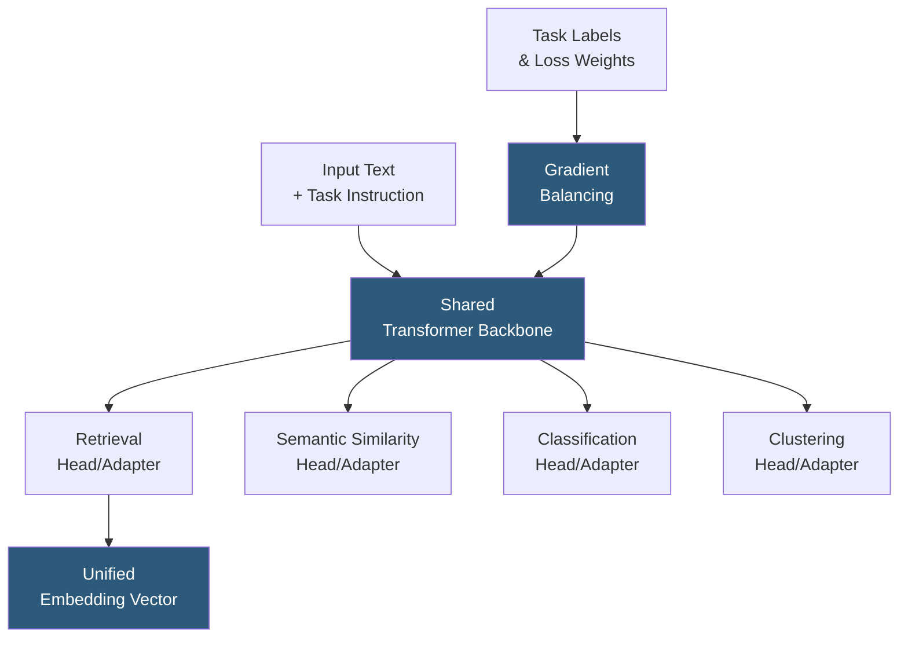

**Category:** Emerging Vector Technologies
**Difficulty:** Advanced
**Reading time:** 6 min read

---

Multi-task embedding models learn shared representations across multiple retrieval objectives — semantic similarity, question answering, classification, and ranking — within a single model, yielding embeddings that generalize broadly without task-specific fine-tuning. Training on diverse heterogeneous tasks produces embedding spaces that are simultaneously useful for many downstream retrieval applications, reducing model proliferation and serving infrastructure costs.

- **Task-Conditioned Encoding** — prepending task identifier text or tokens to inputs, steering the encoder toward task-appropriate geometric structure
- **Auxiliary Tasks** — secondary training objectives (e.g., NLI, classification) that regularize the primary retrieval objective and improve representation quality
- **Gradient Balancing** — techniques such as GradNorm or PCGrad that prevent high-loss tasks from dominating gradients and degrading other tasks
- **Shared Trunk / Task Heads** — architecture where a common transformer backbone is shared and small task-specific adapters or heads branch off
- **Negative Transfer** — when training on one task degrades performance on another; a core challenge in multi-task learning
- **MTEB Benchmark** — Massive Text Embedding Benchmark evaluating models across 56 tasks including retrieval, classification, clustering, and semantic similarity
- **Mixture of Experts (MoE)** — architecture where different expert networks specialize on different tasks, reducing negative transfer while sharing parameters

Multi-task embedding training collects datasets spanning many tasks — retrieval pairs (query, relevant document), NLI triplets (premise, hypothesis, label), classification examples (text, category), and clustering corpora — and interleaves them during training. Each mini-batch samples from this heterogeneous mixture, with sampling weights typically proportional to dataset size or calibrated to task importance.

The simplest architecture shares all transformer parameters across tasks. Task-conditioning is achieved by prepending an instruction prefix (e.g., "Represent this document for retrieval:") to steer the model without architectural branching. INSTRUCTOR and E5-mistral demonstrate that pure instruction-conditioning at inference time enables a single model to serve as retrieval, semantic similarity, and classification encoder simultaneously.

More complex architectures use **adapter layers** — small bottleneck modules inserted into each transformer layer — that are task-specific while the main backbone weights are shared. Adapters add fewer than 2% extra parameters but allow each task to learn independent transformations without interference in the main backbone.

Gradient balancing addresses the core challenge of multi-task training: if one task has much higher loss magnitude, it will dominate gradient updates and cause negative transfer to lower-loss tasks. GradNorm normalizes per-task gradient magnitudes; PCGrad projects task gradients onto planes orthogonal to conflicting tasks' gradients, mathematically preventing destructive interference.

The payoff is substantial: MTEB-leading models like E5-large-v2 and GTE-Qwen achieve top-10 performance across 56 heterogeneous tasks from a single model, obviating the need to maintain separate models for retrieval, classification, and clustering applications.

- Enterprise AI platforms serving diverse NLP tasks from a single embedding endpoint
- RAG systems requiring both document retrieval and semantic classification in one inference call
- Multi-lingual search platforms where a single model handles retrieval across dozens of languages
- Vector databases used for heterogeneous workloads (search, recommendation, deduplication)
- Cost-constrained deployments where maintaining multiple specialized models is infeasible

| Advantage | Disadvantage |
|-----------|--------------|
| Single model reduces serving infrastructure complexity | Negative transfer can degrade task-specific performance vs. specialized models |
| Broad generalization reduces need for task-specific fine-tuning | Gradient balancing adds training complexity and hyperparameter tuning burden |
| MTEB benchmark enables standardized multi-task evaluation | Large training data requirements across many tasks |
| Instruction-conditioning enables zero-shot task steering | Task instruction quality significantly impacts embedding geometry |

- [Transfer Learning for Retrieval](transfer-learning-for-retrieval.md)
- [Cross-Domain Embeddings](cross-domain-embeddings.md)
- [Zero-Shot Vector Search](zero-shot-vector-search.md)

---
*Part of the [Emerging Vector Technologies](index.md) category · [Back to Master Index](../../index.md)*
