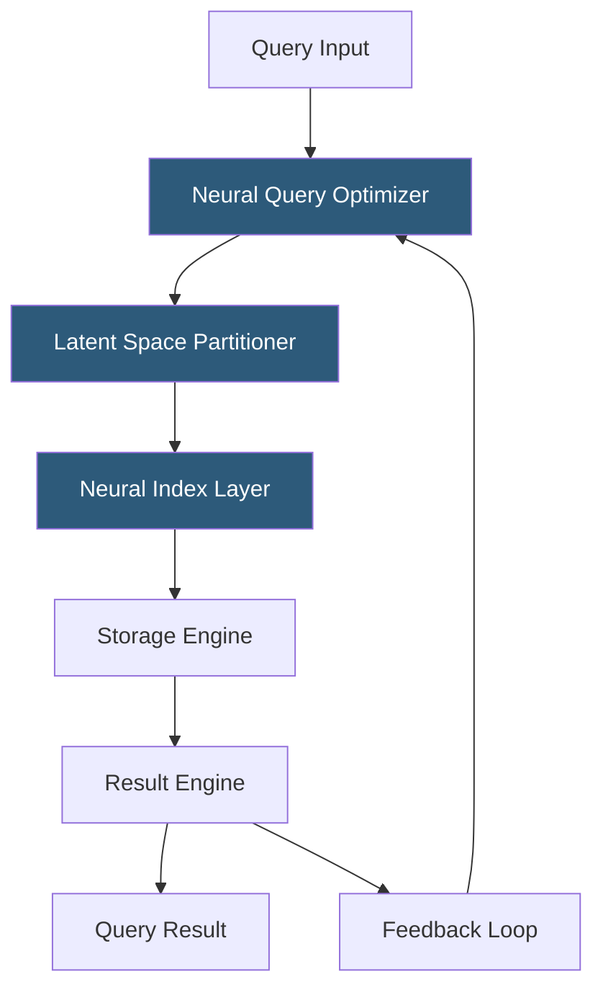

**Category:** Emerging Vector Technologies
**Difficulty:** Advanced
**Reading time:** 7 min read

---

Neural database architectures fuse deep learning models directly into the database engine, enabling learned query execution plans and adaptive storage layouts. Unlike traditional databases that rely on static cost-based optimizers, neural databases replace or augment key components with trainable neural modules. This paradigm promises order-of-magnitude query acceleration for certain workloads, especially high-dimensional similarity search.

- **Neural Query Optimizer** — a trained model that predicts optimal join orders, index selection, and execution strategies from historical query patterns
- **Learned Cardinality Estimation** — replacing histogram-based row-count estimates with neural models that capture complex correlations
- **Differentiable Indexing** — embedding structures whose parameters are updated via gradient descent to minimize query latency
- **End-to-End Trainable Pipeline** — a database architecture where storage, indexing, and query layers all participate in a unified training objective
- **Latent Space Partitioning** — organizing data on disk according to clusters in a learned embedding space rather than B-tree key ranges
- **Neural Cache Replacement** — using recurrent models to predict future data access patterns and pre-fetch pages proactively
- **Hybrid Execution Engine** — runtime that falls back to deterministic algorithms when neural predictions fall outside confidence bounds

Neural database architectures replace discrete, rule-based components with parameterized neural modules trained on workload data. The process begins with an ingestion phase: raw data is encoded into a latent embedding space, and a learned index model — typically a small feedforward network — maps embedding coordinates to physical page locations. Unlike a B-tree's deterministic branching, the learned index interpolates over a continuous function, achieving O(1) amortized lookup for sorted data.

Query optimization follows a similar pattern. A neural query optimizer takes a vectorized representation of the SQL or vector query and produces a plan: which indexes to probe, how to order joins, and which execution operator to invoke. This plan is conditioned on real-time statistics collected by a monitoring agent that feeds updated cardinality estimates back into the optimizer at runtime.

For vector similarity workloads, the latent space partitioner groups nearby embeddings into contiguous disk pages, so a k-NN scan needs to read far fewer pages than a flat exhaustive scan. The system continuously retrains the partitioner as the data distribution drifts — a process called incremental online learning — ensuring that physical layout stays aligned with access patterns.

Safety guarantees come from a deterministic fallback: whenever the neural component's confidence score drops below a threshold (e.g., out-of-distribution queries), the engine reverts to a conventional cost-based plan, preserving correctness at the cost of some performance.

- Accelerating trillion-scale embedding similarity search in recommendation engines
- Adaptive OLAP query optimization in data warehouses with shifting query patterns
- Real-time fraud detection requiring sub-millisecond feature vector lookup
- Scientific genomics databases with high-dimensional phenotype vectors
- Financial time-series databases needing fast nearest-neighbor retrieval for pattern matching

| Advantage | Disadvantage |
|-----------|--------------|
| Dramatically faster lookups for learned data distributions | Requires large workload corpus to train effectively |
| Self-adapts to shifting data patterns without manual re-tuning | Neural components add model management overhead |
| Compresses index structures, reducing memory footprint | Fallback paths needed for correctness guarantees |
| Enables joint optimization across storage and query layers | Training and retraining cycles introduce operational complexity |

- [Learned Index Structures](learned-index-structures.md)
- [AI-Optimized Vector Indexes](ai-optimized-vector-indexes.md)
- [Adaptive Indexing Strategies](adaptive-indexing-strategies.md)

---
*Part of the [Emerging Vector Technologies](index.md) category · [Back to Master Index](../../index.md)*
