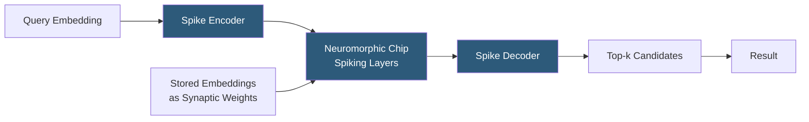

**Category:** Emerging Vector Technologies
**Difficulty:** Advanced
**Reading time:** 6 min read

---

Neuromorphic computing mimics the brain's spiking neural architecture to perform massively parallel, energy-efficient computation. Applied to vector search, neuromorphic chips like Intel's Loihi encode embedding dimensions as spike timing patterns and compute similarity through synaptic weight sums, offering orders-of-magnitude better energy efficiency than GPU-based ANN search. This field is still pre-commercial but demonstrates compelling properties for always-on edge inference.

- **Spiking Neural Network (SNN)** — a neural model where neurons communicate via discrete spike events rather than continuous activations, enabling event-driven computation
- **Loihi 2** — Intel's second-generation neuromorphic research chip with 1 million programmable neurons and on-chip learning
- **Temporal Coding** — representing vector component magnitudes as inter-spike intervals (ISI), enabling analog-like computation in digital circuits
- **Spike-Timing-Dependent Plasticity (STDP)** — an online learning rule updating synaptic weights based on the relative timing of pre- and post-synaptic spikes
- **Associative Memory** — neuromorphic networks that store embedding patterns as attractor states, retrieving the closest stored pattern to a noisy query
- **Energy-per-Query** — key metric for neuromorphic systems: measured in picojoules versus millijoules for GPU inference
- **NxSDK** — Intel's software development kit for programming Loihi-based neuromorphic applications

In a neuromorphic similarity search system, the embedding database is compiled into synaptic weight matrices stored on-chip. Each stored vector becomes a pattern encoded across a population of neurons, with the synaptic strengths representing the vector components. This compilation step is done offline and is analogous to building an index.

At query time, the query embedding is rate-encoded or time-encoded into a spike train and injected into the input layer. The signal propagates through the synaptic weight layers, and neurons representing stored embeddings integrate incoming spikes. Neurons whose stored patterns closely match the query fire earliest or most frequently, exploiting the physical dynamics of the spiking network to perform parallel inner-product computation at the speed of physics rather than sequential multiply-accumulate operations.

Associative memory networks like Hopfield networks — implemented in neuromorphic hardware — retrieve the closest stored embedding in a single forward pass through the attractor dynamics. Modern dense Hopfield networks (used in transformer attention mechanisms) store exponentially many patterns and can be mapped to neuromorphic substrates for ultra-low-latency retrieval.

The energy advantage is profound: Intel's Loihi 2 benchmarks show spiking networks consuming 1000× less energy per inference than equivalent GPU operations for sparse, event-driven workloads. This makes neuromorphic chips compelling for battery-powered edge devices performing continuous embedding matching, such as keyword spotting, face recognition, or anomaly detection.

- Always-on keyword and voice embedding matching on IoT devices
- Edge facial recognition with battery-powered cameras
- Industrial anomaly detection with continuous sensor embedding comparison
- Implantable medical devices requiring neural signal pattern matching
- Robotics navigation using continuous place-cell embedding localization

| Advantage | Disadvantage |
|-----------|--------------|
| 100–1000× energy reduction versus GPU ANN search | Pre-commercial: limited available hardware and tooling |
| Inherently parallel spike propagation matches ANN topology | Programming model (SNN) is fundamentally different from standard ML |
| On-chip learning enables adaptation without cloud round-trips | Maximum database size constrained by on-chip synaptic memory |
| Sub-millisecond latency for compiled pattern matching | Precision limited by spike encoding quantization |

- [Photonic Vector Processing](photonic-vector-processing.md)
- [FPGA Acceleration for Vectors](fpga-acceleration-for-vectors.md)
- [Quantum Computing for Similarity Search](quantum-computing-for-similarity-search.md)

---
*Part of the [Emerging Vector Technologies](index.md) category · [Back to Master Index](../../index.md)*
