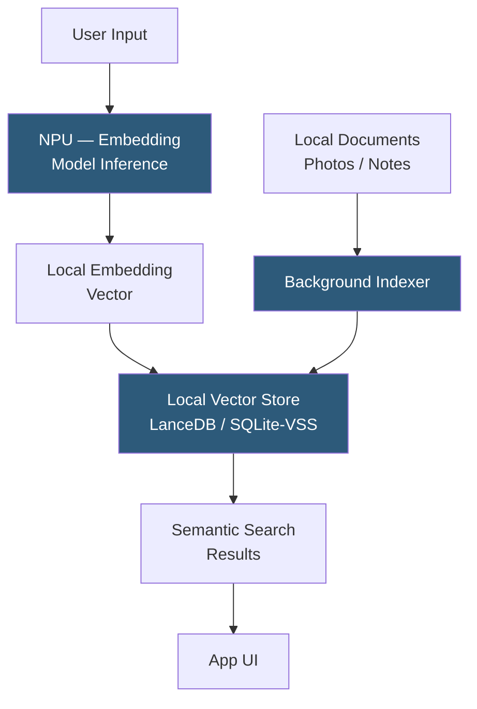

**Category:** Emerging Vector Technologies
**Difficulty:** Intermediate
**Reading time:** 5 min read

---

On-device embedding search executes the full embedding generation and similarity retrieval pipeline on end-user hardware — smartphones, laptops, and edge computers — without sending data to remote servers. This architecture is gaining momentum as mobile Neural Processing Units (NPUs) become powerful enough to run quantized language and vision models, enabling features like Apple's semantic photo search, Windows Semantic Search, and private RAG (Retrieval-Augmented Generation) assistants.

- **Neural Processing Unit (NPU)** — dedicated silicon on modern SoCs (Apple M-series, Qualcomm Snapdragon) for efficient neural network inference
- **Core ML / ONNX Runtime** — platform runtimes that schedule neural network layers to NPU, GPU, or CPU based on operator support
- **On-Device RAG** — retrieval-augmented generation where both the embedding model, vector index, and LLM run entirely on local hardware
- **Model Quantization** — INT4/INT8 weight compression reducing model size to fit within device memory budgets (4–16 GB)
- **Local Vector Store** — embedded databases like LanceDB, Chroma (local mode), or SQLite with vector extensions running without a server process
- **Semantic Cache** — an on-device embedding-based cache that retrieves past responses for semantically similar queries
- **Privacy-Preserving Indexing** — embedding-based indexes that encode semantic meaning without retaining raw text or image content

On-device embedding search requires tight co-design between the embedding model, the vector store, and the OS scheduling layer. The embedding model — typically a 40–350M parameter transformer quantized to INT4 or INT8 — runs on the NPU during indexing and at query time. Modern NPUs deliver 10–40 TOPS, sufficient to encode a 512-token text chunk in under 20ms.

Background indexing is triggered by file system watches. When the user creates a new note, photo, or document, the indexer encodes it into an embedding vector and inserts it into the local vector store without user intervention. Embedding models for on-device use are often distilled from larger server-side models: a 40M parameter MiniLM encoding documents into 384 dimensions achieves 90%+ of the recall of a 340M parameter server model at 100× lower compute cost.

The local vector store is embedded as a library within the application (no separate server process). LanceDB uses columnar Lance files on local storage with HNSW indexes; SQLite with the sqlite-vss extension adds vector search to an existing SQLite database. Both support memory-mapped access so the index pages are loaded on-demand from flash storage rather than loaded entirely into RAM.

At query time, the user's text or image is encoded by the NPU, the embedding is passed to the vector store for ANN retrieval, and the top-k matching documents are surfaced. Apple's Photos semantic search and Spotlight use this architecture on iPhone 14+. Windows 11 Recall extends it to a continuous screenshot archive searchable by natural language descriptions.

- Smartphone photo library semantic search by scene description
- Offline personal knowledge base with natural language retrieval
- Privacy-sensitive enterprise document search on air-gapped workstations
- Local AI assistant RAG without cloud dependency
- Continuous note-taking apps with instant semantic cross-referencing

| Advantage | Disadvantage |
|-----------|--------------|
| Complete privacy: no data leaves the device | NPU and RAM constraints limit model size and index capacity |
| Zero latency from network round-trips | Background indexing drains battery on mobile devices |
| Works offline in airplane mode or air-gapped environments | Index quality lower than server-side large model embeddings |
| No cloud infrastructure cost per query | Cross-device index sync requires careful encrypted transfer |

- [Edge Vector Search](edge-vector-search.md)
- [Privacy-Preserving Embeddings](privacy-preserving-embeddings.md)
- [Federated Vector Search](federated-vector-search.md)

---
*Part of the [Emerging Vector Technologies](index.md) category · [Back to Master Index](../../index.md)*
