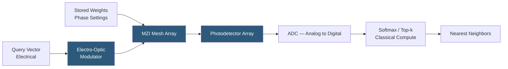

**Category:** Emerging Vector Technologies
**Difficulty:** Advanced
**Reading time:** 6 min read

---

Photonic computing uses light rather than electrons to perform matrix-vector multiplications at the speed of light and with near-zero heat generation. For AI inference and vector similarity search, photonic integrated circuits (PICs) can implement dot-product operations in O(1) time using interference of coherent light beams, offering radical improvements in energy efficiency and latency. Companies like Lightmatter and Luminous Computing are commercializing photonic accelerators for neural network and embedding workloads.

- **Mach-Zehnder Interferometer (MZI)** — a photonic device that implements a 2×2 unitary matrix operation using beam splitting and phase shifting
- **Optical Matrix-Vector Multiplication** — encoding a matrix in the phases of an array of MZIs and a vector in light amplitude, performing multiplication at photon propagation speed
- **Silicon Photonics** — manufacturing photonic circuits on CMOS-compatible silicon wafers to leverage existing semiconductor fabrication
- **Coherent Detection** — measuring both amplitude and phase of optical signals, enabling signed arithmetic for inner product computation
- **Wavelength Division Multiplexing (WDM)** — transmitting multiple data streams on different light wavelengths through a single waveguide in parallel
- **Electro-Optic Modulator** — converts electrical embedding vectors into optical amplitude signals for photonic processing
- **On-Chip Photodetector** — converts optical output back to electronic signals, completing the hybrid photonic-electronic pipeline

Photonic vector processing begins by encoding the query embedding as modulated light intensity across multiple waveguide channels. An array of Mach-Zehnder interferometers, configured with phase shifts corresponding to the stored database vectors, performs matrix-vector multiplication as light propagates through the mesh. The physical interference of light beams computes weighted sums in the time it takes photons to traverse the chip — typically picoseconds, irrespective of vector dimensionality.

For similarity search, the dot-product output (approximating cosine similarity for normalized vectors) appears simultaneously across all stored-vector output channels. A photodetector array converts optical intensities to electrical signals, which are then digitized by analog-to-digital converters. The classical digital system performs a final sort to identify top-k nearest neighbors.

The energy advantage comes from the physics: photons do not generate resistive heat, and interference is a passive physical process requiring no switching energy. Lightmatter's Passage chip demonstrates 25 TOPS/W photonic throughput versus ~1 TOPS/W for GPU. However, encoding precision is limited by optical shot noise and modulator linearity, typically achieving 4–8 bits of effective resolution compared to 16 bits for GPU FP16.

Practical deployments today use photonics as an accelerator within a larger system: the photonic chip handles bulk dot-product computation while classical electronics handle memory access, indexing, and control flow. As silicon photonics fabrication matures and optical memory improves, fully photonic pipelines become feasible.

- Ultra-low-latency embedding similarity for real-time ad targeting
- Energy-efficient inference at hyperscale data centers
- High-frequency trading: microsecond pattern matching on market embeddings
- Datacenters targeting 10× energy reduction per AI query
- Optical neural network accelerators for edge deployment

| Advantage | Disadvantage |
|-----------|--------------|
| Matrix-vector multiply at the speed of light in O(1) time | Limited precision (4–8 bits) versus GPU 16-bit arithmetic |
| Near-zero energy for photonic computation step | Electro-optic conversion adds latency and power overhead |
| No crosstalk heating between adjacent computations | Photonic chips are expensive and difficult to reprogram |
| Scales naturally with WDM for parallel multi-vector search | Optical memory does not yet exist; DRAM bottleneck remains |

- [Neuromorphic Vector Search](neuromorphic-vector-search.md)
- [FPGA Acceleration for Vectors](fpga-acceleration-for-vectors.md)
- [ASIC Chips for Embedding Search](asic-chips-for-embedding-search.md)

---
*Part of the [Emerging Vector Technologies](index.md) category · [Back to Master Index](../../index.md)*
