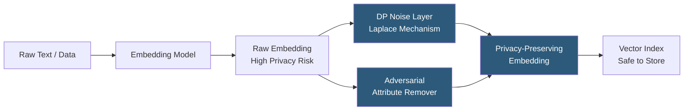

**Category:** Emerging Vector Technologies
**Difficulty:** Advanced
**Reading time:** 6 min read

---

Privacy-preserving embeddings prevent sensitive information from being reconstructed from stored or transmitted embedding vectors. Research shows that raw embeddings generated by language models can be inverted to recover near-exact source text, creating significant privacy risks. Techniques including differential privacy, adversarial training, and dimensionality reduction with information-theoretic bounds aim to make embeddings useful for search while eliminating personal data leakage.

- **Embedding Inversion Attack** — techniques that reconstruct source text from an embedding with 50–90% word-overlap accuracy, demonstrating the privacy risk of raw embeddings
- **Differential Privacy (DP) Noise** — adding calibrated Laplace or Gaussian noise to embedding vectors to provide formal (epsilon, delta)-DP guarantees
- **Adversarial Anonymization** — training an encoder with an adversarial loss term that penalizes the ability of a discriminator to recover sensitive attributes
- **Metric Differential Privacy** — extending DP to metric spaces (embedding space) where adjacent points differ by at most distance d
- **Sanitized Embedding** — an embedding vector with sensitive dimensions projected out or noised to make attribute inference statistically impossible
- **Information-Theoretic Bound** — mathematical proof that a specific transformation provides a minimum level of information removal about source data
- **k-Anonymity in Embedding Space** — ensuring that each embedding is indistinguishable from at least k-1 others in the database under any distance metric

The core problem is that modern transformer embedding models are trained to preserve maximum semantic information, which unfortunately includes personal identifiers, demographic signals, and verbatim text fragments. Experiments with embedding inversion models (vec2text and related work) show that OpenAI ada-002 embeddings can be inverted to recover source sentences with high accuracy, making it unsafe to store raw embeddings of personal communications or health records.

Differential privacy addresses this by adding noise sampled from a calibrated distribution before storage or transmission. For metric DP in embedding space, the noise magnitude is proportional to the desired privacy radius d: embeddings within distance d of the source embedding are indistinguishable. The trade-off is controlled by epsilon: smaller epsilon provides stronger privacy at the cost of greater recall loss in ANN search.

Adversarial anonymization takes a training-time approach: the embedding model is jointly trained with an adversarial classifier that attempts to predict sensitive attributes (age, gender, diagnosis codes) from the embeddings. The encoder learns to minimize task loss (retrieval quality) while maximizing adversarial confusion, producing embeddings where sensitive attributes cannot be inferred.

A practical hybrid uses both: adversarial training removes structured attribute information, while post-processing DP noise provides formal guarantees against arbitrary reconstruction attacks. The resulting embeddings retain sufficient semantic signal for similarity search while providing provable protections against known and future attack types.

- Healthcare: storing patient note embeddings without HIPAA-violating information leakage
- Financial services: embedding transaction descriptions for fraud detection without exposing merchant names
- Legal: semantic search across privileged communications without exposing client identity
- HR analytics: clustering employee engagement survey embeddings without individual identification
- Federated learning scenarios where embeddings are shared across organizational boundaries

| Advantage | Disadvantage |
|-----------|--------------|
| Formal (epsilon, delta)-DP guarantees against reconstruction attacks | DP noise degrades ANN recall, especially at high privacy budgets |
| Adversarial training removes structured sensitive attribute signal | Requires retraining the embedding model; not applicable post-hoc |
| Enables regulatory compliance for embedding-based AI systems | Attackers with auxiliary data may partially overcome noise protections |
| Compatible with existing ANN index infrastructure | Privacy-utility trade-off curve requires careful calibration per use case |

- [Homomorphic Encryption for Vectors](homomorphic-encryption-for-vectors.md)
- [Differential Privacy in Embeddings](differential-privacy-in-embeddings.md)
- [Federated Vector Search](federated-vector-search.md)

---
*Part of the [Emerging Vector Technologies](index.md) category · [Back to Master Index](../../index.md)*
