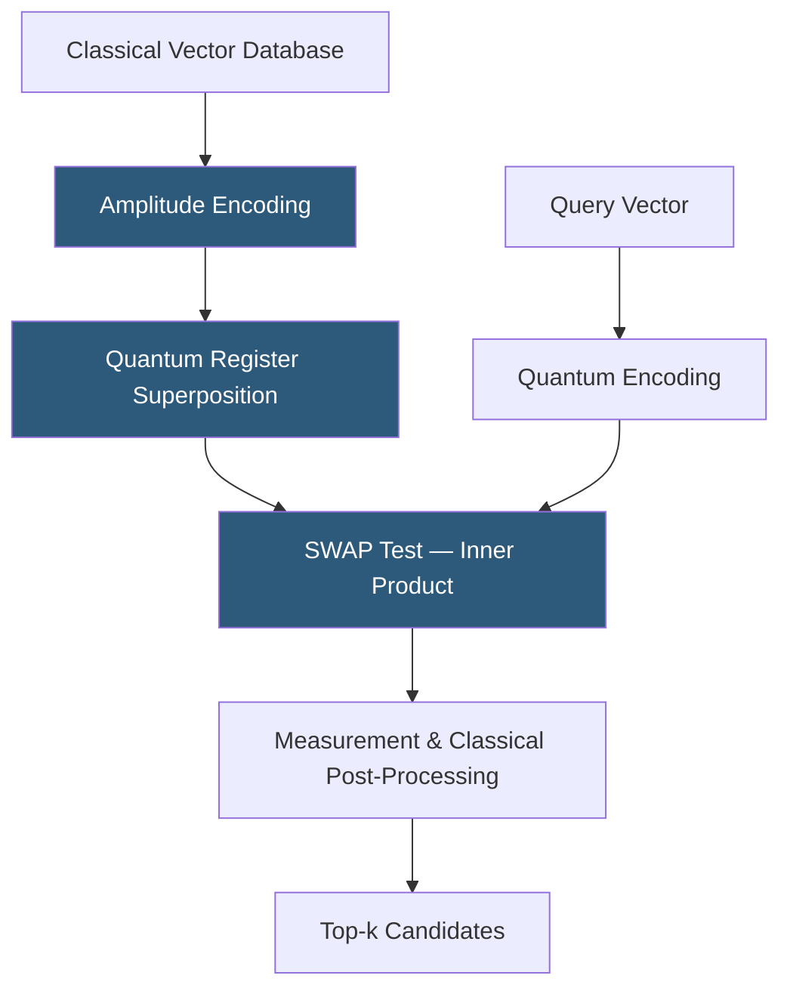

**Category:** Emerging Vector Technologies
**Difficulty:** Advanced
**Reading time:** 7 min read

---

Quantum computing offers theoretical speedups for similarity search through quantum amplitude amplification and quantum random access memory (QRAM). Algorithms like Grover's search provide quadratic speedup over classical exhaustive scan, while quantum distance estimation algorithms can compute inner products between high-dimensional vectors in superposition. Though practical quantum hardware remains noisy and limited, near-term hybrid quantum-classical approaches are being explored for embedding retrieval.

- **Grover's Algorithm** — quantum search delivering O(√N) query complexity versus classical O(N) for unstructured databases
- **QRAM (Quantum RAM)** — hypothetical hardware enabling efficient superposition loading of classical data into quantum registers
- **Quantum Inner Product Estimation** — SWAP-test-based circuit measuring cosine similarity between two quantum-encoded vectors
- **Variational Quantum Eigensolver (VQE)** — a hybrid algorithm that can formulate similarity search as an optimization on a quantum annealer
- **Quantum Approximate Optimization Algorithm (QAOA)** — near-term algorithm potentially applicable to graph-structured ANN problems
- **Amplitude Encoding** — mapping a classical vector of length n into log₂(n) qubits via quantum state amplitudes
- **Noisy Intermediate-Scale Quantum (NISQ)** — current era of quantum hardware with 50–1000 qubits and significant gate errors

Quantum similarity search begins with data encoding: each embedding vector is mapped into a quantum state using amplitude encoding, where the 2^n amplitudes of an n-qubit register represent the n-dimensional vector components. This compression into log₂(n) qubits is the key advantage, but QRAM hardware to efficiently load arbitrary classical data into these states does not yet exist at scale.

Given quantum-encoded data, distance estimation exploits quantum interference. The SWAP test circuit takes two quantum states and produces a measurement outcome whose probability is directly related to their inner product — achieving inner product estimation in a single circuit evaluation compared to O(n) classical operations. For a database of N vectors, Grover's amplitude amplification can locate the maximum-similarity vector in O(√N) queries rather than O(N), providing a quadratic speedup.

In practice, NISQ devices limit circuit depth severely. Hybrid approaches partition the problem: a quantum sampler identifies candidate clusters using low-depth circuits, and a classical ANN system performs exact retrieval within those clusters. Quantum annealers from D-Wave have been explored for reformulating k-NN as a quadratic unconstrained binary optimization (QUBO) problem, where the annealer's energy minimization corresponds to finding nearest neighbors.

The fundamental challenge remains QRAM: loading a billion-vector database into quantum superposition requires fault-tolerant hardware orders of magnitude beyond current capabilities. Researchers estimate practical advantage requires ~10^6 physical qubits with error correction, targeting the 2030s timeframe.

- Drug discovery: molecular similarity search across chemical compound libraries
- Cryptographic key search and post-quantum security analysis
- Financial portfolio optimization formulated as similarity clustering
- Combinatorial protein folding similarity across structural databases
- Academic research benchmarking quantum versus classical ANN algorithms

| Advantage | Disadvantage |
|-----------|--------------|
| Theoretical O(√N) quadratic speedup over classical search | QRAM hardware does not practically exist at scale today |
| O(log n) qubit encoding for n-dimensional vectors | NISQ noise degrades algorithm fidelity significantly |
| New algorithmic paradigms for combinatorial similarity problems | Data loading overhead may erase query-time advantages |
| Potential exponential advantage for specific structured problems | Requires full fault-tolerant quantum computing for most gains |

- [Neuromorphic Vector Search](neuromorphic-vector-search.md)
- [Photonic Vector Processing](photonic-vector-processing.md)
- [FPGA Acceleration for Vectors](fpga-acceleration-for-vectors.md)

---
*Part of the [Emerging Vector Technologies](index.md) category · [Back to Master Index](../../index.md)*
