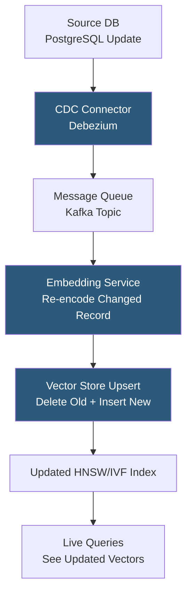

**Category:** Emerging Vector Technologies
**Difficulty:** Advanced
**Reading time:** 6 min read

---

Real-time embedding updates address the challenge of keeping vector indexes current when the underlying data changes — a product's description is edited, a user's preferences evolve, or a document is revised. Unlike initial indexing, updates require atomically replacing a stored embedding while preserving index integrity, supporting concurrent reads, and propagating changes through any derived indexes or caches. This capability is essential for recommendation systems, dynamic knowledge bases, and personalized search.

- **Upsert** — an operation that inserts a new embedding if the ID doesn't exist or atomically replaces the existing embedding if it does
- **Vector Tombstone** — a deletion marker applied to an outdated embedding, enabling lazy removal without immediate index restructuring
- **Soft Deletion** — marking an embedding as deleted in metadata while retaining the vector in the index until a compaction pass physically removes it
- **Incremental HNSW Update** — inserting a new embedding and then performing the deletion of the old embedding's edges in the HNSW graph
- **Versioned Vectors** — storing multiple versions of an embedding keyed by (id, version), allowing point-in-time queries without locking the primary index
- **Change Data Capture (CDC)** — propagating database row updates (from PostgreSQL, MySQL) to the vector index via Debezium or similar CDC tooling
- **Consistency Window** — the maximum time lag between a source data change and its reflection in the vector index, governed by the update pipeline latency

Real-time embedding updates are more complex than simple key-value updates because changing an embedding requires restructuring graph or cluster membership in the underlying index. In HNSW, each vector has a set of graph neighbors established at insertion time. When a vector changes, its neighbors may no longer be the closest vectors to the new embedding position, degrading recall for that vector's neighborhood.

The recommended approach for most production systems is a "delete then insert" strategy: the old embedding is marked with a tombstone (making it invisible to queries), and the new embedding is inserted fresh with correctly established HNSW connections. Physical removal of tombstoned vectors occurs during periodic compaction passes that rebuild affected index segments.

CDC-driven update pipelines automate this process for database-backed systems: a CDC connector (Debezium for PostgreSQL, DynamoDB Streams for DynamoDB) publishes row-level change events to a Kafka topic. A consumer service re-encodes the changed record, calls the vector store's upsert API, and acknowledges the Kafka offset. This provides at-least-once delivery semantics; idempotent upsert APIs prevent duplicate insertions.

The consistency window is the key SLA metric: with a well-tuned pipeline, updates appear in the vector index within 1–30 seconds of the source change. Tighter windows require dedicated embedding compute instances and higher-priority Kafka consumers. For strict consistency requirements, synchronous upsert paths (the application directly calls the vector store after database commit) eliminate the async window at the cost of increased write latency.

Versioned vectors enable time-travel queries: each update creates a new version record, allowing historical searches ("what did the vector index look like last Tuesday?") useful for A/B testing and reproducibility.

- E-commerce product catalog: reflect price changes, inventory updates, and description edits in semantic search within seconds
- News aggregation: re-embed and re-rank articles as editorial tags are updated
- User profile search: update user preference embeddings as behavioral data accumulates
- Content moderation: update embeddings after human review changes content labels
- Knowledge management: reflect document edits in enterprise semantic search immediately

| Advantage | Disadvantage |
|-----------|--------------|
| Search always reflects current data state within consistency window | Delete-insert upsert temporarily degrades HNSW neighborhood quality |
| CDC automation eliminates manual sync code | High update rates cause compaction pressure and index fragmentation |
| Versioned vectors enable point-in-time reproducibility | Re-encoding requires running the embedding model on every changed record |
| At-least-once delivery with idempotent upserts prevents data loss | Consistency window varies under load, requiring monitoring |

- [Streaming Vector Search](streaming-vector-search.md)
- [Temporal Vector Search](temporal-vector-search.md)
- [Time-Aware Embeddings](time-aware-embeddings.md)

---
*Part of the [Emerging Vector Technologies](index.md) category · [Back to Master Index](../../index.md)*
