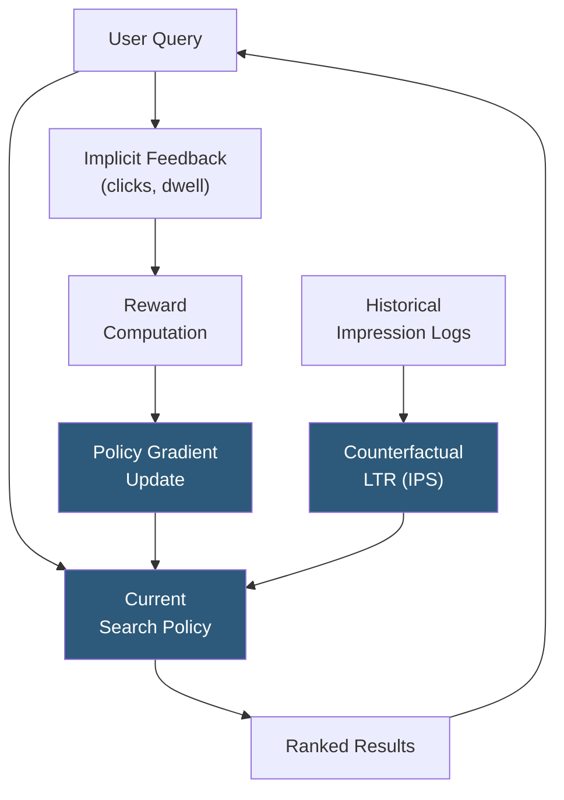

**Category:** Emerging Vector Technologies
**Difficulty:** Advanced
**Reading time:** 6 min read

---

Reinforcement learning (RL) for search treats retrieval as a sequential decision problem where an agent learns to select, rank, or re-query documents based on implicit user feedback signals such as clicks, dwell time, and conversion events. By optimizing directly for long-term user satisfaction metrics rather than surrogate relevance labels, RL-based retrieval systems align search behavior with real-world utility, capturing engagement signals that static annotated relevance judgments often miss.

- **Reward Signal** — the user feedback (click, purchase, dwell time) that the RL agent maximizes; design choices here critically determine what behavior is learned
- **Policy** — the retrieval or ranking function that the RL agent learns; parameterized as a neural embedding model or scoring function
- **Bandit Feedback** — the most common RL setting for search: only the relevance of shown documents is observed, not of documents that were not shown
- **Counterfactual Learning** — estimating what would have happened under a different ranking policy using logged data and inverse propensity scoring
- **REINFORCE** — policy gradient algorithm applying directly to ranking by treating document selection as a sequence of stochastic actions
- **Learning to Rank (LTR)** — supervised precursor to RL for ranking; RL extends LTR by using implicit rather than explicit labels
- **Exploration vs. Exploitation** — the fundamental RL tradeoff: exploiting known good results vs. exploring novel documents to learn better policies

RL for search most commonly operates in the **contextual bandit** setting: each search request is an independent context, the action is the ranked list of documents shown, and the reward is user engagement (clicks, purchases, long dwell time). Because only engaged documents receive observable feedback, naive gradient updates are biased toward popular results. Inverse Propensity Scoring (IPS) corrects this bias by reweighting each feedback signal by the inverse probability that the document was shown, enabling unbiased policy gradient estimates from logged data without online exploration.

For online learning, epsilon-greedy or Thompson sampling exploration policies occasionally inject novel documents into result sets to gather feedback on unexplored items. This exploration cost must be balanced against user experience impact, typically keeping exploration rates below 5% of impressions.

Deep policy gradient methods parameterize the ranking policy as a neural embedding model. The policy selects candidate documents by embedding the query, retrieving a set via ANN search, and then applying a scoring head optimized via REINFORCE or actor-critic methods. Baselines (value function estimates of expected reward) reduce gradient variance, which is otherwise prohibitively high for long-tail queries with sparse feedback.

Multi-turn session modeling extends RL to sequential queries in a session, treating the full search session as a Markov Decision Process where intermediate results influence subsequent query reformulations and the final conversion event serves as delayed reward. Recurrent or transformer-based policy networks maintain session state across turns.

- E-commerce product search optimized for purchase conversion rather than click-through rates
- News feed ranking aligned to long-term user engagement and reduced bounce rate
- Streaming service recommendation where sequential watch behavior defines session-level reward
- Advertising search balancing user satisfaction with monetization objectives
- Real-time bidding systems where retrieval precision directly impacts revenue per query

| Advantage | Disadvantage |
|-----------|--------------|
| Directly optimizes for downstream business metrics | Requires large volumes of implicit feedback for stable gradient estimation |
| Captures long-term user satisfaction beyond single-click relevance | Exploration degrades short-term user experience during policy learning |
| Adapts to shifting user preferences without re-annotation | Position bias in click logs requires careful IPS correction |
| Handles delayed and sparse rewards via multi-step returns | Training instability common; requires careful reward shaping and baseline design |

- [Active Learning for Retrieval](active-learning-for-retrieval.md)
- [Continual Learning for Embeddings](continual-learning-for-embeddings.md)
- [Adaptive Indexing Strategies](adaptive-indexing-strategies.md)

---
*Part of the [Emerging Vector Technologies](index.md) category · [Back to Master Index](../../index.md)*
