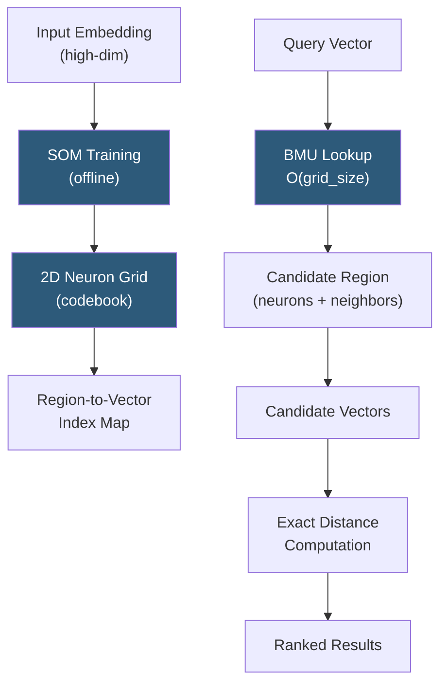

**Category:** Emerging Vector Technologies
**Difficulty:** Intermediate
**Reading time:** 6 min read

---

Self-organizing vector maps (SOMs) are unsupervised neural networks that project high-dimensional embedding spaces onto low-dimensional topological grids while preserving neighborhood structure. Applied to vector search, SOMs enable hierarchical clustering of embeddings, accelerating approximate nearest neighbor lookups by reducing candidate sets before fine-grained distance computation. They represent an adaptive, topology-aware alternative to static indexing structures.

- **Kohonen Network** — the canonical SOM architecture where neurons arranged in a 2D grid compete to represent input vectors
- **Best Matching Unit (BMU)** — the neuron whose weight vector is closest to an input embedding; the primary candidate for retrieval routing
- **Neighborhood Function** — Gaussian decay function that updates neurons near the BMU during training, preserving topological ordering
- **Topological Mapping** — the property that semantically similar embeddings map to spatially proximate neurons in the grid
- **Codebook** — the complete set of neuron weight vectors; acts as a compressed representation of the embedding distribution
- **Quantization Error** — distance between an input vector and its BMU; measures how well the SOM represents the data distribution
- **Hierarchical SOM** — multi-resolution SOM variant that uses coarse-to-fine grid search for scalable retrieval

SOM-based vector indexing works in two phases. During offline training, the SOM iterates over the embedding corpus, updating neuron weights to mirror the statistical distribution of the vector space. The learning rate and neighborhood radius decrease over epochs, causing the grid to progressively refine its topology-preserving mapping. Once trained, each corpus embedding is assigned to its BMU, building a region-to-vector lookup structure.

At query time, the query embedding is compared against the SOM's codebook — a far smaller set than the full corpus — to find the BMU and its neighboring neurons. Only vectors assigned to those neurons become candidates for exact distance computation, dramatically pruning the search space. This two-stage approach achieves sub-linear complexity: O(grid\_size) for coarse search plus O(candidates\_per\_region) for fine search.

Hierarchical SOMs extend this by stacking multiple resolutions. A coarse top-level SOM routes queries to broad regions, finer sub-SOMs within those regions narrow candidates further. This resembles product quantization but with topology awareness, meaning vectors that cluster semantically are also spatially adjacent in the grid — a property useful for browsable semantic visualization alongside retrieval.

SOMs adapt to distributional shift by periodic re-training or online weight updates, making them suitable for dynamic embedding corpora where new content arrives continuously.

- Exploratory semantic search with visual map-based navigation interfaces
- Recommendation systems where topological browsing assists discovery
- Clustering and anomaly detection in high-dimensional embedding spaces
- Hierarchical document organization for large knowledge bases
- Adaptive indexing for streaming embedding workloads with distributional drift

| Advantage | Disadvantage |
|-----------|--------------|
| Topology preservation enables semantic browsing | Training time grows with corpus size and grid resolution |
| Pruning reduces candidate set for faster exact search | Quantization error can cause missed nearest neighbors at boundaries |
| Naturally supports hierarchical multi-resolution search | Fixed grid size must be chosen before training |
| Online adaptation possible for dynamic corpora | Less precise recall than HNSW or IVF-PQ for static datasets |

- [Adaptive Indexing Strategies](adaptive-indexing-strategies.md)
- [AI-Optimized Vector Indexes](ai-optimized-vector-indexes.md)
- [In-Memory Vector Computing](in-memory-vector-computing.md)

---
*Part of the [Emerging Vector Technologies](index.md) category · [Back to Master Index](../../index.md)*
