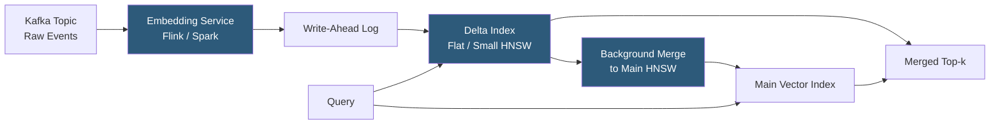

**Category:** Emerging Vector Technologies
**Difficulty:** Advanced
**Reading time:** 6 min read

---

Streaming vector search enables similarity queries against continuously arriving data streams — social media posts, IoT sensor readings, financial tick data, and log events — without buffering to a batch index first. The challenge is maintaining a fresh, consistent vector index while new embeddings arrive at rates of thousands to millions per second. Systems like Weaviate's real-time ingestion, Kafka-connected vector pipelines, and custom streaming HNSW implementations address this operational frontier.

- **Online Vector Insertion** — adding new embeddings to an HNSW or IVF index without pausing query serving or full index rebuild
- **Write-Ahead Log (WAL) for Vectors** — durably logging insertions before applying them to the index, enabling crash recovery and consistent read-after-write semantics
- **Delta Index** — a small, frequently flushed flat index containing recent insertions merged periodically with the main index structure
- **Kafka Vector Pipeline** — an architecture where embedding generation and index insertion are driven by Kafka topic consumption
- **Staleness Bound** — the maximum age guarantee for indexed data: "all data older than T seconds is searchable"
- **Concurrent HNSW** — thread-safe HNSW variants (used in Milvus, Weaviate) supporting simultaneous reads and writes via node-level locking
- **Stream Processing Engine** — Flink, Spark Streaming, or Kafka Streams coordinating embedding generation and vector index ingestion

Streaming vector search uses a dual-index architecture to balance write throughput with query freshness. Incoming events are consumed from a message queue (Kafka, Pulsar) by a stream processing job that batches events into micro-batches (100–1000 events per batch) and calls an embedding model to vectorize each event. The resulting vectors are written to a WAL for durability, then inserted into a small, flat "delta index."

The delta index accepts inserts with O(1) amortized complexity — simply appending vectors to a flat array. Queries are executed against both the delta index (via linear scan over the small set) and the main HNSW index, with results merged. This ensures that embeddings inserted in the last few seconds (before the next merge cycle) are immediately searchable with the staleness bound equal to the query time minus the WAL commit time.

Periodic background merges consolidate the delta index into the main HNSW structure. The merge process inserts delta vectors into HNSW one-by-one, taking advantage of the fact that HNSW online insertion is O(log n). For million-scale daily ingest rates, merge jobs run every few minutes on background threads.

Concurrent reads during merges are handled by version-fenced snapshots: queries hold a reference to the current index version, preventing the merge from modifying data structures under live queries. Node-level read-write locks (as implemented in Milvus's concurrent HNSW) allow insertions into new HNSW nodes while existing nodes remain readable.

- Social media real-time trending topic detection using tweet embeddings
- Cybersecurity SIEM systems identifying similar attack patterns in live log streams
- Financial news monitoring matching breaking events to portfolio position embeddings
- IoT predictive maintenance indexing sensor pattern embeddings in real time
- Customer support ticket routing against a continuously updated knowledge base

| Advantage | Disadvantage |
|-----------|--------------|
| Fresh data searchable within seconds of arrival | Write throughput vs. index quality trade-off: fast inserts degrade HNSW graph quality |
| Delta index provides predictable staleness bounds | Background merge consumes CPU, competing with query serving |
| Kafka integration enables existing data pipeline reuse | Distributed streaming adds operational complexity versus batch indexing |
| WAL enables crash recovery without data loss | Merge backpressure during traffic spikes can increase staleness |

- [Real-Time Embedding Updates](real-time-embedding-updates.md)
- [Temporal Vector Search](temporal-vector-search.md)
- [AI-Optimized Vector Indexes](ai-optimized-vector-indexes.md)

---
*Part of the [Emerging Vector Technologies](index.md) category · [Back to Master Index](../../index.md)*
