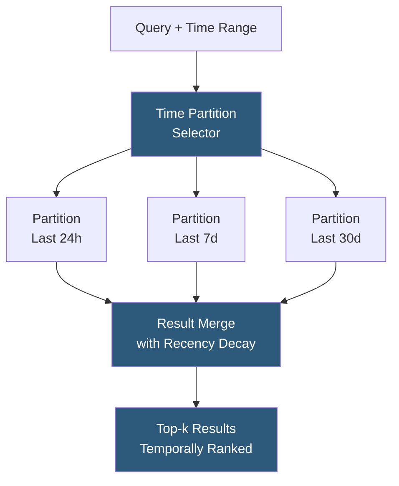

**Category:** Emerging Vector Technologies
**Difficulty:** Advanced
**Reading time:** 6 min read

---

Temporal vector search combines semantic similarity with time-based filtering, enabling queries like "find documents similar to this query, published in the last 7 days" or "retrieve the nearest neighbors as of a specific historical date." Naively filtering by timestamp post-ANN search yields poor recall; effective temporal systems integrate time constraints into the index structure itself or use time-partitioned indexes with merge strategies.

- **Time-Partitioned Index** — a set of separate vector indexes, each covering a discrete time window (hourly, daily), queried in parallel with time-bounded selection
- **Temporal Metadata Filter** — post-processing ANN results by applying a timestamp range filter, combined with over-fetch to compensate for recall loss
- **Hybrid Time-Vector Index** — an index structure encoding time as an additional embedding dimension or using time-aware graph edges in HNSW
- **Recency Decay** — a scoring modifier that down-weights older embeddings in the final ranking, balancing semantic relevance with freshness
- **Versioned Snapshot Index** — immutable index snapshots keyed by timestamp, enabling point-in-time queries for audit and reproducibility
- **TTL (Time-to-Live) Vectors** — embeddings automatically expired and removed from the index after a configured duration
- **Temporal Query Expansion** — automatically broadening narrow time windows when the initial constrained search yields insufficient results

The fundamental challenge of temporal vector search is that ANN indexes optimize for vector proximity, not timestamp proximity. A naïve approach — run ANN search then filter by timestamp — suffers from recall degradation: if 90% of the nearest neighbors are outside the time window, the returned result set may contain very few or zero results, requiring an expensive full scan fallback.

Time-partitioned indexes address this by maintaining separate HNSW or IVF structures per time window. Query routing selects the relevant partition(s) based on the requested time range, executes parallel ANN searches, and merges results. This guarantees high recall within the time window because each partition contains only in-window embeddings. The trade-off is increased memory footprint (N copies of the index) and cross-partition query overhead.

Recency decay scoring blends semantic similarity with time freshness. The final score is computed as: `score = cosine_similarity * exp(-lambda * age_days)`, where lambda controls the decay rate. This allows slightly older, highly relevant results to appear alongside very recent but less relevant results, creating a natural freshness-relevance balance. Lambda is tuned per use case: news search uses aggressive decay (lambda=0.1), document archives use gentle decay (lambda=0.001).

Versioned snapshot indexes serve point-in-time queries by maintaining immutable index snapshots at regular intervals. A query specifying `as_of=2025-01-15` routes to the snapshot closest to that date. Snapshots are stored efficiently using copy-on-write semantics: only changed vector slots are duplicated between snapshots, keeping total storage proportional to the rate of change rather than dataset size.

- News aggregation with freshness-boosted semantic ranking
- Financial event correlation across trading sessions with time-bounded search
- Customer support: find tickets from last 30 days similar to the current issue
- Security threat intelligence: recent threat indicators similar to a detected signature
- Scientific literature review: papers from last 5 years semantically related to a research question

| Advantage | Disadvantage |
|-----------|--------------|
| High recall within time windows via partitioned indexes | Multiple partitions multiply memory footprint |
| Recency decay naturally balances freshness vs. relevance | Partition boundaries create discontinuities near window edges |
| Versioned snapshots enable point-in-time query reproducibility | Cross-partition merge adds query latency proportional to partition count |
| TTL vectors automate stale embedding cleanup | Choosing partition granularity (hourly vs. daily) requires workload analysis |

- [Streaming Vector Search](streaming-vector-search.md)
- [Time-Aware Embeddings](time-aware-embeddings.md)
- [Real-Time Embedding Updates](real-time-embedding-updates.md)

---
*Part of the [Emerging Vector Technologies](index.md) category · [Back to Master Index](../../index.md)*
