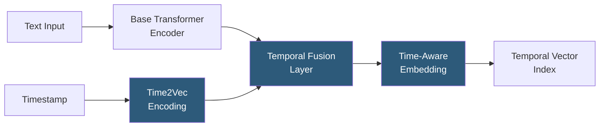

**Category:** Emerging Vector Technologies
**Difficulty:** Advanced
**Reading time:** 6 min read

---

Time-aware embeddings encode temporal context directly into the vector representation, allowing a single embedding model to capture both semantic meaning and its relationship to time. Instead of treating timestamps as metadata filters applied after retrieval, time-aware models produce embeddings where temporal proximity contributes to vector proximity. This enables queries like "find concepts that were semantically similar to X in 2018 but have since diverged," supporting temporal reasoning over knowledge bases.

- **Temporal Positional Encoding** — extending transformer positional encodings with a learned time dimension, conditioning output embeddings on the document's creation timestamp
- **Time2Vec** — a neural module that maps scalar timestamps to learned sinusoidal and linear features, suitable as a plug-in for any encoder architecture
- **Dynamic Embeddings** — embedding models that produce different vectors for the same entity at different timestamps, reflecting semantic drift over time
- **Concept Drift Detection** — monitoring cosine similarity between current and past embeddings of the same entity to detect when its meaning has shifted
- **Temporal Contrastive Learning** — a training objective that pulls together embeddings of the same concept at similar times and pushes apart embeddings at distant times
- **Knowledge Graph Temporal Completion** — using time-aware embeddings to predict when entities held specific relationships based on temporal patterns
- **Causal Embedding** — embeddings that respect causal ordering: future events cannot influence past embeddings

Time-aware embedding models condition their output on a temporal signal alongside the content input. The Time2Vec approach encodes a scalar timestamp t as a feature vector: one linear component (capturing trend) plus k sinusoidal components at learned frequencies (capturing periodic patterns like weekly, monthly, or seasonal cycles). This time feature vector is concatenated with or added to the token embeddings before attention computation.

During training, the model learns to associate semantic meaning with its temporal context. For example, the word "streaming" in a 2015 document should produce an embedding closer to "video delivery platform" vectors of 2015, while the same word in 2024 contexts should embed closer to "real-time data processing" vectors. This temporal semantic disambiguation is impossible with static embeddings.

Temporal contrastive learning supervises this: positive pairs are (document, document from the same time period with same topic), negative pairs are (document, document from a very different time period). The loss function pulls positive pairs together and pushes negative pairs apart in the joint temporal-semantic space.

Concept drift detection uses time-aware embeddings to monitor entity meaning stability. By sampling embeddings of a company name, product, or technical term at monthly intervals and tracking their centroid trajectory, organizations can automatically detect when a concept's meaning has meaningfully changed — triggering retraining or knowledge base updates.

For knowledge graphs, temporal embedding models (TNTComplEx, TComplEx) encode facts as (subject, relation, object, time) quadruples and learn embeddings where the validity of a fact is predicted as a function of both the entity embeddings and the time embedding, enabling temporal link prediction.

- Financial market analysis detecting when company descriptions diverge from historical representations
- News topic evolution tracking: how did "AI" cluster semantically change from 2020 to 2025?
- Medical concept drift: monitoring when clinical term usage shifts following guideline updates
- Patent prior art search conditioned on priority date to find contemporaneous prior art
- Temporal knowledge graph completion for question answering about historical states

| Advantage | Disadvantage |
|-----------|--------------|
| Single index supports both temporal and semantic filtering natively | Model training requires temporally labeled corpora with reliable timestamps |
| Enables temporal reasoning without post-retrieval filtering | Larger embedding dimensionality or separate temporal channel increases model size |
| Concept drift detection provides automatic knowledge base maintenance signals | Temporal patterns may not generalize across domains with different time scales |
| Temporal contrastive learning improves overall embedding quality | Query interface more complex: users must specify or omit a temporal anchor |

- [Temporal Vector Search](temporal-vector-search.md)
- [Streaming Vector Search](streaming-vector-search.md)
- [Continual Learning for Embeddings](continual-learning-for-embeddings.md)

---
*Part of the [Emerging Vector Technologies](index.md) category · [Back to Master Index](../../index.md)*
