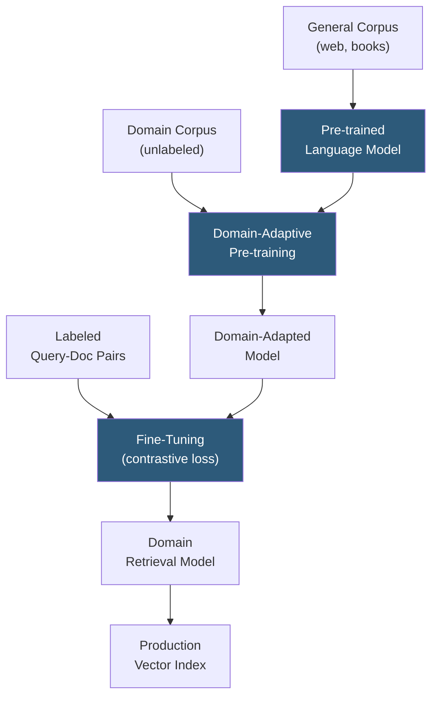

**Category:** Emerging Vector Technologies
**Difficulty:** Intermediate
**Reading time:** 6 min read

---

Transfer learning for retrieval leverages representations learned during large-scale pre-training on general corpora to bootstrap high-quality retrieval models for specialized domains with minimal task-specific data. Pre-trained transformers capture syntactic and semantic knowledge that transfers effectively to dense retrieval, enabling production-quality search with a fraction of the labeled data that training from scratch would require.

- **Pre-trained Language Model (PLM)** — a transformer (BERT, RoBERTa, T5) trained on large text corpora; the starting point for retrieval model fine-tuning
- **Fine-Tuning** — updating all or part of a PLM's weights on task-specific data, adapting general representations to retrieval objectives
- **Intermediate Pre-training** — an optional stage training on domain-specific unlabeled text (e.g., PubMed for biomedical) before task fine-tuning, bridging the domain gap
- **Parameter-Efficient Fine-Tuning (PEFT)** — methods (LoRA, prefix tuning, adapters) that fine-tune a small subset of parameters, reducing cost and catastrophic forgetting
- **LoRA (Low-Rank Adaptation)** — PEFT method adding low-rank weight matrices to attention layers; achieves near full fine-tuning performance at 0.1–1% of trainable parameters
- **Domain-Adaptive Pre-training (DAPT)** — continued pre-training of a PLM on unlabeled domain corpus before supervised fine-tuning
- **Sentence Transformers** — fine-tuned PLMs using Siamese/triplet architectures optimized specifically for producing sentence-level embeddings

Transfer learning for retrieval follows a staged adaptation pipeline. The foundation is a large pre-trained language model whose self-supervised training on hundreds of billions of tokens produces representations encoding rich syntactic and semantic knowledge. Starting from this foundation rather than random initialization gives retrieval models a massive head start.

**Domain-Adaptive Pre-training (DAPT)** optionally continues masked language modeling on an unlabeled domain corpus (e.g., all of PubMed for biomedical, SEC filings for financial) before supervised fine-tuning. This closes the vocabulary and distributional gap between general web text and the target domain, particularly important for domains with specialized terminology. BioBERT and FinBERT demonstrate 3–8% retrieval improvement from DAPT over direct fine-tuning on general PLMs.

Supervised **contrastive fine-tuning** then shapes the representation space for retrieval. Using a Siamese bi-encoder architecture, the model is trained on (query, positive document, hard negatives) triplets. Hard negatives — documents that are topically related but not relevant — are mined from the current model's top-K results, providing the most informative gradient signal. Multiple negatives per positive example (in-batch negatives) further increase training efficiency.

**LoRA-based PEFT** dramatically reduces the cost of fine-tuning large models. By injecting trainable low-rank matrices (rank 8–64) into query and value projection layers of each attention head, LoRA achieves 95% of full fine-tuning recall improvement while training 10× faster and storing adapters that are 1–2% the size of the full model. Multiple domain adapters can be hot-swapped onto a frozen base model, enabling a single GPU to serve many domain-specific retrieval tasks.

- Biomedical literature search using PLMs adapted on PubMed and clinical notes
- Legal case retrieval fine-tuned on judicial opinion paired search queries
- Financial document retrieval using models pre-trained on SEC filings and earnings calls
- Code search using PLMs adapted on GitHub and documentation corpora
- Customer support search rapidly adapting to new product domains with LoRA adapters

| Advantage | Disadvantage |
|-----------|--------------|
| Achieves high recall with 10–100x fewer labeled examples vs. training from scratch | DAPT requires large unlabeled domain corpus and compute |
| LoRA enables low-cost multi-domain adapter deployment | Hard negative mining requires an inference pass over the index per training epoch |
| General PLM foundation generalizes to out-of-distribution queries | Fine-tuned models can overfit to training query distribution |
| Staged pipeline is modular; each step independently improvable | LoRA hyperparameter selection (rank, alpha) requires experimentation |

- [Few-Shot Retrieval](few-shot-retrieval.md)
- [Domain Adaptation for Vectors](domain-adaptation-for-vectors.md)
- [Transformer-Based Indexing](transformer-based-indexing.md)

---
*Part of the [Emerging Vector Technologies](index.md) category · [Back to Master Index](../../index.md)*
