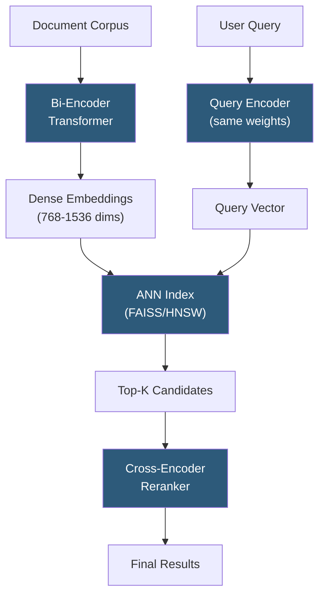

**Category:** Emerging Vector Technologies
**Difficulty:** Advanced
**Reading time:** 6 min read

---

Transformer-based indexing applies self-attention mechanisms from large language models to build semantically rich vector indexes. Instead of traditional keyword or tree-based structures, these systems encode documents and queries into high-dimensional embedding spaces where semantic proximity drives retrieval. The approach enables nuanced, context-aware search that generalizes across vocabulary mismatches.

- **Self-Attention** — the mechanism by which transformers weigh token relationships across a sequence, producing context-sensitive embeddings
- **Dense Retrieval** — retrieval paradigm where both queries and documents are encoded as dense vectors rather than sparse term frequencies
- **Bi-Encoder Architecture** — dual-tower model where query and document are encoded independently, enabling pre-computation of document vectors
- **Cross-Encoder** — a re-ranker that jointly encodes query and document for high-accuracy scoring, at higher computational cost
- **ColBERT** — late interaction model storing per-token embeddings, balancing expressiveness and pre-computation efficiency
- **FAISS Integration** — pairing transformer encoders with Facebook AI Similarity Search for scalable approximate nearest neighbor retrieval
- **BEIR Benchmark** — heterogeneous retrieval benchmark evaluating zero-shot generalization of dense retrieval models across domains

Transformer-based indexing pipelines typically operate in two stages. During **offline indexing**, a bi-encoder model (such as a fine-tuned BERT or a purpose-built model like sentence-transformers) processes every document in the corpus. Each document is tokenized, passed through the transformer stack, and the resulting CLS token or mean-pooled representation becomes a fixed-length vector stored in an approximate nearest neighbor (ANN) index such as FAISS or HNSW.

During **online retrieval**, the same encoder (or a lightweight query-specific tower) transforms the incoming query into an embedding. The ANN index performs an approximate nearest neighbor search, returning the top-K most similar document vectors in sub-millisecond time even over billions of documents.

A two-stage pipeline often adds a **cross-encoder re-ranker** that takes the top-K candidates and scores them by feeding the concatenated query and document through a full transformer, producing a highly accurate relevance score. This separation — fast ANN recall followed by precise cross-encoder scoring — allows systems to balance latency and accuracy.

Models like ColBERT improve expressiveness by storing per-token embeddings for each document and computing late interaction scores (MaxSim) at query time, capturing finer-grained token matches without full cross-encoding overhead. Fine-tuning on domain-specific data dramatically improves recall and mean reciprocal rank for specialized corpora.

- Enterprise search over internal knowledge bases with semantic intent understanding
- Open-domain question answering systems using dense passage retrieval
- E-commerce product search with semantic understanding of descriptions
- Legal and medical document retrieval requiring precise relevance ranking
- Multilingual search where cross-lingual encoders bridge vocabulary gaps

| Advantage | Disadvantage |
|-----------|--------------|
| Semantic generalization beyond keyword overlap | High index storage cost for per-vector or per-token embeddings |
| State-of-the-art recall on heterogeneous corpora | Encoder inference latency requires GPU hardware or batching |
| Handles out-of-vocabulary terms gracefully | Fine-tuning requires labeled query-document pairs |
| Composable with re-ranking for precision | Index rebuilds are expensive when encoder model is updated |

- [Attention-Based Retrieval](attention-based-retrieval.md)
- [AI-Optimized Vector Indexes](ai-optimized-vector-indexes.md)
- [Graph Neural Networks for Search](graph-neural-networks-for-search.md)

---
*Part of the [Emerging Vector Technologies](index.md) category · [Back to Master Index](../../index.md)*
