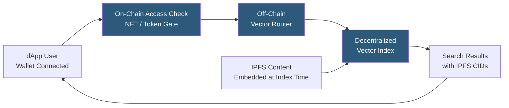

**Category:** Emerging Vector Technologies
**Difficulty:** Intermediate
**Reading time:** 5 min read

---

Vector search in Web3 enables semantic retrieval within decentralized applications (dApps), NFT ecosystems, DAO knowledge bases, and on-chain data archives. Unlike traditional Web2 embedding search, Web3 vector systems must handle content-addressed data (IPFS CIDs), wallet-address-based access control, and on-chain query verification. Projects like The Graph Protocol's subgraph-based search, Ceramic's decentralized document store with vector extensions, and Pinecone-IPFS integrations are pioneering this space.

- **Subgraph Indexing** — The Graph Protocol's approach to indexing on-chain events and off-chain IPFS content into queryable data structures
- **Ceramic Network** — a decentralized data network storing mutable documents with cryptographic streams, enabling off-chain data that on-chain contracts can reference
- **IPFS Content Search** — searching across a corpus of IPFS-pinned documents by embedding their content and indexing the resulting vectors
- **Wallet-Gated Index** — a vector index where access control is enforced by verifying NFT ownership or DAO membership via on-chain state
- **Semantic NFT Discovery** — finding conceptually similar NFTs (art, music, metaverse assets) using embedding similarity rather than tag matching
- **On-Chain Query Hash** — committing a hash of the query embedding and result set to the blockchain as a verifiable search audit record
- **Hybrid On-Chain/Off-Chain Search** — on-chain access control + off-chain vector computation, the dominant practical architecture

Web3 vector search combines on-chain identity and access control with off-chain embedding computation and storage. The process begins with indexing: content stored on IPFS (documents, NFT metadata, DAO proposals) is fetched, embedded using a standard model, and inserted into a vector database that stores each vector paired with its IPFS CID (content identifier).

When a user searches, their dApp front-end calls a wallet-signing step that generates an access token proving the user holds required tokens or NFT membership. This token is passed to the off-chain search service, which verifies it against on-chain state (an ERC-721 balance check or Snapshot voting record) before executing the ANN query.

Search results are returned as lists of IPFS CIDs ranked by embedding similarity. The dApp resolves each CID through an IPFS gateway to retrieve the actual content. Optionally, the query hash and result CID list are committed to a smart contract transaction, creating an immutable audit trail useful for DAO governance decisions or evidence of prior art searches.

Semantic NFT discovery applies this to NFT collections: metadata, generated art descriptions, and provenance are embedded and indexed. Users can find "NFTs similar to this one" by searching the embedding space, discovering thematic or stylistic neighbors across multiple collections without relying on manual tag curation.

The primary challenge is latency: IPFS content retrieval adds variable delays (100ms–30s depending on pinning and gateway), and on-chain access verification adds one RPC call per query. Practical systems cache access tokens and pre-fetch popular content to IPFS hot storage.

- DAO knowledge base semantic search accessible to token holders
- NFT marketplace discovery by conceptual similarity rather than keyword tags
- Decentralized academic publishing with semantic full-text search
- Web3 journalism platforms with censorship-resistant searchable archives
- Metaverse asset discovery by description similarity across virtual worlds

| Advantage | Disadvantage |
|-----------|--------------|
| Wallet-native access control without centralized authentication | IPFS content retrieval latency degrades user experience |
| Censorship-resistant: content persists on IPFS regardless of platform | On-chain access verification adds an RPC round-trip per query |
| Verifiable audit trail via on-chain query commitments | Embedding model centralization creates a trust bottleneck |
| Enables token-gated, privacy-preserving search for communities | Low developer tooling maturity compared to Web2 vector databases |

- [Blockchain-Based Vector Storage](blockchain-based-vector-storage.md)
- [Decentralized Embedding Networks](decentralized-embedding-networks.md)
- [Federated Vector Search](federated-vector-search.md)

---
*Part of the [Emerging Vector Technologies](index.md) category · [Back to Master Index](../../index.md)*
