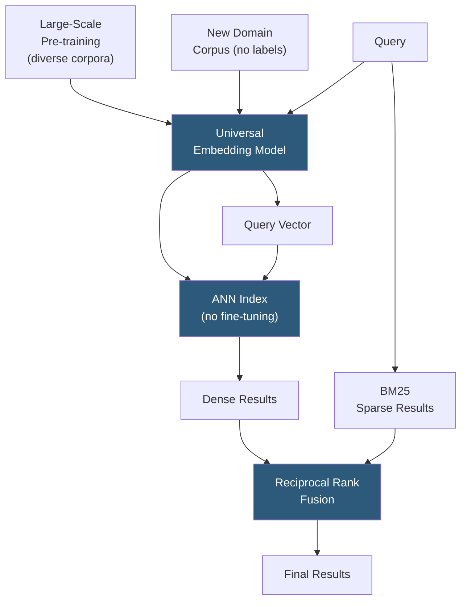

**Category:** Emerging Vector Technologies
**Difficulty:** Advanced
**Reading time:** 6 min read

---

Zero-shot vector search enables retrieval models to find relevant documents in domains and languages they have never been trained on, using only pre-trained semantic embeddings without any task-specific labeled data. Models leveraging large-scale pre-training on diverse corpora develop generalizable representations that transfer across domains, making zero-shot deployment of semantic search feasible for data-scarce scenarios.

- **Zero-Shot Transfer** — the ability of a model to perform well on a new task or domain without any task-specific training examples
- **Universal Embeddings** — large-scale sentence encoders (e.g., INSTRUCTOR, E5, BGE) trained on diverse data to generalize broadly across domains
- **BEIR Benchmark** — 18-dataset heterogeneous retrieval benchmark specifically designed to evaluate zero-shot generalization of dense retrieval models
- **Instruction-Following Embeddings** — models that accept task-describing text prompts alongside the input, steering embeddings toward task-appropriate geometry
- **Cross-Lingual Zero-Shot** — applying an English-trained embedding model to retrieve documents in languages unseen during training
- **Lexical Fallback** — using BM25 or other sparse retrieval as a safety net when dense zero-shot recall is insufficient
- **Hybrid Retrieval** — combining sparse (BM25) and dense (zero-shot embedding) scores to improve robustness across domain types

Zero-shot vector search relies on embedding models pre-trained on sufficiently large and diverse datasets that their representations generalize without domain-specific fine-tuning. Models like E5, BGE, and GTE are trained on hundreds of millions of query-document pairs across diverse domains using contrastive learning objectives, building an embedding space where semantic similarity generalizes beyond training distribution.

At deployment, the target corpus is encoded using the pre-trained model and loaded into an ANN index — no labels are needed. Queries are encoded and nearest neighbor search proceeds identically to a fine-tuned setup. BEIR benchmarks show that top universal embedding models achieve competitive nDCG@10 across domains as varied as scientific papers, news, financial reports, and biomedical literature without any domain-specific training.

Instruction-tuned embedding models improve zero-shot performance by accepting a natural language task description alongside the text. For example, prepending "Represent this legal document for retrieval:" steers the model to emphasize domain-relevant features. INSTRUCTOR and similar models show that the same underlying encoder can adapt its representation geometry purely through instruction text, enabling single-model deployment across many retrieval tasks.

Hybrid retrieval significantly boosts zero-shot robustness: BM25 handles vocabulary-specific queries (exact product names, specialized terminology) where semantic models may fail to generalize, while dense embeddings handle paraphrase and intent-based queries. Reciprocal Rank Fusion combines both result lists without requiring score normalization, consistently outperforming either method alone on out-of-domain benchmarks.

- Immediate search deployment for new products or domains without annotation sprints
- Multi-tenant search platforms serving diverse industries from a single model
- Prototype and MVP search features before labeled data collection begins
- Cross-lingual enterprise search using multilingual universal encoders
- Research environments where query distributions are unpredictable and varied

| Advantage | Disadvantage |
|-----------|--------------|
| No labeled data required for deployment | Performance ceiling lower than fine-tuned models for well-resourced domains |
| Single model serves multiple domains | Vocabulary-specific queries may fail without lexical fallback |
| Fast time-to-deployment; skip annotation pipeline entirely | Instruction-tuned models require crafting effective task descriptions |
| Hybrid retrieval fallback recovers most recall gaps | Evaluation is harder without domain ground truth for recall measurement |

- [Few-Shot Retrieval](few-shot-retrieval.md)
- [Cross-Lingual Vector Search](cross-lingual-vector-search.md)
- [Transformer-Based Indexing](transformer-based-indexing.md)

---
*Part of the [Emerging Vector Technologies](index.md) category · [Back to Master Index](../../index.md)*
