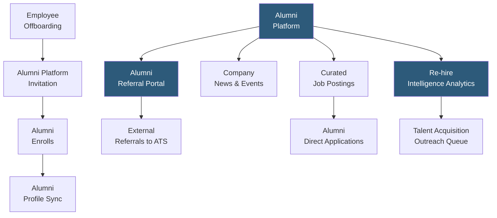

**Category:** Employee Referral Platforms
**Difficulty:** Intermediate
**Reading time:** 5 min read

---

Alumni network platforms provide organizations with dedicated digital communities for engaging former employees, enabling ongoing relationship maintenance that supports boomerang hiring, referral pipeline, business development, and employer brand advocacy. Unlike LinkedIn alumni groups, purpose-built alumni platforms offer controlled membership, structured engagement content, job posting capabilities, and analytics on alumni career progression and re-hire potential.

- **Corporate Alumni Community** — a moderated digital network of former employees maintained by the company as a long-term relationship asset
- **Alumni CRM** — the database layer tracking each alumnus's former role, departure date, current employer, and re-hire eligibility status
- **Job Board for Alumni** — curated job postings surfaced specifically to alumni members with context about how their background matches open roles
- **Alumni Referral Program** — extending the employee referral program to alumni who can submit candidate referrals in exchange for referral bonuses or relationship capital
- **Knowledge Network** — connecting alumni as subject matter experts for business development, client introductions, or advisory relationships beyond re-hiring
- **Alumni Engagement Score** — metric tracking how actively each alumnus interacts with platform content (job views, event attendance, content engagement)
- **Re-hire Identification** — platform analytics surfacing alumni whose career progression indicates they may be ready for a return role

Alumni network platforms are deployed as part of the employee offboarding process. Departing employees receive an invitation to join the alumni network during their final week, framed as maintaining their professional connection to the company community. Enrollment rates are highest when the invitation comes from their manager or HR partner personally, rather than as an automated system email.

Upon enrollment, the platform imports the alumnus's role history, department, and tenure from the HRIS, creating a pre-populated profile. Alumni update their current employer and role, providing the talent acquisition team with real-time career progression intelligence. Platform analytics score each alumnus on career progression indicators — a former mid-level engineer now managing a team of 20 at a startup may be ready for a senior leadership return role.

Job postings on the alumni platform are personalized based on the alumnus's previous role and inferred skill growth. A former data scientist sees data engineering and analytics leadership openings matching their background rather than irrelevant volume roles. This targeted approach drives application rates significantly higher than broadcasting all openings.

Alumni referral programs extend referral bonus eligibility to alumni members, incentivizing former employees to submit candidates from their post-company professional networks. Alumni often have broader professional networks than current employees in some domains — a founder alumni who left to build a company knows many technical founders, developers, and operators who would be strong candidates.

- Technology companies with high employee turnover wanting to create a structured re-hire pipeline
- Professional services firms (consulting, finance) where alumni become clients or business partners
- Organizations with strong culture whose alumni remain advocates and are likely to return if circumstances change
- Companies expanding into new markets where alumni in the target market can provide referrals and local introductions
- Employer brand programs leveraging alumni as authentic advocates for candidate attraction

| Advantage | Disadvantage |
|-----------|--------------|
| Creates a controlled, trusted community vs. unmanaged LinkedIn alumni groups | Platform investment (EnterpriseAlumni, Graduway) requires budget and ongoing administration |
| Re-hire intelligence analytics surface boomerang candidates proactively | Alumni enrollment rates vary; a 50% enrollment rate is considered strong |
| Alumni referral extension multiplies referral pool beyond current employee networks | Alumni platform value takes 12–24 months to materialize as hire pipeline develops |
| Business development and client introduction value extends ROI beyond recruiting | Alumni who had poor exit experiences will not enroll or engage regardless of platform quality |

- [EnterpriseAlumni Platform](enterprise-alumni-platform.md)
- [Boomerang Employee Programs](boomerang-employee-programs.md)
- [Graduway Alumni Engagement](graduway-alumni-engagement.md)

---
*Part of the [Employee Referral Platforms](index.md) category · [Back to Master Index](../../index.md)*
