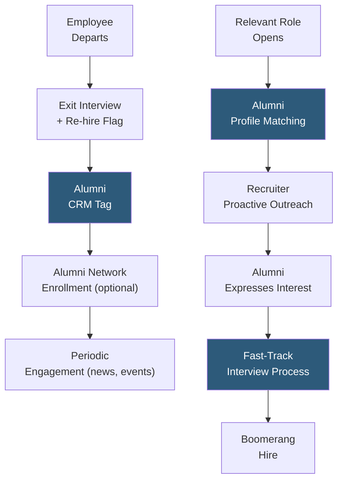

**Category:** Employee Referral Platforms
**Difficulty:** Intermediate
**Reading time:** 5 min read

---

Boomerang employee programs are structured initiatives to recruit former employees back to the organization after they have left to gain experience elsewhere. Former employees who return (boomerangs) offer a unique value proposition: they already understand the company culture, systems, and relationships, reducing onboarding time and culture fit risk significantly compared to external hires.

- **Boomerang Hire** — a former employee who is re-hired by the same organization after a period working elsewhere
- **Alumni Pipeline** — the pool of former employees maintained in a CRM or alumni network as potential future re-hire candidates
- **Eligible Re-Hire Status** — classification in the HRIS indicating whether a departed employee left in good standing and is eligible for future re-hire consideration
- **Exit Interview Integration** — the practice of capturing re-hire interest during exit interviews and flagging strong candidates for alumni network enrollment
- **Tenure Equivalency Policy** — the organizational decision whether and how to credit prior tenure (vacation accrual, vesting schedules) for returning boomerang employees
- **Rehire Onboarding** — abbreviated onboarding track for returning employees who need refreshing on current state rather than fundamental company orientation
- **Proactive Alumni Outreach** — recruiter-initiated outreach to specific alumni when roles matching their experience profile open, rather than waiting for alumni to self-apply

Boomerang programs begin at the exit interview stage. HR collects the departing employee's reason for leaving, whether they would consider returning, and what circumstances would bring them back. Employees who leave for positive reasons (career advancement opportunity, personal circumstances) are flagged as re-hire eligible and enrolled in the alumni tracking system. Those who left due to performance issues or termination are marked ineligible and excluded from alumni outreach.

The alumni CRM captures the former employee's contact information, last role, tenure, and re-hire flag. Periodic low-touch engagement — quarterly company news emails, invitations to alumni networking events, or a LinkedIn alumni group — keeps the relationship warm without pressure. This ambient engagement means that when a relevant role opens, the alumni is receptive to recruiter outreach rather than treating it as cold contact.

Proactive alumni matching runs when new roles are opened: the talent acquisition team or sourcing tool (Teamable, LinkedIn Recruiter's alumni filter) identifies former employees whose role and skill profile matches the opening. Recruiters reach out personally, acknowledging the prior relationship and the specific relevance of the role. Boomerang candidates typically move through a compressed interview process — company culture and values fit is already established, so interviews focus on skill currency and role-specific competencies.

Tenure equivalency decisions significantly affect boomerang program attractiveness: returning employees who lose previously accrued vacation time, vesting credits, or seniority-based benefits are less likely to return. Organizations with generous rehire tenure bridging policies attract higher-quality boomerangs.

- Re-hiring strong individual contributors who left for startup experience and are now ready to return
- Bringing back former leaders for expanded roles they were not yet ready for when they left
- Rapidly re-hiring recently departed employees who left for cultural reasons that have since changed
- Building senior engineering pipeline by re-recruiting alumni who joined companies with complementary skill development
- Industries with natural career paths that cycle through 2–3 employers before returning (consulting, banking, technology)

| Advantage | Disadvantage |
|-----------|--------------|
| Near-zero culture fit risk and dramatically faster onboarding | Some teams have cultural resistance to re-hiring departed employees |
| Alumni already have relationship capital and organizational context | Unclear why the employee left originally requires careful due diligence |
| Higher offer acceptance rates due to informed expectations | Tenure bridging policies can create inequity perceptions with existing employees |
| Access to candidates who have gained experience at peer companies | Alumni network must be maintained proactively; neglected alumni lists produce poor results |

- [Alumni Network Platforms](alumni-network-platforms.md)
- [Candidate Relationship from Referrals](candidate-relationship-from-referrals.md)
- [Referral Campaign Management](referral-campaign-management.md)

---
*Part of the [Employee Referral Platforms](index.md) category · [Back to Master Index](../../index.md)*
