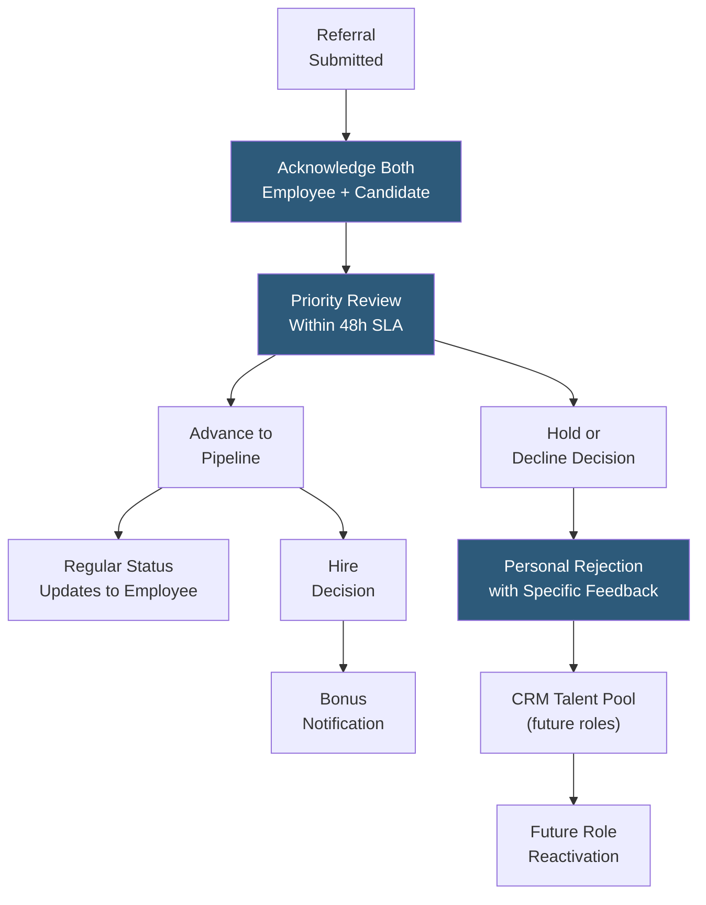

**Category:** Employee Referral Platforms
**Difficulty:** Intermediate
**Reading time:** 5 min read

---

Managing candidate relationships originating from referrals requires a distinct approach from other sourcing channels, because the referring employee's relationship with the candidate creates expectations of communication quality, speed, and personal acknowledgment that standard ATS-driven workflows often fail to meet. Building positive candidate experiences for referred candidates preserves employee trust and the referring employee's professional relationships.

- **Referred Candidate SLA** — the committed maximum time-to-first-response for referred candidates, typically 24–48 hours vs. the standard 5–7 day application review cycle
- **Referring Employee as Advocate** — the role of the submitting employee as informal candidate champion who provides context to recruiters and reassurance to candidates
- **Candidate Experience Score** — referred candidates' satisfaction rating with the hiring process, often measured separately from general applicant experience given higher expectations
- **Transparent Rejection Communication** — the extra care required when rejecting referred candidates, since the rejection reflects on both the company and the referring employee's judgment
- **Long-Term Talent Pool Nurturing** — maintaining relationships with referred candidates not hired for the immediate opening, preserving them for future opportunities
- **Reference Loop** — the informal feedback loop where the referring employee provides candidate context to the recruiter and shares process updates with the candidate
- **CRM Tagging for Referral Origin** — marking all referred candidates in the ATS/CRM with referral origin to trigger differentiated communication workflows

Referred candidate relationship management begins at submission acknowledgment. Both the referring employee (confirming receipt of their referral) and the candidate (introducing the company and setting expectations) should receive personalized communication within 24 hours. Automated acknowledgment is acceptable but should feel personal — templated language acknowledging the specific role and the referring employee's name maintains a human tone at scale.

The 48-hour first-response SLA differentiates referred candidates from the general applicant pool. Most ATS platforms support priority flags or workflow rules that surface referred candidates at the top of recruiter review queues. Adhering to this SLA is critical: when a referred candidate applies and waits 10 days without contact, the referring employee receives a social signal about their company's professionalism that damages program trust far more than a missed bonus would.

Rejection communication for referred candidates requires extra care because the rejection affects three parties: the candidate, the referring employee (whose judgment is implicitly evaluated), and the relationship between them. Generic rejection emails are insufficient. Personalized rejections explaining specifically why the candidate wasn't selected for the current role, while preserving their dignity and the referrer's credibility ("the role required X years of Y experience"), maintain goodwill that sustains both the candidate relationship and the employee's future referral behavior.

CRM-based nurturing preserves rejected referred candidates for future openings. Candidates tagged with referral origin in Lever Nurture, Greenhouse's talent pool, or a standalone CRM receive appropriate re-engagement when suitable roles open, with messaging that acknowledges the prior application and referral relationship.

- Companies where referred candidate rejection rates damage program participation from high-performing employees
- Organizations building talent pipelines for high-demand roles by nurturing declined referrals for future openings
- Talent acquisition teams measuring candidate experience separately for referral vs. direct apply cohorts
- Recruiting operations designing differentiated ATS workflows for priority candidate handling
- Employer brand programs tracking whether positive referral candidate experience drives advocacy

| Advantage | Disadvantage |
|-----------|--------------|
| Differentiated experience maintains referring employee trust and future participation | Separate SLA and workflows increase recruiter workload per referral candidate |
| Personalized rejections preserve candidate and employee relationship dignity | Consistent 48-hour SLA requires organizational commitment and recruiter capacity planning |
| CRM nurturing converts declined referrals into future hire pipeline | Personalized rejection communication at scale requires templating that risks feeling formulaic |
| Tracking referred candidate experience separately surfaces program-specific satisfaction issues | Over-differentiation can create perceived fairness issues among non-referred applicants |

- [Employee Referral Tracking](employee-referral-tracking.md)
- [Referral Quality Metrics](referral-quality-metrics.md)
- [Alumni Network Platforms](alumni-network-platforms.md)

---
*Part of the [Employee Referral Platforms](index.md) category · [Back to Master Index](../../index.md)*
