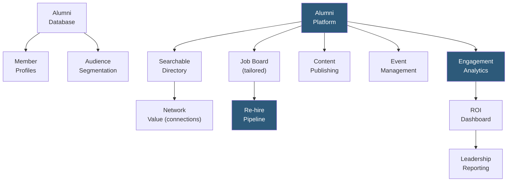

**Category:** Employee Referral Platforms
**Difficulty:** Beginner
**Reading time:** 5 min read

---

Corporate alumni platforms are purpose-built software solutions enabling organizations to manage, engage, and leverage their communities of former employees for re-hiring, referrals, business development, and employer brand advocacy. These platforms provide the infrastructure — profile management, job boards, content publishing, event hosting, and analytics — that transforms an unstructured list of former employees into an actively engaged talent and business network.

- **Alumni Community Infrastructure** — the core platform components (directory, messaging, job board, content feed) enabling sustained alumni engagement
- **Private vs. Public Alumni Networks** — the choice between an invite-only managed platform (EnterpriseAlumni, Graduway) vs. a public LinkedIn group, with different control and engagement tradeoff profiles
- **Alumni Lifecycle Management** — tracking alumni from departure through ongoing engagement to eventual re-hire or business relationship conversion
- **Platform ROI Measurement** — calculating alumni platform value across three dimensions: re-hire hires generated, referral hires from alumni submissions, and business development value (client introductions, partner relationships)
- **Community Manager Role** — dedicated human role required to sustain alumni platform engagement through content, event programming, and personal outreach
- **GDPR/Privacy Compliance** — alumni platforms storing personal data of former employees must comply with data retention, consent, and right-to-erasure regulations
- **Alumni Segment Strategy** — distinguishing different alumni populations (recent graduates, senior leaders, long-tenure employees) for tailored engagement approaches

Corporate alumni platforms are deployed as part of a broader talent management strategy. The platform requires initial population from HRIS historical records — extracting all former employees with eligible re-hire status, their last role, tenure, and contact information. This initial database typically captures 60–80% of the intended alumni population; the remainder must be manually enrolled from memory or via LinkedIn search.

Ongoing alumni enrollment relies on automated HRIS offboarding triggers. When an employee is terminated with an eligible re-hire flag, the platform automatically sends an enrollment invitation to their personal email. Enrollment rates vary from 30% to 70% depending on the company's cultural strength and the perceived value of the alumni community.

Content strategy is critical for sustaining engagement. Platforms that publish only job postings achieve poor long-term retention; those that publish industry insights, company news, and alumni success stories maintain engagement across longer dormancy periods. A monthly newsletter featuring company developments alongside alumni spotlights achieves 25–35% open rates, far above average email engagement.

Analytics provide the reporting needed to justify continued investment. Key metrics include monthly active users, alumni job applications generated, referral submissions from alumni, hires generated (direct and via referral), and business development connection introductions tracked in the CRM. Most enterprise alumni programs with active management generate enough hires within 18 months to recover full platform cost from recruiter fee displacement alone.

- Organizations replacing unmanaged LinkedIn alumni groups with controlled, analytics-enabled platforms
- HR leaders building the business case for alumni program investment using multi-dimensional ROI tracking
- Companies with significant corporate alumni who work at clients, wanting to leverage business development value alongside recruiting
- Talent acquisition teams building proactive re-hire pipelines for future hiring ramps
- Employer brand teams wanting a controlled channel for consistent alumni messaging

| Advantage | Disadvantage |
|-----------|--------------|
| Controlled platform enables consistent branding and GDPR-compliant data management | Requires investment in platform license, community manager, and content production |
| Multi-dimensional ROI (re-hire + referrals + business dev) justifies investment across HR and business stakeholders | Takes 12–24 months to generate measurable pipeline; requires patience from leadership |
| Analytics enable ongoing program improvement based on engagement data | Alumni adoption requires compelling value proposition; purely transactional platforms underperform |
| Segmentation enables tailored engagement for different alumni populations | GDPR compliance requires legal review of data retention and consent for each jurisdiction |

- [Alumni Network Platforms](alumni-network-platforms.md)
- [EnterpriseAlumni Platform](enterprise-alumni-platform.md)
- [Boomerang Employee Programs](boomerang-employee-programs.md)

---
*Part of the [Employee Referral Platforms](index.md) category · [Back to Master Index](../../index.md)*
