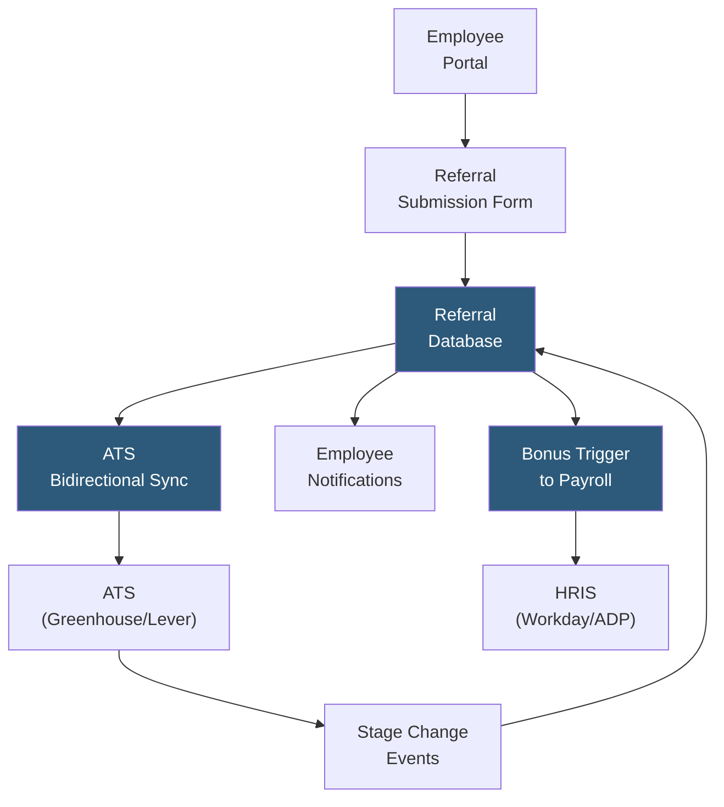

**Category:** Employee Referral Platforms
**Difficulty:** Beginner
**Reading time:** 5 min read

---

Employee referral tracking systems record the complete lifecycle of a referral from initial submission through hiring outcome and bonus payment, maintaining an auditable chain linking referring employees to candidate records within the ATS. Accurate tracking is the operational backbone of referral programs, enabling compliance, bonus administration, program analytics, and trust between employees and HR.

- **Referral Attribution** — the mechanism linking a referred candidate to the submitting employee in the ATS, typically via a unique referral link or ID
- **Candidate Status Visibility** — employee-facing tracking views showing where their referred candidate sits in the hiring pipeline
- **Duplicate Detection** — logic identifying when a referred candidate already exists in the ATS as a prior applicant or sourced contact, resolving attribution conflicts
- **Referral Source Code** — unique identifier embedded in application links or forms to distinguish referred applications from organic direct applies
- **Bonus Trigger Event** — the specific system event (hire date, day-90 tenure confirmation) that initiates bonus payment processing in payroll
- **Audit Trail** — immutable log of all referral record changes supporting compliance reviews and dispute resolution
- **ATS Integration** — bidirectional data sync between the referral platform and the applicant tracking system (Workday, Greenhouse, Lever) to keep candidate status current

Modern referral tracking begins at submission: the employee enters the candidate's contact details and optionally uploads a resume through a dedicated portal. The system generates a unique referral ID linking the employee to the candidate, then either creates a new candidate record in the ATS or enriches an existing one with the referral attribution. Duplicate detection compares submitted email and name against all existing ATS records, flagging cases where a candidate has previously applied or been sourced.

Bidirectional ATS integration keeps the referral database synchronized with pipeline changes. When a recruiter advances or rejects a referred candidate in Greenhouse or Lever, a webhook fires to the referral system, updating the candidate's status and triggering a notification to the referring employee. This visibility is critical for maintaining employee trust — a common failure mode of poorly run programs is employees submitting referrals and never hearing what happened.

Bonus triggers are configured as system events rather than manual processes: when the ATS records a hire date and the HRIS confirms 90 days of active employment, an automated trigger fires to payroll processing. This automation eliminates the manual spreadsheet tracking that many organizations use, which frequently results in missed or delayed payments that erode program trust.

Reporting dashboards aggregate referral data to show volume, pipeline conversion rates, time-to-hire, and bonus liability. Most enterprise platforms provide role-level views showing which open positions have active referrals and which are starved of referral pipeline, enabling recruiters to actively solicit referrals for specific priority roles.

- Enterprises with high-volume referral programs needing automated bonus administration
- Organizations requiring SOX-compliant audit trails for compensation payments
- Companies running tiered bonus programs where accurate attribution is financially critical
- Talent acquisition teams wanting real-time referral pipeline visibility alongside sourced and applied pipeline
- HR teams managing multiple concurrent incentive campaigns with different bonus structures

| Advantage | Disadvantage |
|-----------|--------------|
| Eliminates manual spreadsheet tracking errors | ATS integration complexity requires dedicated implementation effort |
| Automated bonus triggers reduce payment delays and disputes | Duplicate detection rules require careful configuration to avoid false positives |
| Candidate status visibility increases employee program trust | Deep HRIS integration needed for tenure-based vesting automation |
| Complete audit trail supports compliance and dispute resolution | Data privacy considerations when storing employee-to-candidate relationship data |

- [Referral Bonus Automation](referral-bonus-automation.md)
- [Referral Source Tracking](referral-source-tracking.md)
- [Referral Quality Metrics](referral-quality-metrics.md)

---
*Part of the [Employee Referral Platforms](index.md) category · [Back to Master Index](../../index.md)*
